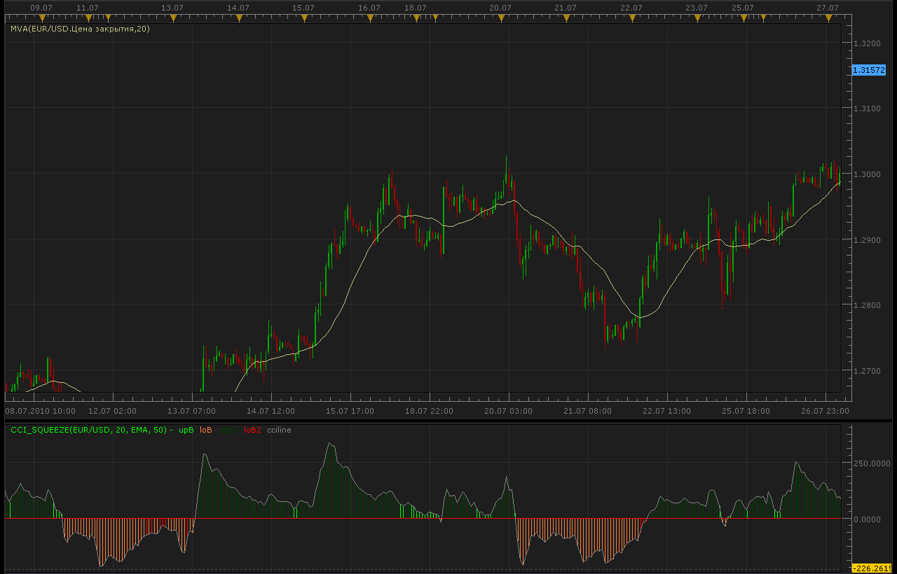
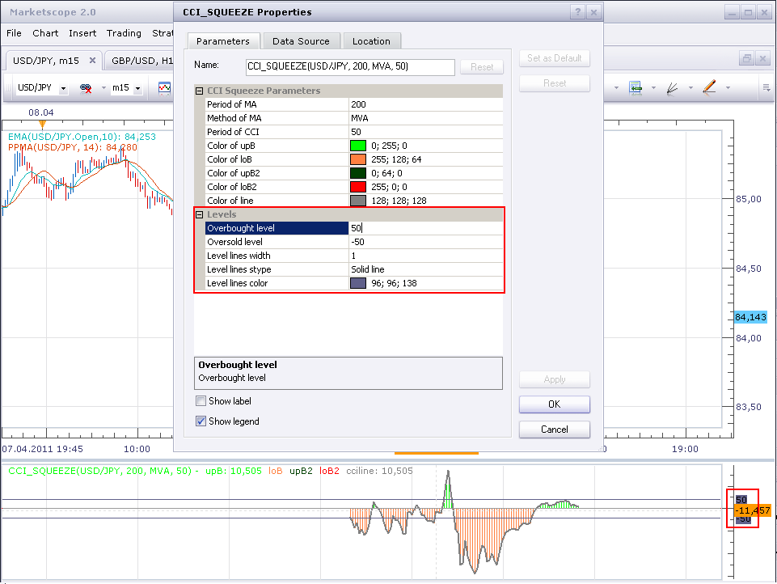

# CCI Squeeze indicator

> Source: https://fxcodebase.com/code/viewtopic.php?f=17&t=1651  
> Forum: 17 · Topic 1651 · 4 post(s)

---

## CCI Squeeze indicator

**Alexander.Gettinger** · Tue Aug 03, 2010 1:40 am

Line of indicator is a CCI.
If CCI>0 and close price>MA bar have a green color,
if CCI>0 and close price<MA bar have a lite green color,
if CCI<0 and close price >MA - red color,
if CCI<0 and close price <MA - orange color.

 

The indicator was revised and updated

---

## Re: CCI Squeeze indicator

**ClivePackham** · Sun Apr 10, 2011 12:21 pm

Hi
This is a great indicator and ideal for my strategy of trading the pullbacks in a trade.

However could I ask a massive favour could a horizontal line be included? I need one at +50 and -50, I have tried adding it myself manually but everytime I leave the chart and come back its gone and I have to re-enter them both again, which is just a bit tiresome.

Anyway thanks for a brilliant indicator and if you could make the lines part of the initial settings that would be great.

Many thanks in advance.

Clive Packham

[[email protected]](https://fxcodebase.com/cdn-cgi/l/email-protection#cba8a7a2bdaee5bbaaa8a0a3aaa68ba9bfa2a5bfaeb9a5aebfe5a8a4a6)

skype: clive.packham1

---

## Re: CCI Squeeze indicator

**sunshine** · Tue Apr 12, 2011 6:59 am

Hi,

Please find the indicator with custom levels in the attachment.

 

 [CCI_Squeeze_Lines.lua](files/9587/CCI_Squeeze_Lines.lua)

---

## Re: CCI Squeeze indicator

**Apprentice** · Mon Mar 06, 2017 7:37 am

Indicator was revised and updated.
