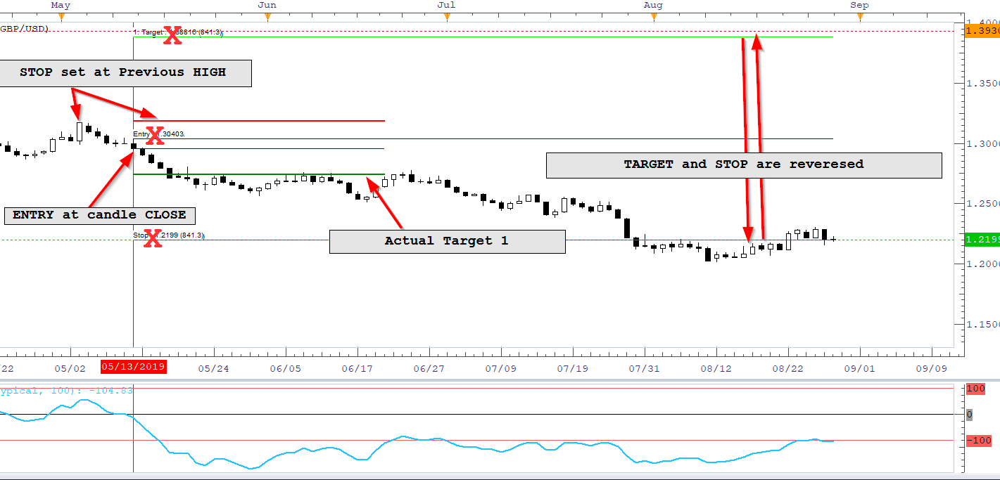
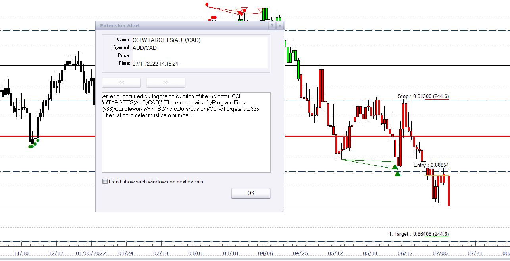

# CCI wTargets

> Source: https://fxcodebase.com/code/viewtopic.php?f=17&t=68858  
> Forum: 17 · Topic 68858 · 17 post(s)

---

## CCI wTargets

**Apprentice** · Thu Aug 29, 2019 5:18 am

Based on request.
[viewtopic.php?f=17&t=65883](https://fxcodebase.com/code/viewtopic.php?f=17&t=65883)

 [CCI wTargets.lua](files/128275/CCI%20wTargets.lua)

MT4 version
[https://fxcodebase.com/code/viewtopic.p ... 15#p160915](https://fxcodebase.com/code/viewtopic.php?f=38&t=76376&p=160915#p160915)

---

## Re: CCI wTargets

**jrichardson83** · Thu Aug 29, 2019 12:04 pm

> **Apprentice wrote:**
>
>
> The attachment **EURUSD D1 (08-29-2019 1022).png** is no longer available
>
>
> Based on request.
> [viewtopic.php?f=17&t=65883](https://fxcodebase.com/code/viewtopic.php?f=17&t=65883)
>
>
> The attachment **EURUSD D1 (08-29-2019 1022).png** is no longer available

Apprentice, see attached image with commentary. The calculations for the Target and Stop are printing in reverse and the entry is printing at the high rather than at the candle close.

Thanks

 

---

## Re: CCI wTargets

**jrichardson83** · Thu Sep 05, 2019 11:21 pm

Status on this one? Would it simplify the code if the "Other Time Frame" functionality was removed?

---

## Re: CCI wTargets

**Apprentice** · Fri Sep 06, 2019 2:48 pm

1) Fixed bug
2) I don't understand the stop logic. The screenshot shows high-level several bars ago.

---

## Re: CCI wTargets

**jrichardson83** · Mon Jul 11, 2022 2:21 pm

> **Apprentice wrote:**
> 1) Fixed bug
> 2) I don't understand the stop logic. The screenshot shows high-level several bars ago.

Error message when applying this indicator

 

---

## Re: CCI wTargets

**Apprentice** · Tue Jul 12, 2022 12:47 am

I was unable to reproduce.
I continue testing.

---

## Re: CCI wTargets

**jrichardson83** · Tue Jul 12, 2022 9:18 pm

> **Apprentice wrote:**
> I was unable to reproduce.
> I continue testing.

I figured it out. When you set the "Show label" parameter to "At the right" the error appears. It doesn't appear if you select "On the left" or "Do not show".

---

## Re: CCI wTargets

**Apprentice** · Wed Jul 13, 2022 11:05 am

Fixed.

---

## Re: CCI wTargets

**jrichardson83** · Wed Jul 27, 2022 3:51 pm

> **Apprentice wrote:**
>
>
> EURUSD D1 (08-29-2019 1022).png
>
>
> Based on request.
> [viewtopic.php?f=17&t=65883](https://fxcodebase.com/code/viewtopic.php?f=17&t=65883)
>
>
> CCI wTargets.lua

Can I get an MT4 version of this indie?

Thanks!

---

## Re: CCI wTargets

**Apprentice** · Thu Jul 28, 2022 8:00 am

We have added your request to the development list.
Development reference 451.

---

## Re: CCI wTargets

**jrichardson83** · Wed Aug 10, 2022 9:57 pm

> **Apprentice wrote:**
>
>
> The attachment **EURUSD D1 (08-29-2019 1022).png** is no longer available
>
>
> Based on request.
> [viewtopic.php?f=17&t=65883](https://fxcodebase.com/code/viewtopic.php?f=17&t=65883)
>
>
> The attachment **EURUSD D1 (08-29-2019 1022).png** is no longer available

With the most recent update to TS, this error is now printing when the indicator is applied.

 

---

## Re: CCI wTargets

**Apprentice** · Mon Aug 15, 2022 3:03 am

Try it now.

---

## Re: CCI wTargets

**jrichardson83** · Mon Aug 15, 2022 8:21 am

> **Apprentice wrote:**
> Try it now.

It works now. But I have a question. Can the STOP value be adjusted to either the PREVIOUS MONTHS HIGH or the MOST RECENT HIGH for the MONTH for SELL signals and either the PREVIOUS MONTHS LOW or the MOST RECENT LOW for the MONTH for BUY signals?

 

---

## Re: CCI wTargets

**Apprentice** · Wed Aug 17, 2022 2:30 am

We have added your request to the development list.
Development reference 493.

---

## Re: CCI wTargets

**jrichardson83** · Mon Sep 19, 2022 9:38 am

> **Apprentice wrote:**
> We have added your request to the development list.
> Development reference 451.

Any movement on this one??

---

## Re: CCI wTargets

**Apprentice** · Tue Aug 15, 2023 12:03 pm

[CCI_wTargets.lua](files/152048/CCI_wTargets.lua)

Try this version.

---

## Re: CCI wTargets

**Apprentice** · Sat Oct 18, 2025 1:02 pm

MT4 version
[https://fxcodebase.com/code/viewtopic.p ... 15#p160915](https://fxcodebase.com/code/viewtopic.php?f=38&t=76376&p=160915#p160915)
