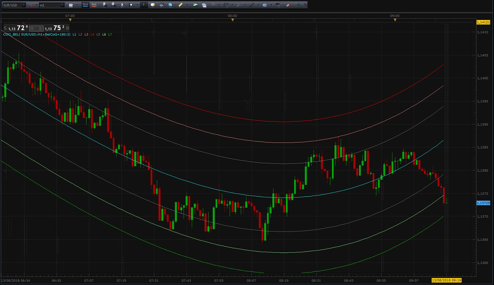
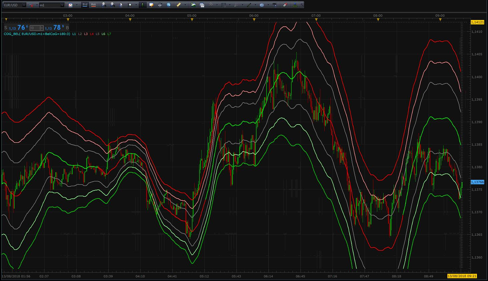

# Center of Gravity (COG)

> Source: https://fxcodebase.com/code/viewtopic.php?f=17&t=66494  
> Forum: 17 · Topic 66494 · 1 post(s)

---

## Center of Gravity (COG)

**Scrat_Power** · Mon Aug 13, 2018 6:31 am

Hi,
Here my modified version of Belkhayate CoG with new functionaties :
- Can choose between Dynamic or Static visualization
- Static version show all periods (not only NCoG period in Dynamic version)
- Show slope trend to show Dynamic history (green fo Up, red for Down)
- Can suppress levels to keep only central CoG

Dynamic version :

 

Static version :

 

Indicator file :

 [CoG_Bel.lua](files/120517/CoG_Bel.lua)

Scrat.
