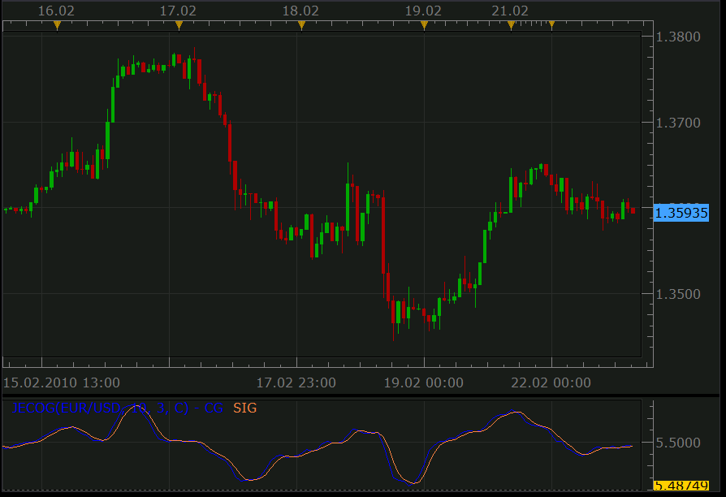

# Center Of Gravity Oscillator by John Ehlers (Upd: Jun 08)

> Source: https://fxcodebase.com/code/viewtopic.php?f=17&t=366  
> Forum: 17 · Topic 366 · 17 post(s)

---

## Center Of Gravity Oscillator by John Ehlers (Upd: Jun 08)

**Nikolay.Gekht** · Wed Feb 17, 2010 12:46 pm

Updated Jun, 06:
a) The price range is shifted to the proper area because of Marketscope bug fixed in the Apr release.
b) The weighted price is added to the list. The price calculation procedure is removed because Marketscope support median, typical and weighted prices since the Apr release.
c) The default line color is changed from blue to cyan for easier reading

Update Feb, 22: The type of the indicator was incorrectly specified as "Indicator" instead of "Oscillator". The problem is fixed. Many thanks to the user **Stardom** from [http://www.fxprogrammers.com](http://www.fxprogrammers.com)!

The COG oscillator is a John Ehler's FIR filer applied on the price. Center of Gravity actually has a zero lag and allows to define turning points precisely. This indicator is the result of Ehler's study of adaptive filters. The indicator Center of Gravity allows to identify main pivot points almost without any lag as well.

 

Download:

 [JECOG.lua](files/605/JECOG.lua)

Code: [Select all](https://fxcodebase.com/code/)
`-- Indicator profile initialization routine
function Init()
    indicator:name("John Ehlers' Center Of Gravity Indicator");
    indicator:description("");
    indicator:requiredSource(core.Bar);
    indicator:type(core.Oscillator);

    indicator.parameters:addInteger("FIR_N", "FIR (LWMA) number of periods", "No description", 10);
    indicator.parameters:addInteger("S_N", "Signal Line Smoothing Periods", "No description", 3);
    indicator.parameters:addString("PM", "Price Mode", "", "C");
    indicator.parameters:addStringAlternative("PM", "Close", "", "C");
    indicator.parameters:addStringAlternative("PM", "Median", "", "M");
    indicator.parameters:addStringAlternative("PM", "Typical", "", "T");
    indicator.parameters:addStringAlternative("PM", "Weighted", "", "W");
    indicator.parameters:addColor("CG_color", "Color of CG", "Color of CG", core.rgb(0, 255, 255));
    indicator.parameters:addColor("SIG_color", "Color of SIG", "Color of SIG", core.rgb(255, 128, 64));
end

-- Indicator instance initialization routine
-- Processes indicator parameters and creates output streams
local FIR_N;
local S_N;
local PM;

local firstCG;
local firstSIG;
local source = nil;

-- Streams block
local CG = nil;
local SIG = nil;
local PRICE;

-- Routine
function Prepare()
    FIR_N = instance.parameters.FIR_N;
    S_N = instance.parameters.S_N;
    PM = instance.parameters.PM;
    source = instance.source;
    firstCG = source:first() + FIR_N;
    firstSIG = firstCG + S_N;

    local name = profile:id() .. "(" .. source:name() .. ", " .. FIR_N .. ", " .. S_N .. ", " .. PM .. ")";
    instance:name(name);

    if PM == "C" then
        PRICE = source.close;
    elseif PM == "M" then
        PRICE  = source.median;
    elseif PM == "T" then
        PRICE  = source.typical;
    elseif PM == "W" then
        PRICE  = source.weighted;
    end
    CG = instance:addStream("CG", core.Line, name .. ".CG", "CG", instance.parameters.CG_color, firstCG);
    SIG = instance:addStream("SIG", core.Line, name .. ".SIG", "SIG", instance.parameters.SIG_color, firstSIG);
end

-- Indicator calculation routine
function Update(period)
    if period >= firstCG then
        local k, i, s, w;
        k = FIR_N;
        s = 0;
        w = 0;
        for i = period - FIR_N + 1, period, 1 do
            w = w + k * PRICE[i];
            s = s + PRICE[i];
            k = k - 1;
        end
        CG[period] = -w / s;
    end

    if period >= firstSIG then
        SIG[period] = core.avg(CG, core.rangeTo(period, S_N));
    end
end`

---

## Re: Center Of Gravity Oscillator by John Ehlers (Upd: Feb, 22)

**zekelogan** · Sun Jun 06, 2010 1:56 pm

A crossover signal for this indicator would be wonderful!

Thank you!

---

## Re: Center Of Gravity Oscillator by John Ehlers (Upd: Feb, 22)

**cruelhoax** · Mon Jun 07, 2010 12:03 am

Yeah, I would also LOVE a signal to this Oscillator when Buff 1 and Buff 2 crossover.

Any chance, please?

---

## Re: Center Of Gravity Oscillator by John Ehlers (Upd: Feb, 22)

**cruelhoax** · Mon Jun 07, 2010 12:04 am

Yes please me too!!!

---

## Re: Center Of Gravity Oscillator by John Ehlers (Upd: Feb, 22)

**one2share** · Mon Jun 07, 2010 6:39 am

I agree a crossover signal would be great

---

## Re: Center Of Gravity Oscillator by John Ehlers (Upd: Jun 08)

**Nikolay.Gekht** · Tue Jun 08, 2010 3:43 pm

Updated.
See also for the signal:
[viewtopic.php?f=29&t=1283](https://fxcodebase.com/code/viewtopic.php?f=29&t=1283)

---

## Re: Center Of Gravity Oscillator by John Ehlers (Upd: Jun 08)

**zekelogan** · Wed Jun 09, 2010 7:27 pm

Who rocks? Fxcodebase does

---

## Re: Center Of Gravity Oscillator by John Ehlers (Upd: Jun 08)

**Nikolay.Gekht** · Wed Jun 09, 2010 7:43 pm

Thank you.

---

## Re: Center Of Gravity Oscillator by John Ehlers (Upd: Jun 08)

**briansummy** · Thu Mar 22, 2012 10:23 pm

Very cool indicator!

---

## Re: Center Of Gravity Oscillator by John Ehlers (Upd: Jun 08)

**chaudhry** · Fri Mar 30, 2012 5:29 am

will appreciate if u can add over bought n over sold levels on this indi.. thanks....

---

## Re: Center Of Gravity Oscillator by John Ehlers (Upd: Jun 08)

**Apprentice** · Sat Mar 31, 2012 3:48 am

Your request is added to the development list.

---

## Re: Center Of Gravity Oscillator by John Ehlers (Upd: Jun 08)

**elsigis** · Tue Apr 24, 2012 8:08 am

I agree: overbought/oversold levels would make this indicator perfect! As it already is.
Great work guys!
Thanks.

---

## Re: Center Of Gravity Oscillator by John Ehlers (Upd: Jun 08)

**cyanidez** · Tue Apr 24, 2012 2:23 pm

I agree, oversold/overbought levels will be great!

Guys, where does the value of this ocillator come from? -5.5 as center line is very confusing, but I fully realize I might just be missing something about this indicator.

Thanks, you guys are freakin amazing at what you do - we appreciate it!

---

## Re: Center Of Gravity Oscillator by John Ehlers (Upd: Jun 08

**easytrading** · Sun Jan 11, 2015 2:06 pm

Hello Development team,

is it possible to show an arrow on the bars with direction and color maching the crossing of COG lines (green for up & red for down), please?

your help is much appreciated as always.

---

## Re: Center Of Gravity Oscillator by John Ehlers (Upd: Jun 08

**Apprentice** · Tue Jan 13, 2015 9:21 am

Can you confirm.
Up If we have CrossOver and Candle is Up
Down If there are CrossUnder and Candle is Down

---

## Re: Center Of Gravity Oscillator by John Ehlers (Upd: Jun 08

**easytrading** · Tue Jan 13, 2015 1:21 pm

UP if we have Crossover and 2 candles UP, arrow will be at the second confirmed UP candle.
Down if we have CrossUnder and 2 candles Down,arrow will be at the second confirmed Down candle.
in this way we can eliminate the false crossing signal.

many thanks in advance as always.

---

## Re: Center Of Gravity Oscillator by John Ehlers (Upd: Jun 08

**Apprentice** · Fri Sep 07, 2018 5:07 am

The indicator was revised and updated.
