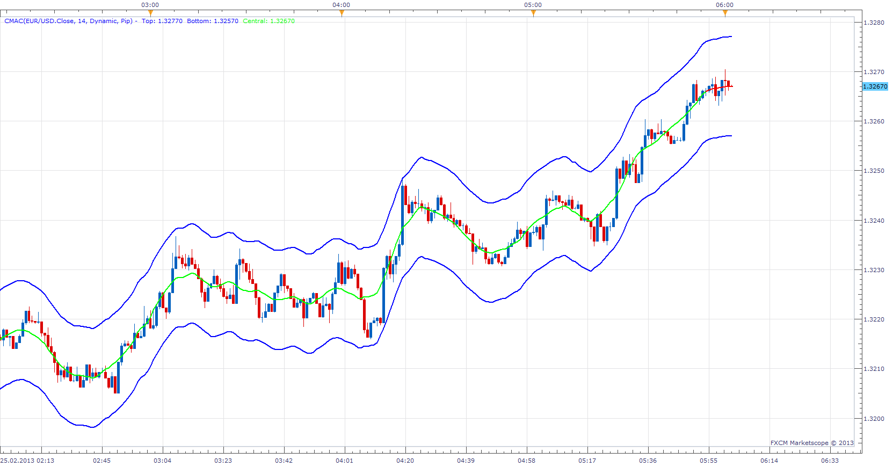
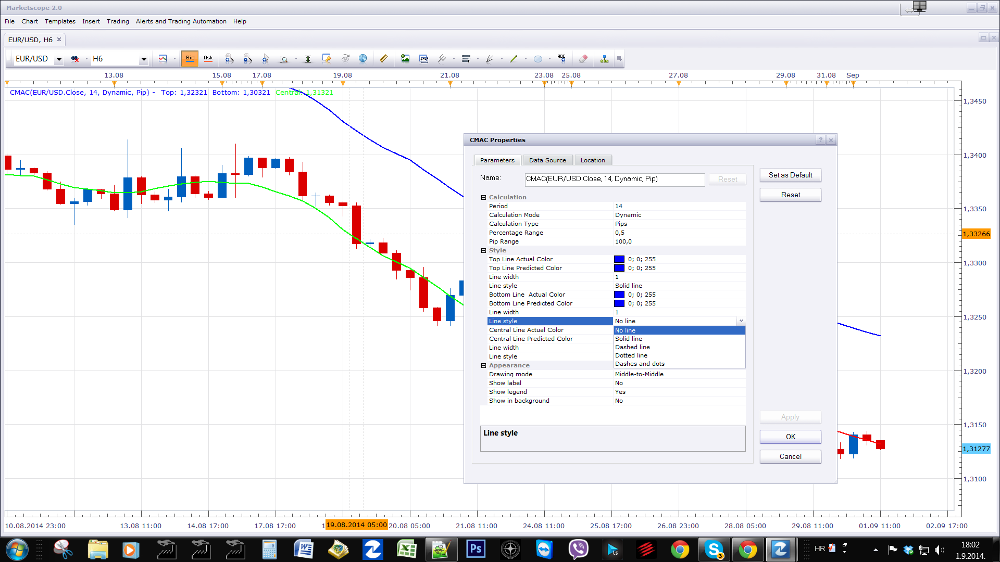

# Centred moving average Channel

> Source: https://fxcodebase.com/code/viewtopic.php?f=17&t=32423  
> Forum: 17 · Topic 32423 · 21 post(s)

---

## Centred moving average Channel

**Apprentice** · Mon Feb 25, 2013 7:26 am

Generate Channel around Centered moving average.
In pips or percentage.

 [CMAC.lua](files/55239/CMAC.lua)

To make it work install CMA.bin Indicator.
[viewtopic.php?f=17&t=24476](https://fxcodebase.com/code/viewtopic.php?f=17&t=24476)

if Mode is set to Dynamic
Yes for last Period/2 values,
they are just a projection of possible future MA value (Red Line),
indicator repaints.
if Mode is set to Static
No, indicator will not repaint.

 [OCMA CMAC.lua](files/55239/OCMA%20CMAC.lua)

 [Multiple OCMA CMAC.lua](files/55239/Multiple%20OCMA%20CMAC.lua)

OCMA CMAC will support OCMA.
OCMA is basically CMA which will support A wider selection of moving averages.
ATR and Standard deviation was introduced as additional methods for Channel calculation.

---

## Re: Centred moving average Channel

**lucmat** · Mon Feb 25, 2013 2:46 pm

Great work Apprentice

Thanks

---

## Re: Centred moving average Channel

**Apprentice** · Tue Mar 05, 2013 3:41 am

Description update.

---

## Re: Centred moving average Channel

**lucmat** · Tue Mar 05, 2013 12:46 pm

Hi Apprentice
I've test this indicator in shorter timeframe and even if it changes only last value with the change of price, suddenly it draws a big change to setup the output line.
So also with static mode, this indicator repaints?

Thanks for your helpful works

Lucmat

---

## Re: Centred moving average Channel

**Thumper** · Thu Mar 14, 2013 11:39 pm

Apprentice. Can you reduce the re paint on CMA Channel without compromising the indicator too much? Perhaps you can apply a second average to the middle line or both the upper and lower lines to simulate the same as what the indicator produces at this moment. Also you can get rid of the dynamic selection and just leave it at Static.

---

## Re: Centred moving average Channel

**Apprentice** · Sat Mar 16, 2013 8:35 am

Additional smoothing is necessary to be apply only to the central line.
Unfortunately, it will not remove the repaint.
I'd rather leave it to user selection, if it is static or dynamic.

---

## Re: Centred moving average Channel

**Apprentice** · Wed Mar 20, 2013 3:23 am

Updated

---

## Re: Centred moving average Channel

**klutzy** · Tue Aug 26, 2014 2:16 pm

Proposed CMAC extension

1. Allow user to set MA span AND channel width, perhaps also the MA type.
Each channel width could be user multiplier times SdDev or ATR [user choice of span days].

2. Allow at least two such channels, inner and outer.

3. Plus options on line style/color/width.

I would try to set outer channel to be roughly "tangent" to inner.

This would be somewhat similar to J.M. Hurst cycles.

---

## Re: Centred moving average Channel

**Apprentice** · Thu Aug 28, 2014 5:33 am

Your request is added to the development list.

---

## Re: Centred moving average Channel

**klutzy** · Sat Aug 30, 2014 7:42 pm

I downloaded the CMAC.lua and supporting CMA.bin to D:\Program Files (x86)\Candleworks\FXTS2\indicators\Standard
and liked the result. Learned, however, that line widths of 2 or 3 can reset themselves to 1.

Then I copied the first file to CMAC-Copy.lua and proved that I can make inner and outer channels by using both copies.
Unfortunately, I cannot save my settings for the composite, so still hope for programmer to develop concept.

I did like the results with inner channel span of 15 days, with outer at 31 or 61 or 121. I attach the 15-121 example.
I set the outer channel mid line to white, because CMAC does not yet have the option to hide.

Note the overlaying text box, which should have the option to suppress.

I believe that this two centered MA channel approach sort of automates trendlines and can help to reveal cycles.
I view it as a simplified, manual, alternative to Hurst analysis.

---

## Re: Centred moving average Channel

**Apprentice** · Mon Sep 01, 2014 10:59 am

U can use No Line, Line Style Option.

---

## Re: Centred moving average Channel

**Apprentice** · Mon Sep 01, 2014 11:39 am

Please test OCMA CMAC.
I have addressed all of your requests, with the exception of multiple channels.

---

## Re: Centred moving average Channel

**klutzy** · Mon Sep 01, 2014 4:56 pm

"Please test OCMA CMAC." Where?

---

## Re: Centred moving average Channel

**Apprentice** · Tue Sep 02, 2014 2:25 am

Top Most (First) Post in this Topic.

---

## Re: Centred moving average Channel

**speakinmymind** · Fri Sep 05, 2014 12:32 am

What is the difference between this and bollinger bands?

---

## Re: Centred moving average Channel

**Apprentice** · Fri Sep 05, 2014 1:57 am

Centred Moving Average Channel will use Centred Moving Average as base.
CMAC & CMAC OCMA will give you other methods for calculating the Channel.
(Pip, ATR, percentage)
Bollinger Bands only uses deviation.

---

## Re: Centred moving average Channel

**speakinmymind** · Fri Sep 05, 2014 7:23 am

That is great, could you add levels like you did with the Multi-BB indicator? Thanks!

---

## Re: Centred moving average Channel

**Apprentice** · Sun Sep 07, 2014 4:06 am

Multiple OCMA CMAC.lua Added.

---

## Re: Centred moving average Channel

**Apprentice** · Tue Jul 11, 2017 1:35 pm

The indicator was revised and updated.

---

## Re: Centred moving average Channel

**Cactus** · Thu Feb 01, 2018 10:18 pm

Hello Apprentice
Could you please develop this simple strategy using the CMAC indicator?
Much appreciated!

**Strategy parameters**
Allowed Side = Both
Allow Multiple Positions = True
Timeframe = 1 minute
Price soruce = Bid
Price type = Close

**CMAC parameters**
Period = Let user choose
Calculation mode = Static
Calculation type = "Percentage" (2)
Percentage range = Let user choose
Pip range = Let user choose

**Buy condition**
((source.open( 0 ) > CMAC.Bottom( 0 )) .and. (source.close( 0 ) < CMAC.Bottom( 0 )))
**Sell condition**
((source.open( 0 )<CMAC.Top( 0 )) .and. (source.close( 0 ) > CMAC.Top( 0 )))

**Close long positions**
(getBuyNetPL( symbol ) > var)
**Close short positions**
(getSellNetPL( symbol ) > var)

**Functions**

Code: [Select all](https://fxcodebase.com/code/)
`function getBuyNetPL(sInstrument)
    local res;
    checkSummaryRow(sInstrument);
    res = mSummaries[sInstrument];
    if res == nil then
        return 0;
    else
        return res.BuyNetPL;
    end
end`

Code: [Select all](https://fxcodebase.com/code/)
`function getSellNetPL(sInstrument)
    local res;
    checkSummaryRow(sInstrument);
    res = mSummaries[sInstrument];
    if res == nil then
        return 0;
    else
        return res.SellNetPL;
    end
end`

---

## Re: Centred moving average Channel

**Apprentice** · Sun Feb 04, 2018 6:15 am

Try this version.
[viewtopic.php?f=31&t=65693](https://fxcodebase.com/code/viewtopic.php?f=31&t=65693)
