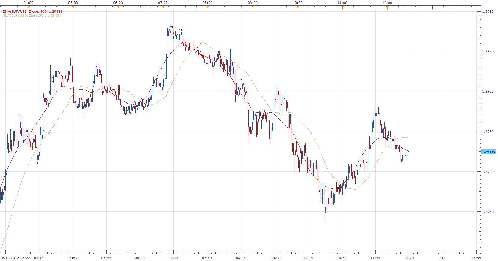

# Centred moving average

> Source: https://fxcodebase.com/code/viewtopic.php?f=17&t=24476  
> Forum: 17 · Topic 24476 · 49 post(s)

---

## Centred moving average

**Apprentice** · Mon Oct 15, 2012 12:20 pm

This indicator is basically a simple moving average,
if compared with the original, there is a notable reduction in lag time,
last Period/2 values are just a projection of possible future SMA values.

 [CMA.bin](files/42118/CMA.bin)

 [OCMA.bin](files/42118/OCMA.bin)

 

 [CMAD.lua](files/42118/CMAD.lua)

 [CMAD Histogram.lua](files/42118/CMAD%20Histogram.lua)

CMAD = CMA1 -CMA2

 [CMAS.lua](files/42118/CMAS.lua)

 [CMAS Histogram.lua](files/42118/CMAS%20Histogram.lua)

CMAS = CMA-CMA[-1]

 

CMAD Momentum = CMAD- CMAD N Perods Ago

 [CMAD Momentum.lua](files/42118/CMAD%20Momentum.lua)

---

## Re: Centred moving average

**Apprentice** · Tue Oct 16, 2012 12:16 pm

TAO= MA1-MA2

 [Two Averages Oscillator.lua](files/42174/Two%20Averages%20Oscillator.lua)

Centred moving average is one of the moving averages used.
As Centered moving average repaint,
when CMA is used, TAO will also repaint.
However i have included Static / Dynamic Mode Selector also.

---

## Re: Centred moving average

**lucmat** · Mon Oct 22, 2012 4:22 pm

Hi Apprentice!
Your works are always good!!

Do you think it's possible to build "cyclical indicator" ([seehttp://fxcodebase.com/code/viewtopic ... +indicator](seehttp://fxcodebase.com/code/viewtopic.php?f=27&t=19419&start=10&hilit=cyclical+indicator)) with this centered moving average?

Thanks

Lucmat

---

## Re: Centred moving average

**Apprentice** · Tue Oct 23, 2012 7:15 am

I post your simplified version in the Indicator Request subforum.
I have not had time for you first integral version.

---

## Re: Centred moving average

**Davids0869** · Thu Nov 08, 2012 6:21 am

Hi Appendice, Hello, I would like to know if it is possible at first to have a program which gives a signal of purchase or sale according to three different oscillators in the same graph. A first signal of purchase (1 lot) when 2 two average oscillator are increasing and the second (3 lots) when 3 are increasing. You've an interpretation in this following graph for a short.

> **Apprentice wrote:**
>
>
> The attachment **Two Averages Oscillator.png** is no longer available
>
>
> TAO= MA1-MA2
>
>
> The attachment **Two Averages Oscillator.png** is no longer available
>
>
>
> Centred moving average is one of the moving averages used.
> As Centered moving average repaint,
> when CMA is used, TAO will also repaint.
> However i have included Static / Dynamic Mode Selector also.

---

## Re: Centred moving average

**Apprentice** · Fri Nov 09, 2012 6:14 am

Yes, this is possible.
But i am not sure, CMA is best choice.
Because CMA repaints,
Historical, backtest is meaningless,
trading, in current (last) period is possible...
But I guess with lot of changes in indications.
Write trading algorithm conditions, we can try...

---

## Re: Centred moving average

**Davids0869** · Fri Nov 09, 2012 2:14 pm

Thank you Apprentice, I propose that (for short):

Code: [Select all](https://fxcodebase.com/code/)
`Value for CMA1 = N
Value for CMA2 = 2*N     ,       TAO1=CMA1-CMA2     
Value for CMA3 = 4*N     ,       TAO2=CMA2-CMA3
Value for CMA4 = 8*N     ,       TAO3=CMA3-CMA4

Period = 4*N

Maximum = MAX[PERIOD](close)
Minimum = MIN[PERIOD](close)

G = (CMA2 + CMA3 + CMA4) /3

IF close > G then
C = 1
else C = 0
Endif

IF CMA2 < CMA2[1] then
   C1 = 1
   Else C1 = 0
Endif

IF CMA3 < CMA3[1] then
   C2 = 1
   Else C2 = 0
Endif

IF CMA4 < CMA4[1]  then
   C3 = 1
   Else C3 = 0
Endif

X = C1 + C2 + C3

IF X = 2 and C = 1 and not short on market then
sell 1 lot
Target = G 
Endif

IF X = 3 and C = 1  then
sell 2 lots
Target = 2* G  - MAXIMUM
Endif

The same for long with condition ">" in place of "<", and C = 0  and  MINIMUM in place of MAXIMUM to calculate Target when buy 2 lots.`

If you have any question don't hesitate to contact me.

David.

> **Apprentice wrote:**
> Yes, this is possible.=
> But i am not sure, CMA is best choice.
> Because CMA repaints,
> Historical, backtest is meaningless,
> >Gtrading, in current (last) period is possible...
> But I guess with lot of changes in indications.
> Write trading algorithm conditions, we can try...

---

## Re: Centred moving average

**Davids0869** · Sun Nov 11, 2012 6:19 am

Maybe there is a particular condition for the calculation of G (and of course the new target). It is a mobile point and I think that we could fix it when the price crosses G. At this moment there we shall have defined the new target of exit of the trade.

---

## Re: Centred moving average

**Tigre3** · Sat Nov 24, 2012 6:26 am

Could you make a version that shows with a different type of line where there's projection of the MA?

For example
If you have a CMA(10) the last 5 value is just a projection, right? Well, I'm looking for an indicator that shows this projection with a different type of line such as if the CMA is a line, the projection will be a dotted line.. in this way I can know where the will probably repaint.

The options should be like this:
Type of line: [listbox with the different kind of line]
Type of projection: [listbox with the different kind of line]

Thanks

---

## Re: Centred moving average

**Apprentice** · Sat Nov 24, 2012 6:42 am

This is possible.
But i will prefer different Color, not Style difference, compatibility issue,
for line style i have to use two streams, not one as now.
Is this satisfactory.

---

## Re: Centred moving average

**Tigre3** · Sat Nov 24, 2012 6:45 am

> **Apprentice wrote:**
> This is possible.
> But i will prefer different Color, not Style difference, compatibility issue,
> for line style i have to use two streams, not one as now.
> Is this satisfactory.

Ok, no problem, it's ok too

---

## Re: Centred moving average

**Apprentice** · Sun Nov 25, 2012 5:59 am

Prediction Color Added.

---

## Re: Centred moving average

**arstechnica** · Sun Nov 25, 2012 9:43 am

Dear Mario,

it should be very usefull and I suppose simple to create a CMA speed curve to plot on the graph.

CMA speed: CMA(period)- CMA (Period-1)

Alnd also another curve:

CMA difference: CMA1-CMA2

to plot on the graph.

Please make this possible

Regards

Salvatore

---

## Re: Centred moving average

**Apprentice** · Sun Nov 25, 2012 11:12 am

For CMA difference try Two Averages Oscillator.

---

## Re: Centred moving average

**arstechnica** · Sun Nov 25, 2012 1:51 pm

I know that is almost the same, but I need the difference to be plot on the chart. The same for the speed.

They are both very usefull for cyclic analisys

Can you make this 2 very fast indicators?

Regards

Salvatore

---

## Re: Centred moving average

**Apprentice** · Sun Nov 25, 2012 2:52 pm

Both Added to topmost post.

---

## Re: Centred moving average

**Tigre3** · Sun Nov 25, 2012 3:38 pm

Could you make a speed indicator for the CMADifference too?

Something like this:

CMADSpeed= CMAD[]-CMAD[-1]

Thanks:)

(With this indicator you fulfill my request in this topic: [http://fxcodebase.com/code/viewtopic.php?f=27&t=24602&p=42392#p42392](https://fxcodebase.com/code/viewtopic.php?f=27&t=24602&p=42392#p42392))

---

## Re: Centred moving average

**arstechnica** · Mon Nov 26, 2012 1:34 am

Dear Mario,

thank You for your fast reply.

There is something wrong in the calculation of CMAD and CMAS

CMAD must be = CMA(period1)-CMA(period2) calculated in the same bar. If I plot CMA1 andCMA2 and then CMAD the result it is not the difference actually

CMAS need only one period, actually we have 2 periods:

CMAS = CMA (actual bar)- CMA (BAR-1)

I apologise if I was not clear in my request.

Please update the indicators.

Regards

Salvatore

---

## Re: Centred moving average

**Apprentice** · Mon Nov 26, 2012 4:06 am

Is not your fault.
I have correct formula.
Unfortunately I mix up the names.
Corrected.

---

## Re: Centred moving average

**arstechnica** · Mon Nov 26, 2012 6:32 am

Thank You,

now works well..

Just on thing:

Id I put on CMAD 25 and 50 as periods it explode.. with other periods it work well

---

## Re: Centred moving average

**Apprentice** · Mon Nov 26, 2012 7:02 am

I have added a fix for this problem.
Not a perfect solution, but better from older versions.

In fact I have a problem with CMA, not with CMAD.
All odd periods are not allowed.

---

## Re: Centred moving average

**Apprentice** · Mon Nov 26, 2012 7:52 am

CMA updated.

---

## Re: Centred moving average

**Apprentice** · Mon Nov 26, 2012 11:42 am

Tigre3 try CMAD Momentum Indicator.

---

## Re: Centred moving average

**arstechnica** · Tue Nov 27, 2012 8:26 am

I have a problem with CMAD.

If I put as period 200 and 400 it work strange.

On daily it works as I change from daily to h4 or h1 it explode...

---

## Re: Centred moving average

**Apprentice** · Tue Nov 27, 2012 2:22 pm

New Version of CMA will fix things.
Download it from top most post.

---

## Re: Centred moving average

**Tigre3** · Thu Nov 29, 2012 11:23 am

I've a problem with the CMAD..

With 15 - 30 setting it shows an horizontal line

---

## Re: Centred moving average

**Apprentice** · Thu Nov 29, 2012 11:49 am

Try to installed a new version of CMA.bin.
That should fix things.

---

## Re: Centred moving average

**Davids0869** · Thu Nov 29, 2012 2:45 pm

Hi Tigre3. You can have on the same graph CMA10 with the "projection" and an other CMA with the indicators (shift MVA). In this example you have three CMA (blue, pink and red represented with a line ) and three other CMA (with shift MVA) represented with big point in superposition. It's easy to see where the repainting is beginning.
David.

> **Tigre3 wrote:**
> Could you make a version that shows with a different type of line where there's projection of the MA?
>
> For example
> If you have a CMA(10) the last 5 value is just a projection, right? Well, I'm looking for an indicator that shows this projection with a different type of line such as if the CMA is a line, the projection will be a dotted line.. in this way I can know where the will probably repaint.
>
>
> The options should be like this:
> Type of line: [listbox with the different kind of line]
> Type of projection: [listbox with the different kind of line]
>
> Thanks

---

## Re: Centred moving average

**Davids0869** · Thu Nov 29, 2012 2:58 pm

Tigre3 and Arstechnica to solve your problem, you do not have to put of odd number in your indicator TAO. If you replace 15 by 14 or 16 and 25 by 24 or 26 you obtain a correct result without this line which disrupts your indicator.
David

> **Tigre3 wrote:**
> I've a problem with the CMAD..
>
> With 15 - 30 setting it shows an horizontal line

---

## Re: Centred moving average

**lucmat** · Mon Feb 25, 2013 4:39 am

Dear Apprentice
is it possible to build an indicator that draws a channel using the centered moving average as center line?
In other words, to build this channel, a number (selected by user) must be added and subtracted to the centered moving average.
Thanks

Lucmat

---

## Re: Centred moving average

**Apprentice** · Mon Feb 25, 2013 7:27 am

Requested can be found here.
[viewtopic.php?f=17&t=32423](https://fxcodebase.com/code/viewtopic.php?f=17&t=32423)

---

## Re: Centred moving average

**gianpierobn** · Mon Mar 18, 2013 3:27 am

would be possible to display CMADifference and CMDA momentum directly on the chart index?
using a new scale on the left of the graph?

thanks....

---

## Re: Centred moving average

**Apprentice** · Mon Mar 18, 2013 5:31 am

You mean, to have both indicators on one chart simultaneously.

---

## Re: Centred moving average

**gianpierobn** · Tue Mar 19, 2013 7:45 am

> **Apprentice wrote:**
> You mean, to have both indicators on one chart simultaneously.

yes, and drawn in the same chart area index, like a Ema.
would be much easier to use. in a single graph, there would be the representation of the cycle and of its speed...

---

## Re: Centred moving average

**Apprentice** · Wed Mar 20, 2013 3:52 am

Several indicators was updated.

---

## Re: Centred moving average

**Apprentice** · Fri Mar 22, 2013 11:27 am

Support added for EMA, LWMA, TMA, SMMA, KAMA, VIDYA, WMA

---

## Re: Centred moving average

**Alexander.Gettinger** · Wed Aug 14, 2013 2:26 pm

MQL4 version of Centred moving average: [http://www.fxcodebase.com/code/viewtopi ... 38&t=59119](http://www.fxcodebase.com/code/viewtopic.php?f=38&t=59119)

---

## Re: Centred moving average

**virgilio** · Fri Nov 01, 2013 3:37 pm

hello, I am not sure if this can even be done, but is it possible to have the CMA (Centred Moving Average) static without repainting? Any way at all?

---

## Re: Centred moving average

**Apprentice** · Sat Nov 02, 2013 2:46 am

Possible, but not practical.
Because the historical and live calculations will then use different algorithm.
And with this said, incomparable, with each other or with the moving average.

---

## Re: Centred moving average

**Apprentice** · Tue Jul 08, 2014 11:39 am

CMAD Histogram.lua & CMAS Histogram.lua Added.

---

## Re: Centred moving average

**Apprentice** · Tue May 10, 2016 3:25 am

Minor Update.

---

## Re: Centred moving average

**Apprentice** · Wed Sep 06, 2017 5:13 am

The indicator was revised and updated.

---

## Re: Centred moving average

**projection** · Tue Oct 31, 2017 7:19 am

Hi Apprentice,

Where can I get CMA for meta trader 4? Could not find on mql4.

Regards,

---

## Re: Centred moving average

**projection** · Wed Nov 01, 2017 1:59 am

Hi FXcodebase,

I request to kindly make CMA for mq4. Indicator would be great. The good thing is that CMA can be used for future projections.

Regards,

---

## Re: Centred moving average

**Apprentice** · Thu Nov 02, 2017 5:08 pm

Your request is added to the development list under Id Number 3937

---

## Re: Centred moving average

**Alexander.Gettinger** · Mon Nov 06, 2017 1:36 pm

> **projection wrote:**
> Hi FXcodebase,
>
> I request to kindly make CMA for mq4. Indicator would be great. The good thing is that CMA can be used for future projections.
>
> Regards,

MT4 version of CMA indicator: [viewtopic.php?f=38&t=65339](https://fxcodebase.com/code/viewtopic.php?f=38&t=65339)

---

## Re: Centred moving average

**Apprentice** · Mon Apr 09, 2018 6:36 am

The indicator was revised and updated.

---

## Re: Centred moving average

**Gilles** · Sat Apr 01, 2023 11:20 am

Hi Apprentice,
Could we obtain the LUA code of the CMA.bin file to understand how you managed to display this moving average on the screen ?
How did you obtain the current period ?
Did you apply an adjustment by an affine function to obtain the current period or another method ?
If so, I am curious to see how you did it.
This may explain why the indicator repaints.
I am very curious to see/understand your code to achieve this result.
It will certainly be very instructive.

Thank you in advance for your response.

---

## Re: Centred moving average

**Apprentice** · Mon Apr 03, 2023 7:50 am

Unfortunately, I don't have permission to share the code.
