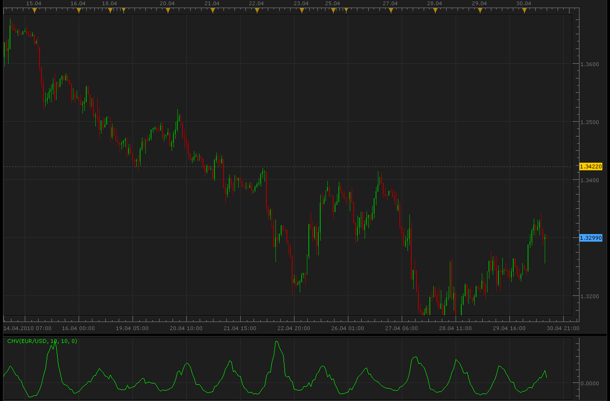

# Chaikin Volatility Oscillator (CHV)

> Source: https://fxcodebase.com/code/viewtopic.php?f=17&t=894  
> Forum: 17 · Topic 894 · 4 post(s)

---

## Chaikin Volatility Oscillator (CHV)

**Alexander.Gettinger** · Fri Apr 30, 2010 11:18 am

Chaikin's volatility indicator calculates the spread between the maximum and minimum prices. It judges the value of volatility basing on the amplitude between the maximum and the minimum.
According to Chaikin's interpretation, a growth of volume indicator in a relatively short space of time means that the prices approach their minimum (like when the securities are sold in panic), while a decrease of volatility in a longer period of time indicates that the prices are on the peak (for example, in the conditions of a mature bull market).

Calculations:

H-L(i) = HIGH (i) - LOW (i)
H-L(i - 10) = HIGH (i - 10) - LOW (i - 10)
CHV = (EMA (H-L (i), 10) - EMA (H-L (i - 10), 10)) / EMA (H-L (i - 10), 10) * 100

Where:
HIGH (i) — maximum price of current bar;
LOW (i) — minimum price of current bar;
HIGH (i - 10) — maximum price of the bar ten positions away from the current one;
LOW (i - 10) — minimum price of the bar ten positions away from the current one;
H-L (i) — difference between the maximum and the minimum price in the current bar;
H-L (i - 10) — difference between the maximum and the minimum price ten bars ago;
EMA — exponential moving average.

 

 [CHV.lua](files/1636/CHV.lua)

Version with additional averaging methods.

 [Chaikin Volatility Oscillator.lua](files/1636/Chaikin%20Volatility%20Oscillator.lua)

The indicator was revised and updated

---

## Re: Chaikin Volatility Oscillator (CHV)

**Apprentice** · Mon Dec 26, 2016 7:27 am

Indicator was revised and updated.

---

## Re: Chaikin Volatility Oscillator (CHV)

**fxlion** · Mon Dec 26, 2016 8:45 am

hi

can u create strategy based on this indiator

parameters:
smoothening period :10
roc period:10
type of smooth:0

buy level:0
sell level:0

buy: chv cross over buy level
sell: chv crossunder sell levell

---

## Re: Chaikin Volatility Oscillator (CHV)

**Apprentice** · Tue Dec 27, 2016 5:39 am

Try this version.
[viewtopic.php?f=31&t=64250](https://fxcodebase.com/code/viewtopic.php?f=31&t=64250)
