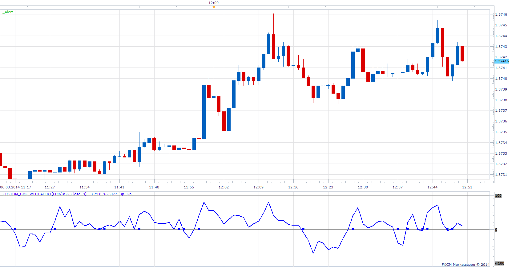

# Chande Momentum Oscillator with Alert

> Source: https://fxcodebase.com/code/viewtopic.php?f=17&t=60411  
> Forum: 17 · Topic 60411 · 6 post(s)

---

## Chande Momentum Oscillator with Alert

**Apprentice** · Thu Mar 06, 2014 6:51 am

 [Custom_CMO with Alert.lua](files/93075/Custom_CMO%20with%20Alert.lua)

This indicator provides Audio / Email Alerts if and when CMO cross over/under central Zero Line.

The indicator was revised and updated

---

## Re: Chande Momentum Oscillator with Alert

**xpertizetrading** · Wed Dec 10, 2014 11:15 pm

Is it possible to code a strategy with this indicator (Chande Momentu Oscillator)

Buy: Cross over 50
Sell: Cross under 50

Allowed Side: Buy/Sell/Both

Regards,
xpertizetrading

---

## Re: Chande Momentum Oscillator with Alert

**Apprentice** · Fri Dec 12, 2014 4:45 am

Your request is added to the development list.

---

## Re: Chande Momentum Oscillator with Alert

**Apprentice** · Fri Dec 12, 2014 6:44 am

Requested can be found here.
[viewtopic.php?f=31&t=61589](https://fxcodebase.com/code/viewtopic.php?f=31&t=61589)

---

## Re: Chande Momentum Oscillator with Alert

**Apprentice** · Sun Dec 06, 2015 7:02 am

Compatibility issue fixed.
_Alert Helper is not longer needed.

---

## Re: Chande Momentum Oscillator with Alert

**Apprentice** · Fri Jul 21, 2017 9:02 am

The indicator was revised and updated.
