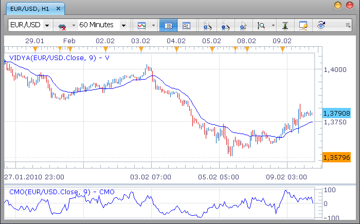
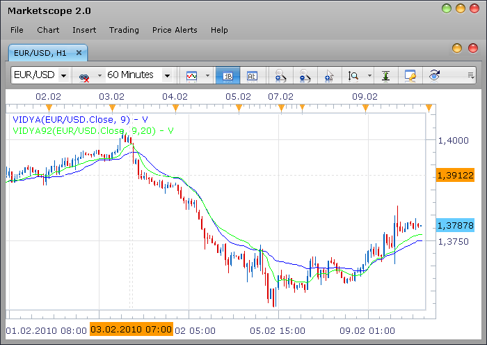

# Chande's Momentum Osc. and Variable Index Dyn. Avg. (Vidya)

> Source: https://fxcodebase.com/code/viewtopic.php?f=17&t=301  
> Forum: 17 · Topic 301 · 9 post(s)

---

## Chande's Momentum Osc. and Variable Index Dyn. Avg. (Vidya)

**Nikolay.Gekht** · Tue Feb 09, 2010 8:40 pm

**Chande’s Momentum Oscillator and Variable Index Dynamic Average (VIDYA)**

The VIDYA is similar to the exponential moving average (EMA) but automatically adjusts the smoothing weight based on the volatility of the prices.
The VIDYA was developed by Tushar Chande and presented in March, 1992 in “Technical Analysis of Stocks & Commodities” magazine. In the first version, a standard deviation was used as the Volatility Index. In October, 1995 Chande modified the VIDYA to use a new Chande Momentum Oscillator (CMO) as the Volatility Index.

CMO(n) formula is:
D[i] = PRICE[i] – PRICE[i – 1]
CMO1[i] = IF D[i] > 0 THEN D[i] ELSE 0
CMO2[i] = IF D[i] < 0 THEN -D[i] ELSE 0
S1[i] = SUM(CMO1 for last n periods before i)
S2[i] = SUM(CMO2 for last n periods before i)
CMO[i] = (S1[i] - S2[i]) / (S1[i] + S2[i]) * 100

VIDYA(n) Formula is
K = 2 / (n + 1)
SC[i] = ABS(CMO(n)[i])
VIDYA[i] = K * SC * PRICE[i] + (1 – K * SC) * VIDYA[I - 1]

Just for information: the original VIDYA(short, long) formula were
K = 2 / (short + 1)
SC = STDEV(PRICE for last short periods before i) / STDEV(PRICE for last long periods before i)
VIDYA[i] = K * SC * PRICE[i] + (1 – K * SC) * VIDYA[I - 1]

 

Download:

 [CMO.lua](files/523/CMO.lua)

See also absolute CMO below ([viewtopic.php?f=17&t=301#p1250](https://fxcodebase.com/code/viewtopic.php?f=17&t=301#p1250))

 [VIDYA.lua](files/523/VIDYA.lua)

The indicator was revised and updated

---

## Vidya in 1992 edition (stdev-based)

**Nikolay.Gekht** · Tue Feb 09, 2010 9:05 pm

Compare the Vidya (blue) and Vidya92 (green) at the chart:

 

Code: [Select all](https://fxcodebase.com/code/)
`-- Indicator profile initialization routine
function Init()
    indicator:name("Chande's Variable Index Dynamic Average 1992 version");
    indicator:description("");
    indicator:requiredSource(core.Tick);
    indicator:type(core.Indicator);

    indicator.parameters:addInteger("S", "Short range", "", 9);
    indicator.parameters:addInteger("L", "Long range", "", 20);
    indicator.parameters:addColor("V_color", "Color of the line", "Color of the line", core.rgb(0, 0, 255));
end

-- Indicator instance initialization routine
local S;
local L;
local sc;

local first;
local first_cm;
local source = nil;

-- Streams block
local V = nil;

-- Routine
function Prepare()
    S = instance.parameters.S;
    L = instance.parameters.L;
    source = instance.source;
    first = source:first() + L;
    sc = 2 / (S + 1);
    local name = profile:id() .. "(" .. source:name() .. ", " .. S .. "," .. L .. ")";
    instance:name(name);
    V = instance:addStream("V", core.Line, name, "V", instance.parameters.V_color, first);
end

-- Indicator calculation routine
function Update(period)
    if period == first then
        V[period] = source[period];
    elseif period > first then
        local p, cmo, s1, s2;
        p = core.rangeTo(period, S);
        s1 = core.stdev(source, p);
        p = core.rangeTo(period, L);
        s2 = core.stdev(source, p);
        cmo = s1 / s2;
        V[period] = sc * cmo * source[period] + (1 - sc * cmo) * V[period - 1];
    end
end`

Download:

 [VIDYA92.lua](files/525/VIDYA92.lua)

---

## Re: Chande's Momentum Osc. and Variable Index Dyn. Avg. (Vidya)

**jagui_fx** · Sat Feb 13, 2010 4:47 pm

Thank you.
This is exactly the indicator I was starting to code myself...
This version of the variable moving average is VERY useful, if you know how to use it.

---

## Re: Chande's Momentum Osc. and Variable Index Dyn. Avg. (Vidya)

**michaelwen** · Thu Apr 15, 2010 10:24 pm

do you have indicator call: Absolute CMO? thanks

---

## Re: Chande's Momentum Osc. and Variable Index Dyn. Avg. (Vidya)

**Nikolay.Gekht** · Sun Apr 18, 2010 1:42 pm

Oh, I see. Absolute CMO is just a
Abs(CMO) / 100 (referring to [http://www.meta-formula.com/Metastock-Formulas-B1.html](http://www.meta-formula.com/Metastock-Formulas-B1.html)).
So, it's easy to modify the CMO indicator to absolute CMO.

1) Remove levels (because AbsCMO gives other scale)
2) Change the calculation formula to CMO[period] = math.abs((s1 - s2) / (s1 + s2) * 100) / 100;

The code of the indicator is below

Code: [Select all](https://fxcodebase.com/code/)
`-- Indicator profile initialization routine
    function Init()
        indicator:name("Absolute Chande Momentum Oscillator");
        indicator:description("");
        indicator:requiredSource(core.Tick);
        indicator:type(core.Oscillator);

        indicator.parameters:addInteger("P", "Periods", "", 9);
        indicator.parameters:addColor("CMO_color", "Color of the line", "Color of the line", core.rgb(0, 0, 255));
    end

    -- Indicator instance initialization routine
    local P;
    local sc;

    local first;
    local first_cm;
    local source = nil;

    -- Streams block
    local cmo1 = nil;
    local cmo2 = nil;
    local CMO = nil;

    -- Routine
    function Prepare()
        P = instance.parameters.P;
        source = instance.source;
        first_cm = source:first() + 1;
        first = first_cm + P;
        sc = 2 / (P + 1);
        local name = profile:id() .. "(" .. source:name() .. ", " .. P .. ")";
        instance:name(name);
        cmo1 = instance:addInternalStream(first_cm, 0);
        cmo2 = instance:addInternalStream(first_cm, 0);
        CMO = instance:addStream("CMO", core.Line, name, "CMO", instance.parameters.CMO_color, first);
        CMO:addLevel(0);
        CMO:addLevel(1);
    end

    -- Indicator calculation routine
    function Update(period)
        cmo1[period] = 0;
        cmo2[period] = 0;

        if period >= first_cm then
            -- calculate CMO
            local diff;
            diff = source[period] - source[period - 1];
            if diff > 0 then
                cmo1[period] = diff;
            elseif diff < 0 then
                cmo2[period] = -diff;
            end
        end

        if period >= first then
            local p, cmo, s1, s2;
            p = core.rangeTo(period, P);
            s1 = core.sum(cmo1, p);
            s2 = core.sum(cmo2, p);
            --CMO[period] = (s1 - s2) / (s1 + s2) * 100;
            CMO[period] = math.abs((s1 - s2) / (s1 + s2) * 100) / 100;
        end
    end`

Download the indicator:

 [AbsCMO.lua](files/1250/AbsCMO.lua)

---

## Re: Chande's Momentum Osc. and Variable Index Dyn. Avg. (Vidya)

**michaelwen** · Sun Apr 18, 2010 2:48 pm

Thanks Mr Nikolay. I will test this indicator. thanks again for your time.

Michael

---

## Re: Chande's Momentum Osc. and Variable Index Dyn. Avg. (Vidya)

**marmax** · Tue May 08, 2012 4:27 pm

Hello to everybody,
i just join fxcodebase and i have no trading experience, although i practised some strategies based on a my adaptation of standard indicators, via a platform (prorealtime).
I'm just starting with loading some indicator on marketscope and see what happens. One of the first indicator i loaded is the Vidya.lue file, since i already experienced it on the other platform, and changed it by using as smoothing for exaple the VHF instead of the CMO. Something that sound strange to me is that the Vidya seems by far the worst moving average , even if compared to a simple moving average. The Kama much more reactive.For example with a period of 20 the lag of Vidya seems more than clear. Perhaps my memory about the Vidya reactivity are groundless, or perhaps i never understood how to use it. But seems to be a confirmation the fact that the other proposed Vidya92.lua behaves "properly", even with short and long range both equal to 20.
I would like also to kindly ask you some suggestion on how to vary the Vidya (or any other variable moving average) in order to use two different periods for the calculation of the smoothing and of the Vidya itself

---

## Re: Chande's Momentum Osc. and Variable Index Dyn. Avg. (Vid

**prodealing1** · Thu Feb 16, 2017 7:19 am

I am having a issue with the VIDYA 92 Indicator, when its operating in the FRACTAL_ALLIGATOR_SYSTEM Strategy using the FXCM Trading Station platform.
The error message I am having is C44,-1:E19-Specified Index Is Out Of Range.

Can I have some assistance with this error message please.

---

## Re: Chande's Momentum Osc. and Variable Index Dyn. Avg. (Vid

**Apprentice** · Fri Feb 17, 2017 9:50 am

Two things.
1) Re-Download your indicator.
2) Can you provide a link for mentioned strategy
