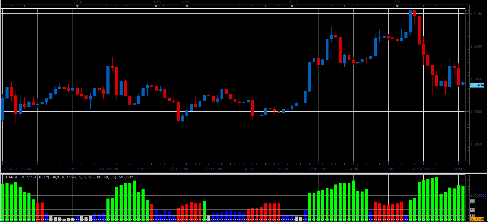

# Change of Volatility oscillator

> Source: https://fxcodebase.com/code/viewtopic.php?f=17&t=10398  
> Forum: 17 · Topic 10398 · 4 post(s)

---

## Change of Volatility oscillator

**Alexander.Gettinger** · Sun Dec 25, 2011 2:11 pm

This indicator is a ported MQL5 indicator from [http://www.mql5.com/ru/code/773](http://www.mql5.com/ru/code/773) (in Russian).

Formula:
CoV=100*StdDev(Short)/StdDev(Long), where
StdDev - standard deviation form Momentum indicator.

 

Download:

 [Change_Of_Volatility.lua](files/21607/Change_Of_Volatility.lua)

For this oscillator must be installed Momentum ([viewtopic.php?f=17&t=896&p=19407](https://fxcodebase.com/code/viewtopic.php?f=17&t=896&p=19407)) and StdDev ([viewtopic.php?f=17&t=870&p=1577](https://fxcodebase.com/code/viewtopic.php?f=17&t=870&p=1577)) indicators.

The indicator was revised and updated

---

## Re: Change of Volatility oscillator

**Vengerskiy Ivan** · Wed May 30, 2012 5:00 am

Hello Alexander!

Your indicator is very, very nice and well to use!!!

I have got one request. Can you add to indicator the signal (screen alert and sound)? Because the "Strategy Builder.lua" not supports the CoV and I need signals for my strategy.

Thank you and have a nice day!

---

## Re: Change of Volatility oscillator

**Apprentice** · Thu May 31, 2012 3:00 am

Can you contact me on my private mail.

---

## Re: Change of Volatility oscillator

**Apprentice** · Tue Apr 04, 2017 6:01 am

Indicator was revised and updated.
