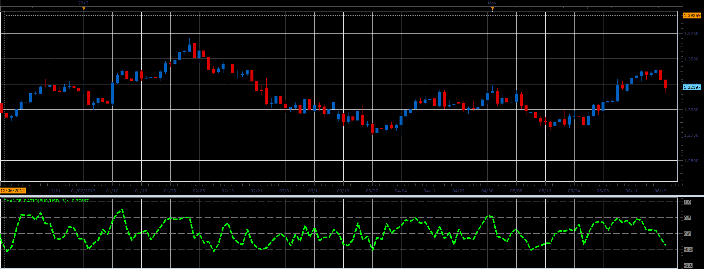

# Change ratio oscillator

> Source: https://fxcodebase.com/code/viewtopic.php?f=17&t=41580  
> Forum: 17 · Topic 41580 · 3 post(s)

---

## Change ratio oscillator

**Alexander.Gettinger** · Thu Jun 20, 2013 3:15 pm

This indicator is a ported MQL5 indicator from [http://www.mql5.com/ru/code/1759](http://www.mql5.com/ru/code/1759) (in Russian).

Formulas:
Change Ratio[i] = (Close[i]-Close[i-Period)/sum, where
sum = sum of Ratio from (i-Period+1) to i,
Ratio[i] = High[i]-Low[i].

 

Download:

 [Change_Ratio.lua](files/67862/Change_Ratio.lua)

The indicator was revised and updated

---

## Re: Change ratio oscillator

**Alexander.Gettinger** · Thu Jun 20, 2013 3:17 pm

MQL4 version of Change ratio oscillator: [viewtopic.php?f=38&t=41581](https://fxcodebase.com/code/viewtopic.php?f=38&t=41581)

---

## Re: Change ratio oscillator

**Apprentice** · Thu Jun 01, 2017 9:56 am

Indicator was revised and updated.
