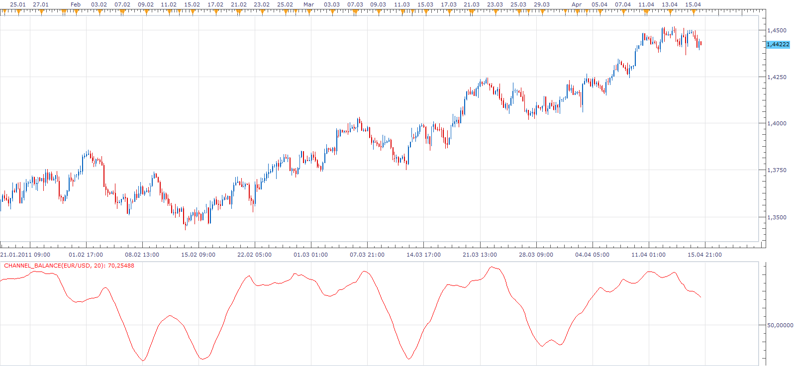

# Channel Balance

> Source: https://fxcodebase.com/code/viewtopic.php?f=17&t=3941  
> Forum: 17 · Topic 3941 · 3 post(s)

---

## Channel Balance

**Apprentice** · Sat Apr 16, 2011 12:27 pm

 [Channel_Balance.lua](files/9744/Channel_Balance.lua)

The indicator was revised and updated

---

## Re: Channel Balance

**Alexander.Gettinger** · Tue Nov 25, 2014 11:19 am

MQL4 version of Channel Balance oscillator: [viewtopic.php?f=38&t=61538](https://fxcodebase.com/code/viewtopic.php?f=38&t=61538).

---

## Re: Channel Balance

**Apprentice** · Mon Jun 26, 2017 10:24 am

The indicator was revised and updated.
