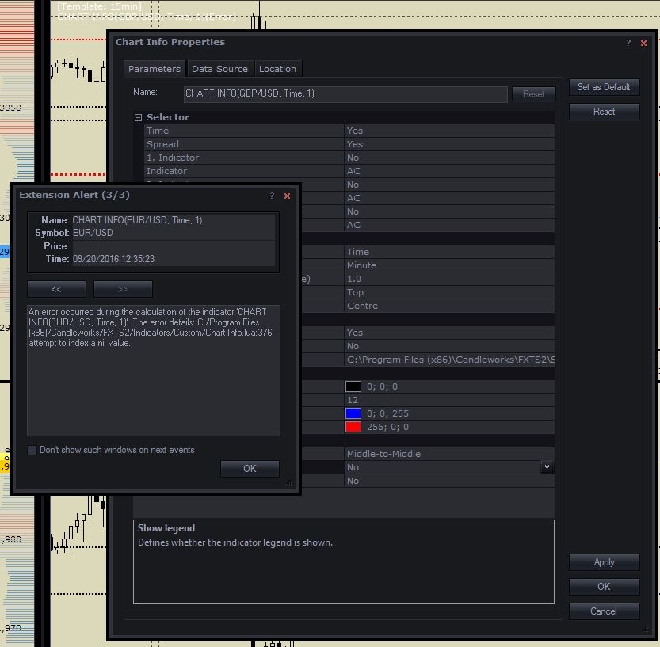

# Chart Info

> Source: https://fxcodebase.com/code/viewtopic.php?f=17&t=61866  
> Forum: 17 · Topic 61866 · 33 post(s)

---

## Chart Info

**Apprentice** · Tue Feb 24, 2015 2:29 am

Based on request.
[viewtopic.php?f=27&t=61840&p=98738&hilit=Info+in+charts#p98738](https://fxcodebase.com/code/viewtopic.php?f=27&t=61840&p=98738&hilit=Info+in+charts#p98738)
Will provide.
1. Time till candle end
2. Spread
3 Up to three indicator values.

 [Chart Info.lua](files/98821/Chart%20Info.lua)

---

## Re: Chart Info

**daniel.kovacik** · Tue Feb 24, 2015 8:13 am

Hello,

thanks for this...

Could you please add these?:
- possibility to add more indicators, I would like to have there RSI, CCI, SSD, SFK, CMO, MACD.
- also, I cant add ATR pips indicator on daily timeframe.. I couldnt even find it in my indicator list when I wanted to apply it, so I had try other ATR...
- could you please add possibility to create font style (bold)
- maybe there is a bug because it doesnt change colour when it goes up or down.
- also, please could you erase words from the chart, just numbers are ok...
- also, about ATR pips indicator... could you add it with possibility to change timeframe: for example: D1, period 14 with multiplier.

Again thank you very much for so quick response
Best regards
DK

---

## Re: Chart Info

**SavvyStrategist** · Fri Jun 19, 2015 10:47 am

Another thank you is in order, I believe, and another request.

Would it be possible to make it so that the first line of the indicator (time thill end: HH:MM:SS) is considerably reduced in size? I'm trying to make it as small and uninvasive as possible. There's an option to determine the time period (units) to be displayed, but this changes nothing I reckon. Basically, I'd like for the "time thill end: " line to be removed entirely and the "unit" option to determine whether it will be displayed as "HH:MM" or "MM:SS". As it stands, when the candle closes and before the next tick (that is to say, before the next candle opens), the indicator shows to "Time thill end: ", but if that line is removed the indicator would flash in and out of existence. Could that be replaced simply with 00:00?

Furthermore, the indicator does not change when the time frame is altered; this is a minor issue as it can be done manually, but still worth noting.

Lastly, I'd like another option to be added: a color change when the remaining time is below, say, a certain percentage (preferable, as it'd allow for easily changing time frames without having to modify the indicator manually) or a certain amount (in HH:MM:SS).

---

## Re: Chart Info

**Apprentice** · Mon Jun 22, 2015 2:58 am

U can use "Font Size" to define the font size.

00:00:00 Added.

Indicator should update immediately, within one second,
after time frame change.

---

## Re: Chart Info

**rtsayers** · Sat Feb 06, 2016 2:06 am

Every time I load my charts this indicator responds with error and then I have to reload then it works again??

---

## Re: Chart Info

**Apprentice** · Mon Feb 08, 2016 4:48 am

Audio Alert compatibility issue fixed.

---

## Re: Chart Info

**adloule** · Fri Mar 25, 2016 10:44 am

apprentice please i have a problem with indicator
i tried to delete it and reinstall it, it didn't fix it

---

## Re: Chart Info

**Apprentice** · Mon Mar 28, 2016 8:12 am

Can you specify?

---

## Re: Chart Info

**adloule** · Mon Mar 28, 2016 3:45 pm

i add the indicator once to the chart after few minutes or if i change the time frame the indicator became like it's two indi on top of each other

---

## Re: Chart Info

**Apprentice** · Tue Mar 29, 2016 2:54 am

This looks like a TS bug.
Can you specify which version of TS you are using?
Try to deinstall, do clean install.

---

## Re: Chart Info

**Apprentice** · Tue Mar 29, 2016 3:31 am

Confirmed.
This is a known bug TS.
Will be fixed in next TS update.

---

## Re: Chart Info

**adloule** · Tue Mar 29, 2016 9:31 am

im using Marketscope 2.0
i will deinstall and will see what happens
thank you

---

## Re: Chart Info

**scandisk** · Tue Jun 14, 2016 7:17 pm

I was wondering when there will be a fix? Such a good indicator

Thanks

---

## Re: Chart Info

**scandisk** · Tue Jul 12, 2016 2:09 pm

Any progress on fixing this indicator?

Thanks

---

## Re: Chart Info

**SavvyStrategist** · Sun Jul 17, 2016 11:48 pm

I'm getting the same bug, very annoying. You basically have to remove all indicators shown in order to remove the text overlay, wherever it may be. Apart from that, could we get a non-verbose version? Right now, when I display ATR it says ATR 1. X.xxxxxx
It'd be better, in my opinion, if that first "1.", which refers to the the indicator shown as opposed to its value, were removed entirely and we also had an option to adjust the number of visible decimal points. Just one would suffice, in most circumstances.

That would basically change the display from ATR 1. X.xxxxxx to ATR X.x

Great indicator, apart from that.

---

## Re: Chart Info

**scandisk** · Thu Jul 21, 2016 10:28 am

No response on this indicator from programmers??

---

## Re: Chart Info

**Apprentice** · Sun Jul 24, 2016 8:02 am

This is a known bug TS.
Will be fixed in next TS update.

As far as I know, next TS update is in the final stages of development.

---

## Re: Chart Info

**scandisk** · Fri Aug 26, 2016 12:51 pm

HI any updates on this indicator the new build is here but there is still a problem?

---

## Re: Chart Info

**scandisk** · Mon Sep 19, 2016 12:40 am

We are still waiting for updates on this?????

---

## Re: Chart Info

**Julia CJ** · Mon Sep 19, 2016 5:58 am

Hi Scandisk,

The problem is fixed now. It should not be in the current version of Trading Station.

---

## Re: Chart Info

**scandisk** · Mon Sep 19, 2016 10:16 am

Hi Julia

I am sorry I don't understand it's fixed but not for this version Of Marketscope?

An error occurred during the calculation of the indicator 'CHART INFO(GBP/USD, Time, 1)'. The error details: C:/Program Files (x86)/Candleworks/FXTS2/Indicators/Custom/Chart Info.lua:295: Specified index is out of range.

---

## Re: Chart Info

**Apprentice** · Tue Sep 20, 2016 4:20 am

I failed to reproduce.
Can you share parameters used, testing method, screenshot.

---

## Re: Chart Info

**scandisk** · Tue Sep 20, 2016 3:29 pm

Hi Apprentice

The problem is when I save my layouts and then I login into the platform and then the indicator gives error code and then I reload the setting and it fine but I am unable to save the show legend to NO..After you have saved these parameters log out then back in and you should get a error code?

 

---

## Re: Chart Info

**Apprentice** · Wed Sep 21, 2016 4:36 am

Try it now.

---

## Re: Chart Info

**scandisk** · Wed Sep 21, 2016 10:23 am

Hi Apprentice

Still same problem it loads for one pair fine but always has error for the second currency pair on my charts and same error 295 same problem?

---

## Re: Chart Info

**scandisk** · Sat Sep 24, 2016 1:48 am

Just wondering when you will fix this it's been months waiting to get this fixed?????

---

## Re: Chart Info

**Apprentice** · Mon Sep 26, 2016 6:21 am

This issue is TS development team problem, I can not do anything.

---

## Re: Chart Info

**Apprentice** · Wed Sep 19, 2018 8:52 am

The indicator was revised and updated.

---

## Re: Chart Info

**scandisk** · Wed Feb 15, 2023 5:41 pm

Hi Mario

The count down of the candles not working? when I put on 15 min chart the counter reverts to 7 minutes count down?
Thanks

---

## Re: Chart Info

**scandisk** · Sat Feb 18, 2023 7:00 pm

Hi apprentice the candle countdown isn't working on the 15min it starts at 7 minutes instead of 15 minutes?
Thanks

---

## Re: Chart Info

**Apprentice** · Wed Feb 22, 2023 3:07 am

We have added your request to the development list.
Development reference 164.

---

## Re: Chart Info

**scandisk** · Tue May 23, 2023 4:09 pm

Hey Apprentice
Just wondering if you guy's figured out a fix? I am still waiting and would like to use this everyday with my trading but I keep getting error but once I refresh its fine? I like it because it displays spread and time till end of candle? Very useful!

Thanks

---

## Re: Chart Info

**scandisk** · Thu Jun 15, 2023 2:26 pm

Any updates???
