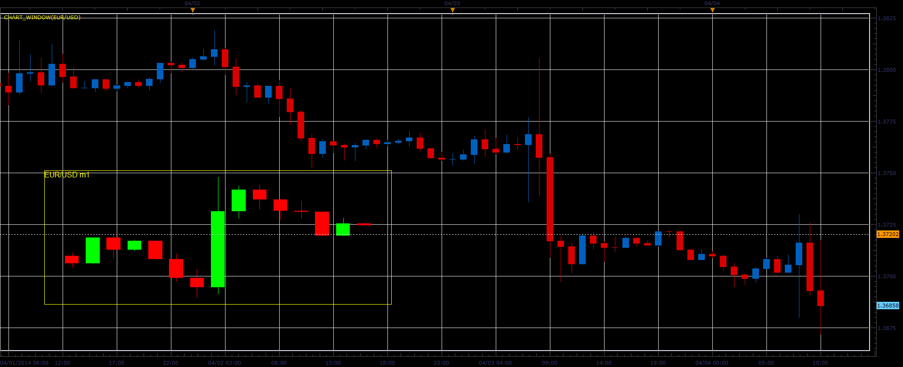
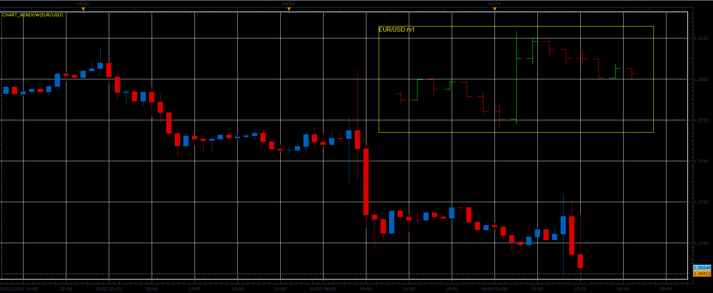
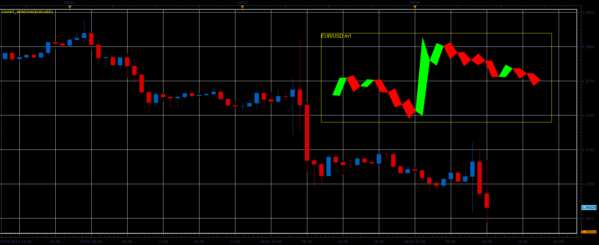
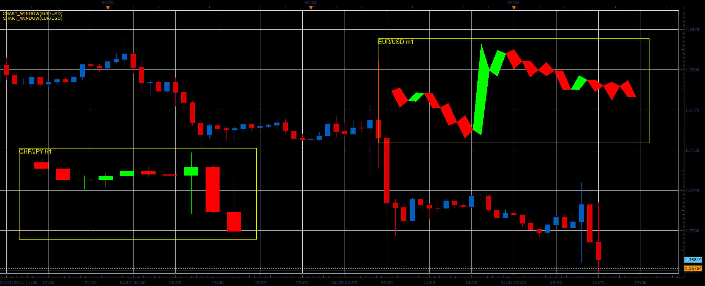
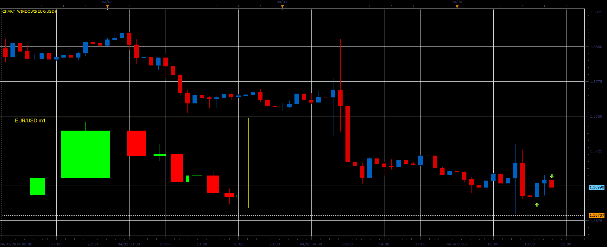
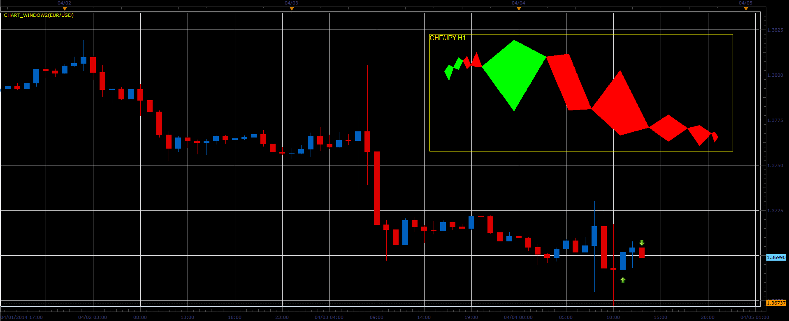

# Chart window indicator

> Source: https://fxcodebase.com/code/viewtopic.php?f=17&t=60499  
> Forum: 17 · Topic 60499 · 6 post(s)

---

## Chart window indicator

**Alexander.Gettinger** · Fri Apr 04, 2014 10:18 am

The indicator allows to draw charts of different instruments and timeframes on the main chart.
The indicator supports different ways to display the prices of the chart.

 

 

 

 

Movement of the indicator is done through menu (right mouse button).

Download:

 [Chart_Window.lua](files/93378/Chart_Window.lua)

The indicator was revised and updated

---

## Re: Chart window indicator

**Alexander.Gettinger** · Fri Apr 04, 2014 12:22 pm

In this version of the indicator, the width of the bars is proportional to the volume of bar.

 

 

Download:

 [Chart_Window2.lua](files/93382/Chart_Window2.lua)

The indicator was revised and updated

---

## Re: Chart window indicator

**Apprentice** · Fri Dec 02, 2016 5:14 am

Minor update.

---

## Re: Chart window indicator

**Paul W** · Sun Dec 11, 2016 1:13 pm

handy indicator

believe there may be a bug - indicator positioning not being saved

movement/positioning of the indicator is also a little difficult to use

thanks

---

## Re: Chart window indicator

**Paul W** · Mon Dec 12, 2016 11:03 am

could a transparency feature could be added ?

would be great

thanks

---

## Re: Chart window indicator

**Apprentice** · Fri Dec 16, 2016 5:00 am

Added
