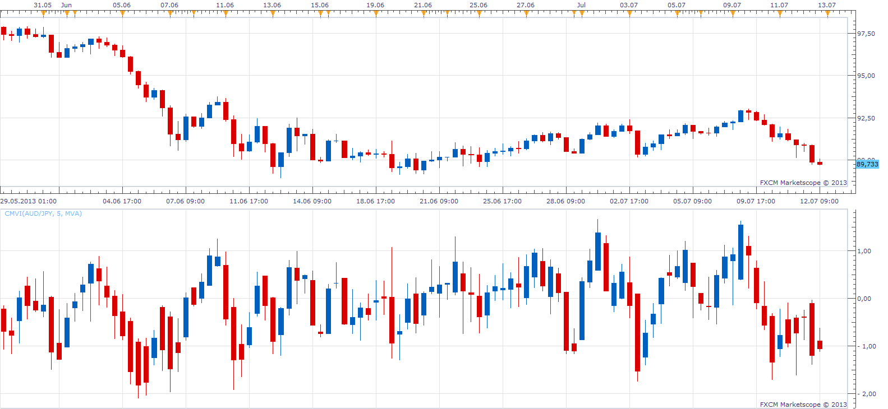

# Chartmill Value Indicator

> Source: https://fxcodebase.com/code/viewtopic.php?f=17&t=51747  
> Forum: 17 · Topic 51747 · 3 post(s)

---

## Chartmill Value Indicator

**Apprentice** · Sun Jul 14, 2013 2:15 pm

The Chartmill Value Indicator (CMVI) was authored by Dirk Vandycke in the Stocks and Commodities Magazine, January 2013. The CMVI uses Moving Averages of True Range and the Midpoint price to calculate adjusted open, high, low and closing prices.

 [CMVI.lua](files/78938/CMVI.lua)

The indicator was revised and updated

---

## Re: Chartmill Value Indicator

**Alexander.Gettinger** · Thu Aug 29, 2013 11:08 am

MQL4 version of Chartmill Value Indicator: [http://www.fxcodebase.com/code/viewtopi ... 38&t=59352](http://www.fxcodebase.com/code/viewtopic.php?f=38&t=59352).

---

## Re: Chartmill Value Indicator

**Apprentice** · Thu Jul 27, 2017 10:02 am

The indicator was revised and updated.
