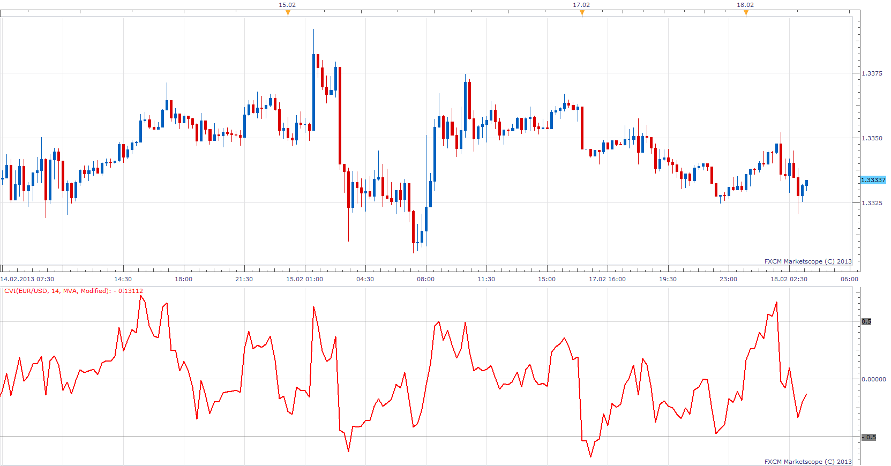

# Chartmill Value Indicator

> Source: https://fxcodebase.com/code/viewtopic.php?f=17&t=32171  
> Forum: 17 · Topic 32171 · 3 post(s)

---

## Chartmill Value Indicator

**Apprentice** · Mon Feb 18, 2013 5:04 am

The Chartmill Value Indicator as described in January 2013 issue of Technical Analysis of Stocks and Commodities. The CVI represents a standardized deviation from a moving average.
Chartmill Value Indicator
Value Consensus
(VC) = MA of Median Price
Chartmill Value Indicator
CVI = (Close – VC) / ATR
Modified Chartmill Value Indicator
 (MCVI) = (CClose – VC) / (ATR * (Period ^ 0.5))

 [CVI.lua](files/54843/CVI.lua)

The indicator was revised and updated

---

## Re: Chartmill Value Indicator

**Alexander.Gettinger** · Thu Sep 18, 2014 9:34 am

MQL4 version of Chartmill Value Indicator: [viewtopic.php?f=38&t=61172](https://fxcodebase.com/code/viewtopic.php?f=38&t=61172).

---

## Re: Chartmill Value Indicator

**Apprentice** · Sat Jun 24, 2017 5:05 am

The indicator was revised and updated.
