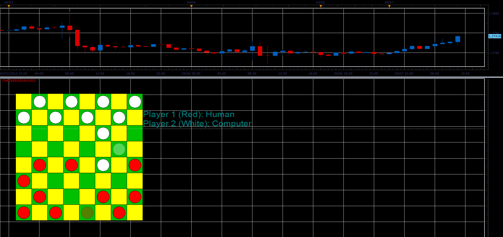
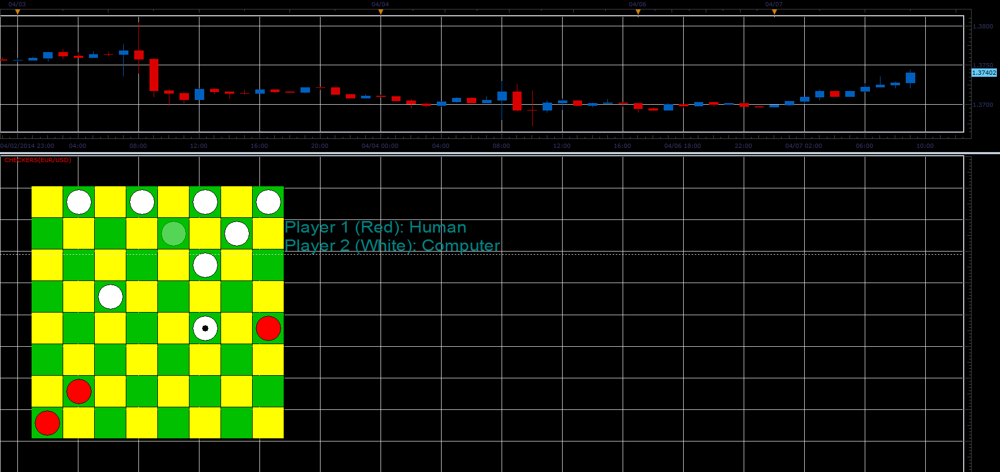

# Checkers game

> Source: https://fxcodebase.com/code/viewtopic.php?f=17&t=60512  
> Forum: 17 · Topic 60512 · 2 post(s)

---

## Checkers game

**Alexander.Gettinger** · Mon Apr 07, 2014 9:13 am

The indicator is just a checkers game ([http://en.wikipedia.org/wiki/Checkers](https://en.wikipedia.org/wiki/Checkers)). Right-click and use context menu to make a turn and restart the game.

 

 

Download:

 [Checkers.bin](files/93414/Checkers.bin)

---

## Re: Checkers game

**Apprentice** · Fri Jun 16, 2017 6:41 am

The indicator was revised and updated.
