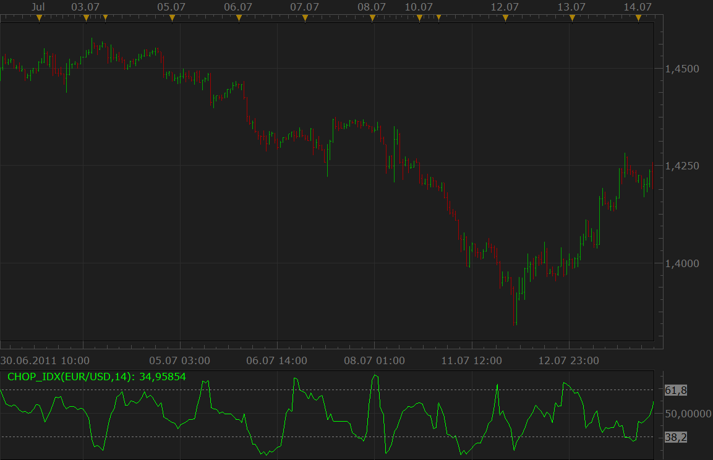
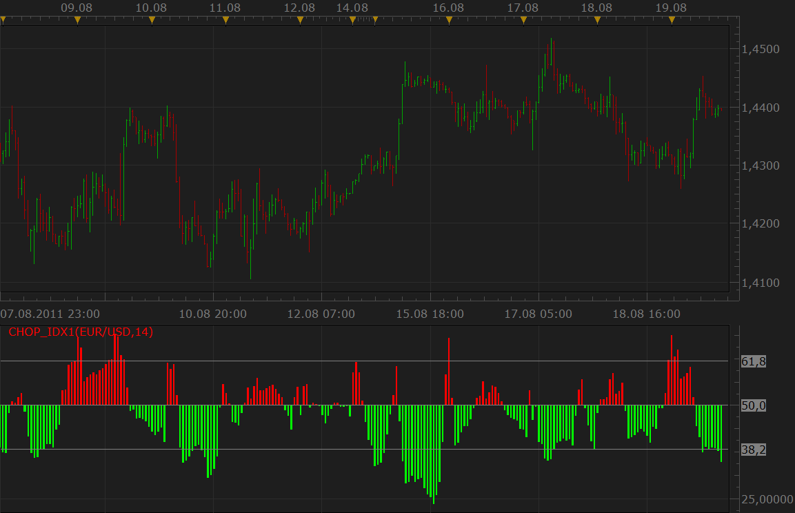

# Choppiness Index

> Source: https://fxcodebase.com/code/viewtopic.php?f=17&t=7115  
> Forum: 17 · Topic 7115 · 5 post(s)

---

## Choppiness Index

**Nikolay.Gekht** · Fri Oct 07, 2011 11:03 am

The indicator is requested [here](https://fxcodebase.com/code/viewtopic.php?f=27&t=7113&p=15931):

> **mjdesmond3001 wrote:**
> 100 * LOG10( SUM(ATR(1), x) / ( MaxHi(x) - MinLo(x) ) ) / LOG10(x)
> where x = Choppiness Period
> LOG10(x) is base-10 LOG of x
> ATR(1) is the True Range (Period of 1)
> SUM(ATR(1), x) is the Sum of the True Range over past x bars
> MaxHi(x) is the highest high over past x bars
>
> The Choppiness Index is designed to measure the market's trendiness (values below 38.20) versus the market's choppiness (values above 61.80). When the indicator is reading values near 100, the market is considered to be in choppy consolidation. The lower the value of the Choppiness Index, the more the market is trending. The period supplied by the user dictates how many bars are used to compute the index.

 

Download:

 [chop_idx.lua](files/15934/chop_idx.lua)

The indicator was revised and updated

---

## Another visualization

**Nikolay.Gekht** · Fri Oct 07, 2011 11:14 am

Another version of the indicator using other visualization method. While the first is more convenient to be used in strategies, this one gives easier readings:

 

Download:

 [chop_idx1.lua](files/15935/chop_idx1.lua)

---

## Re: Choppiness Index

**mjdesmond3001** · Sun Oct 09, 2011 7:10 pm

that was quick, thank you very much!

---

## Re: Choppiness Index

**Alexander.Gettinger** · Thu Nov 20, 2014 5:49 pm

MQL4 version of Choppiness Index: [viewtopic.php?f=38&t=61500](https://fxcodebase.com/code/viewtopic.php?f=38&t=61500).

---

## Re: Choppiness Index

**Apprentice** · Sat Jul 01, 2017 5:29 am

The indicator was revised and updated.
