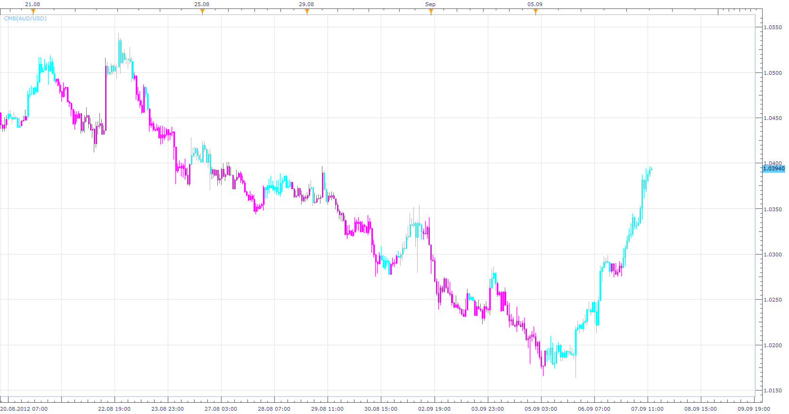

# Clear Method Histogram

> Source: https://fxcodebase.com/code/viewtopic.php?f=17&t=23133  
> Forum: 17 · Topic 23133 · 4 post(s)

---

## Clear Method Histogram

**Apprentice** · Fri Sep 07, 2012 11:53 am

 [CMH.lua](files/39857/CMH.lua)

The indicator was revised and updated

---

## Re: Clear Method Histogram

**Apprentice** · Fri Sep 07, 2012 12:00 pm

 [CMB.lua](files/39858/CMB.lua)

---

## Re: Clear Method Histogram

**Alexander.Gettinger** · Mon Nov 17, 2014 5:00 pm

MQL4 version of oscillator: [viewtopic.php?f=38&t=61450](https://fxcodebase.com/code/viewtopic.php?f=38&t=61450).

---

## Re: Clear Method Histogram

**Apprentice** · Tue Jun 27, 2017 4:28 am

The indicator was revised and updated.
