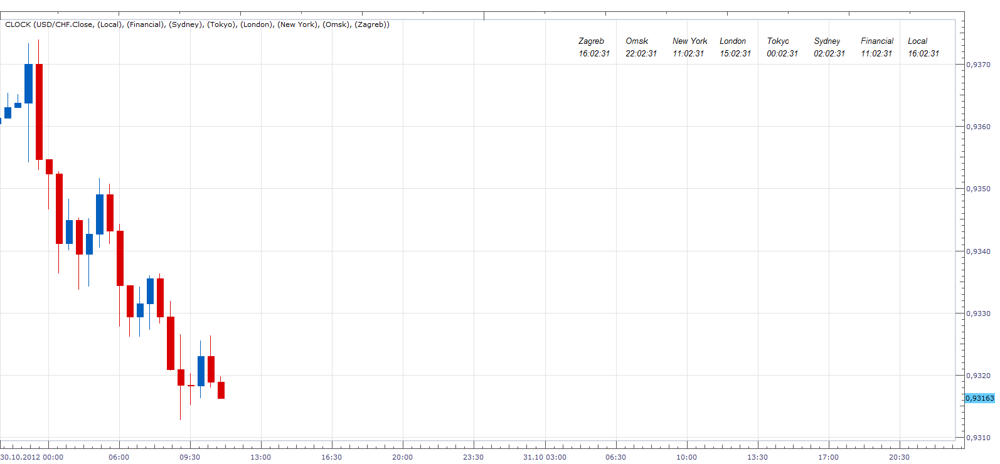

# Clocks

> Source: https://fxcodebase.com/code/viewtopic.php?f=17&t=25168  
> Forum: 17 · Topic 25168 · 12 post(s)

---

## Clocks

**Apprentice** · Tue Oct 30, 2012 9:58 am

 [Clock with trading session.lua](files/43269/Clock%20with%20trading%20session.lua)

With this indicator, you can define up to 12 world clocks,
6 of them can be customized.

 [Clock .lua](files/43269/Clock%20.lua)

The indicator was revised and updated

---

## Re: Clocks

**Jeffreyvnlk** · Tue Oct 30, 2012 2:14 pm

Thank you. My eyes not hurt anymore !Great

---

## Re: Clocks

**Jeffreyvnlk** · Tue Oct 30, 2012 2:29 pm

Could you make it without second running ? Just hour and minute

---

## Re: Clocks

**Apprentice** · Wed Oct 31, 2012 3:20 am

seconds on/off option added.

---

## Re: Clocks

**Jeffreyvnlk** · Wed Oct 31, 2012 6:41 pm

> **Apprentice wrote:**
> seconds on/off option added.

Thanks
Can i ask once more ? Could you make the clock of particular session highlight

Uploaded with [ImageShack.us](http://imageshack.us)

---

## Re: Clocks

**Apprentice** · Thu Nov 01, 2012 3:07 am

Your request is added to the development list.

---

## Re: Clocks

**Nicks123** · Sun Aug 30, 2015 12:54 pm

Bump.Please add session highlight

---

## Re: Clocks

**Forex Signals** · Fri Sep 04, 2015 7:56 am

Hi, I'm Forex Trader.
Sometimes my trading platform clock/timer(top left position) stopped & I didn't find the network signal. But my PC & internet connection is ok on that time. I'm already tries this in another PC but sometimes happen the same problem.
Anybody has idea & solution what is the wrong there????

---

## Re: Clocks

**Apprentice** · Tue Jul 25, 2017 11:39 am

The indicator was revised and updated.

---

## Re: Clocks

**Mountaintrader** · Wed Mar 13, 2019 10:29 pm

Hi Apprentice,

Please could you add time parameters to this indicator that would enable the clocks to be displayed on the chart only between user specified times.

1) Start time
2) Stop time
3) EST,Local,UTC,server

Thanks

---

## Re: Clocks

**Apprentice** · Thu Mar 14, 2019 4:10 am

Your request is added to the development list under Id Number 4538

---

## Re: Clocks

**Apprentice** · Thu Mar 14, 2019 6:38 am

Try Clock with trading session.lua
