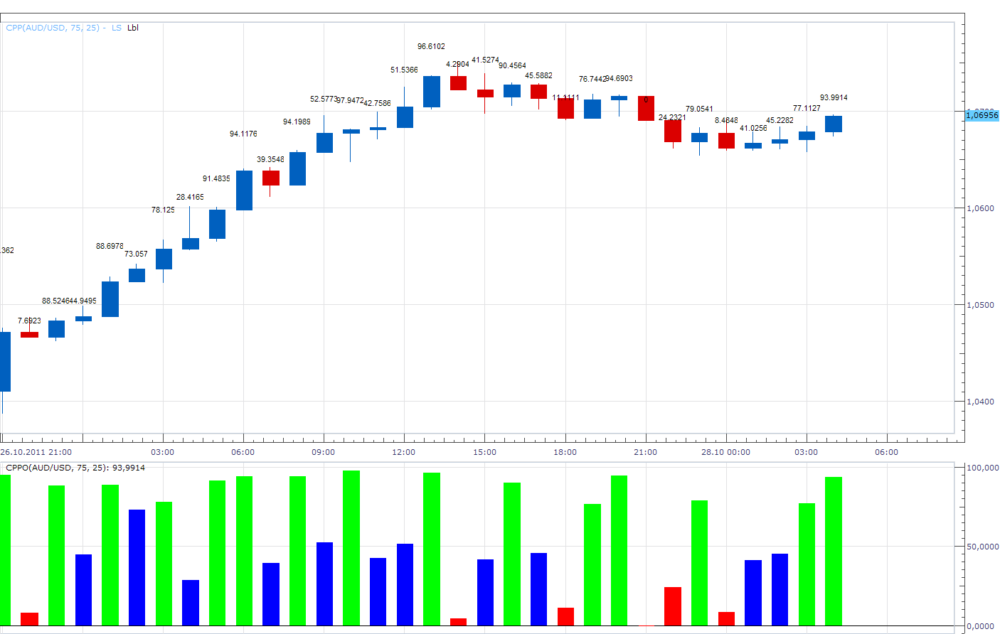

# Closing Price Position

> Source: https://fxcodebase.com/code/viewtopic.php?f=17&t=7662  
> Forum: 17 · Topic 7662 · 2 post(s)

---

## Closing Price Position

**Apprentice** · Fri Oct 28, 2011 3:13 am

Here I offer indicator / oscillator which shows the position of the closing price within the High / Low range of candles.

Theoretical basis.
Strong Uptrend.
Closing price at the top of the range.
Strong Down Trend
Closing price at the bottom of the range.

If not, it may be an indication of weakening of the current trend.

The indicator has several display options.
Label / Overlay / Both

 [CPP.lua](files/17014/CPP.lua)

 [CPPO.lua](files/17014/CPPO.lua)

The indicator was revised and updated

---

## Re: Closing Price Position

**Apprentice** · Fri Mar 17, 2017 7:39 am

Indicator was revised and updated.
