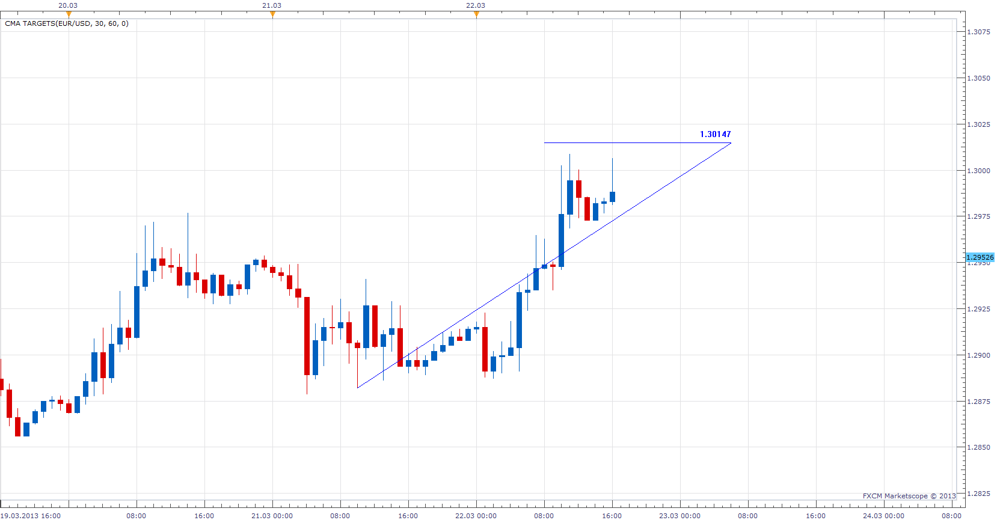

# CMA Targets

> Source: https://fxcodebase.com/code/viewtopic.php?f=17&t=33783  
> Forum: 17 · Topic 33783 · 8 post(s)

---

## CMA Targets

**Apprentice** · Sun Mar 24, 2013 3:48 pm



 


*Target Price = Cross Price + (Price Cross - Wave Min / Max)*

 [CMA Targets.lua](files/57327/CMA%20Targets.lua)

Install CMA indicator if you want to use this indicator.
You can find it here.
[viewtopic.php?f=17&t=24476](https://fxcodebase.com/code/viewtopic.php?f=17&t=24476)

The indicator was revised and updated

---

## Re: CMA Targets

**Apprentice** · Tue Mar 26, 2013 7:48 am

Updated.

---

## Re: CMA Targets

**boss_hogg** · Wed Jan 15, 2014 8:38 am

Hi Apprentice, I'm interested in making a strategy using CMA Targets but I came into problems which trace back to CMA Targets. In indicator debugger I get index out of range in line 145 for the first few periods and then in line 199.

In line 145, while period<math.max(Short/2, Long/2) i gets negative values so MA1.DATA[i] is out of range:

```lua
local i;
      for i=period-math.max(Short/2, Long/2), period , 1 do
      SHORT[i]= MA1.DATA[i];
      LONG[i]= MA2.DATA[i];
      end
   end
```

In line 199, when i==first, then the rule "Because the function also checks the previous bar, the period indexes must be greater than the first() value of the corresponding stream." gets violated so , again, we have index out of range.

```lua
for i = source:size() - 1, first, -1 do
        if core.crosses(MA1.DATA, MA2.DATA, i) then
            Count = Count + 1;
            Cross[Count] = i;
        end
```

The result is that the indicator returns nil values to my strategy, can you fix this?

Best regards,
Alkis

---

## Re: CMA Targets

**Apprentice** · Fri Jan 17, 2014 1:00 pm

Can you share the entire code.

---

## Re: CMA Targets

**boss_hogg** · Tue Jan 21, 2014 2:54 pm

The index out of range issues I'm having are on the indicator itself, CMA Targets.lua; the code is on the first post of this thread.

---

## Re: CMA Targets

**moonamunaf** · Fri Jan 24, 2014 6:20 am

In the book "New Concept from TTS" by Welles Wilder provided 4 price action points for the following day

---

## Re: CMA Targets

**Apprentice** · Sat Jan 25, 2014 4:01 am

For us who do not have this book,
can you share how these price targets are calculated.

---

## Re: CMA Targets

**Apprentice** · Thu Jun 22, 2017 7:02 am

The indicator was revised and updated.
