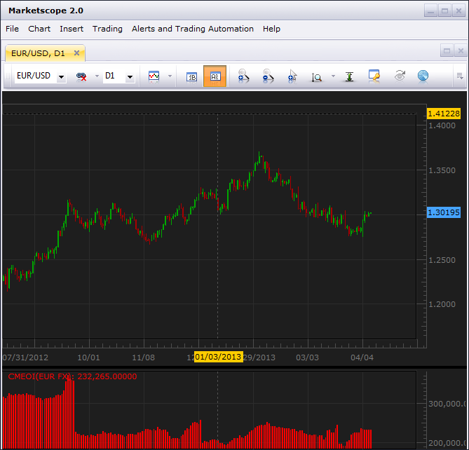

# CME Open Interest

> Source: https://fxcodebase.com/code/viewtopic.php?f=17&t=34229  
> Forum: 17 · Topic 34229 · 1 post(s)

---

## CME Open Interest

**vstrelnikov** · Mon Apr 08, 2013 6:10 pm

Indicator show Overall Combined Total Volume for all CME exchanges on specified instrument.
You can manually see day-by-day data here : [http://www.cmegroup.com/market-data/volume-open-interest/fx-volume.html](http://www.cmegroup.com/market-data/volume-open-interest/fx-volume.html)

CME Open Interest is not derivation of price as like as [COT](https://fxcodebase.com/code/viewtopic.php?f=17&t=1615) indicator

 [CMEOI.lua](files/58342/CMEOI.lua)
