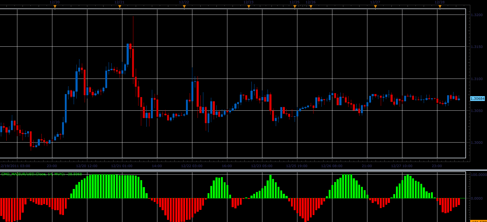

# CMO with MA indicator

> Source: https://fxcodebase.com/code/viewtopic.php?f=17&t=10551  
> Forum: 17 · Topic 10551 · 5 post(s)

---

## CMO with MA indicator

**Alexander.Gettinger** · Wed Dec 28, 2011 7:46 am

This indicator is a ported MQL5 indicator from [http://www.mql5.com/ru/code/784](http://www.mql5.com/ru/code/784) (in Russian).
In contrast to the CMO indicator in this indicator price pre-smoothed by moving average.

Formulas:
CMO_MA[i]=100*(SumBulls-SumBears)/(SumBulls+SumBears), where
SumBulls and SumBears are a sum of a positive and negative values of (MA(i)-MA(i-1)).

 

Download:

 [CMO_MA.lua](files/21841/CMO_MA.lua)

For this indicator must be installed Averages indicator: [viewtopic.php?f=17&t=2430](https://fxcodebase.com/code/viewtopic.php?f=17&t=2430)

The indicator was revised and updated

---

## Re: CMO with MA indicator

**Apprentice** · Mon Mar 20, 2017 8:22 am

Indicator was revised and updated.

---

## Re: CMO with MA indicator

**ANTONIO** · Sun Mar 29, 2020 8:45 am

Hi apprentice,
Can you make a strategy with this indicator?

 if the price of indicator is > 0  open a buy trade (end of turn / live)
 and
 if the price of indicator is < 0  open a sell trade (end of turn / live)  

TRAILING STOP  
Position Cap
Max. of open positions  

ALERT (EMAILS) FOR OPENING THE TRADES  
 
Thank you

---

## Re: CMO with MA indicator

**Apprentice** · Mon Mar 30, 2020 6:30 am

Your request is added to the development list.
Development reference 957.

---

## Re: CMO with MA indicator

**Apprentice** · Tue Mar 31, 2020 6:28 am

Try this version.
[viewtopic.php?f=31&t=69599](https://fxcodebase.com/code/viewtopic.php?f=31&t=69599)
