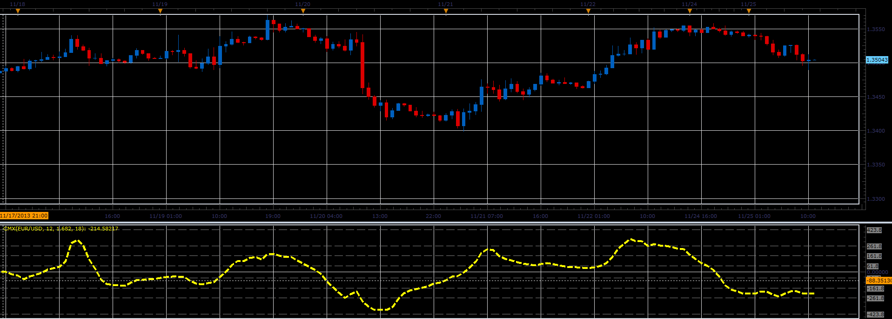

# CMx oscillator

> Source: https://fxcodebase.com/code/viewtopic.php?f=17&t=59971  
> Forum: 17 · Topic 59971 · 5 post(s)

---

## CMx oscillator

**Alexander.Gettinger** · Mon Nov 25, 2013 4:52 pm

The indicator is compilation of Moving Average, CCI, ADX и Fibonacci levels.

Formulas:
CMx[i] = CCI[i]*ADX[i]/(L*K), where
ADX[i] - Average Directional Movement Index with Period as Length,
CCI[i] = (Diff[i]-mean)/(meandev*0.015),
mean, meandev - mean and mean deviation of Diff at range from (i-K_Period+1) to i,
Diff[i] = EMA[i]-EMA_K[i],
EMA - exponential moving average with Period as Length,
EMA_K - exponential moving average with K_Period as Length,
K_Period = Period*K.

 

Download:

 [CMx.lua](files/91107/CMx.lua)

MT4/MQ4 version.
[viewtopic.php?f=38&t=65687&p=117402#p117402](https://fxcodebase.com/code/viewtopic.php?f=38&t=65687&p=117402#p117402)

---

## Re: CMx oscillator

**Apprentice** · Sat Jul 29, 2017 9:23 am

The indicator was revised and updated.

---

## Re: CMx oscillator

**jaricarr** · Sun Jul 30, 2017 1:44 am

Hi Apprentice,

Can you please add the ability to customize the levels.
(line color, style, width)

---

## Re: CMx oscillator

**Apprentice** · Sun Jul 30, 2017 6:20 am

Try it now.

---

## Re: CMx oscillator

**Apprentice** · Sun Oct 07, 2018 9:06 am

The indicator was revised and updated.
