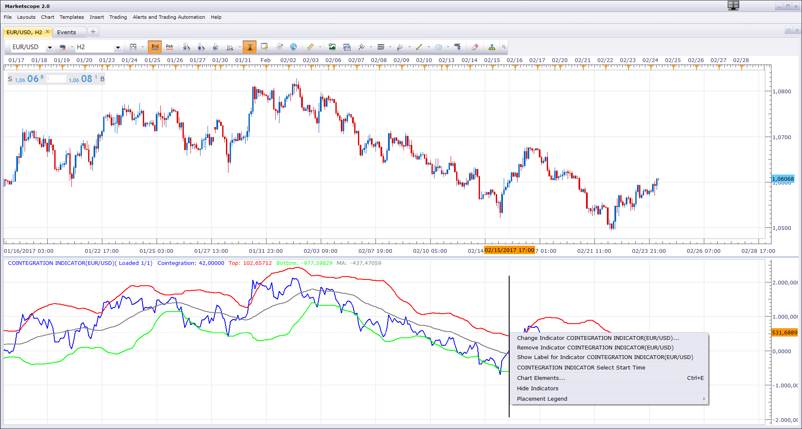

# Cointegration Indicator

> Source: https://fxcodebase.com/code/viewtopic.php?f=17&t=64479  
> Forum: 17 · Topic 64479 · 3 post(s)

---

## Cointegration Indicator

**Apprentice** · Fri Feb 24, 2017 8:10 am

Based on request.
[viewtopic.php?f=27&t=16029](https://fxcodebase.com/code/viewtopic.php?f=27&t=16029)

Can stimulate simple equity curve,
for chosen custom index or portfolio.

 [Cointegration Indicator.lua](files/111181/Cointegration%20Indicator.lua)

 [Cointegration Indicator with Alert.lua](files/111181/Cointegration%20Indicator%20with%20Alert.lua)

The indicator was revised and updated

---

## Re: Cointegration Indicator

**easytrading** · Mon Feb 27, 2017 4:20 am

hello Apprentice ;
could you please add alert (with size & color option) when the blue line crosses up & down the 3 other lines with the ability to let the user which alert to show or not ? with many thanks.

---

## Re: Cointegration Indicator

**Apprentice** · Tue Feb 28, 2017 4:16 am

Cointegration Indicator with Alert.lua added.
