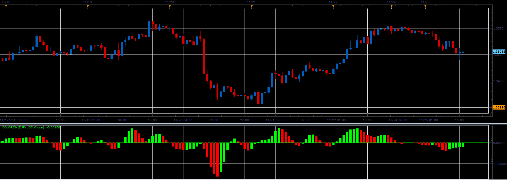
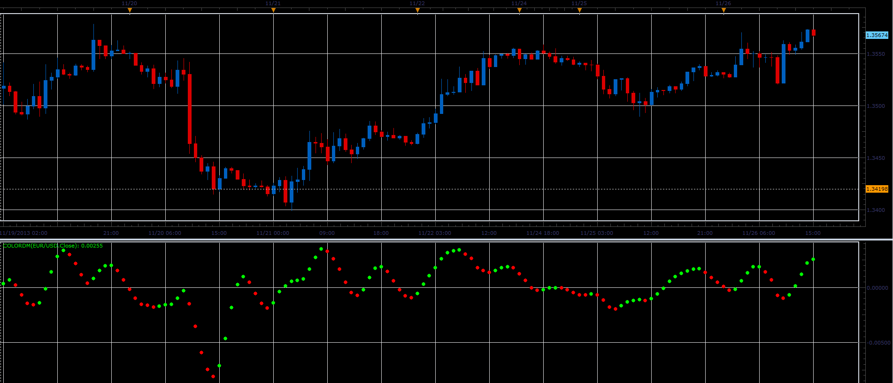

# Color DM oscillator

> Source: https://fxcodebase.com/code/viewtopic.php?f=17&t=59983  
> Forum: 17 · Topic 59983 · 2 post(s)

---

## Color DM oscillator

**Alexander.Gettinger** · Tue Nov 26, 2013 3:33 pm

This indicator is a ported MQL5 indicator from [http://www.mql5.com/en/code/1897](http://www.mql5.com/en/code/1897).

 

 

Download:

 [ColorDM.lua](files/91137/ColorDM.lua)

The indicator was revised and updated

---

## Re: Color DM oscillator

**Apprentice** · Sat Jul 29, 2017 9:17 am

The indicator was revised and updated.
