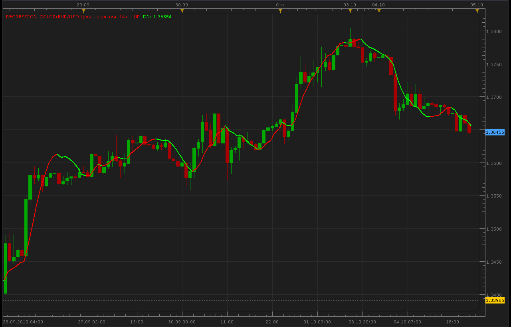

# Color Regression line

> Source: https://fxcodebase.com/code/viewtopic.php?f=17&t=2342  
> Forum: 17 · Topic 2342 · 12 post(s)

---

## Color Regression line

**Alexander.Gettinger** · Mon Oct 04, 2010 9:43 pm

Unlike standard Regression indicator, Up values are red, Down values are green.

 

 [Regression_Color.lua](files/5004/Regression_Color.lua)

 [Regression_Line.lua](files/5004/Regression_Line.lua)

Single Stream version.

 [Regression_Line Overlay.lua](files/5004/Regression_Line%20Overlay.lua)

The indicator was revised and updated

---

## Re: Color Regression line

**sedraude** · Wed Oct 06, 2010 9:26 pm

Hi Alexander,

Great indi and thanks for your work. GBU

---

## Re: Color Regression line

**sedraude** · Thu Oct 07, 2010 9:05 am

Hi Alexander,

I just report, your nice indi sometimes have a broken line like this. Can you fixed it?

Thank you in advance

---

## Re: Color Regression line

**Alexander.Gettinger** · Thu Oct 07, 2010 3:02 pm

I don't see broken line.
Please, write me symbol and timeframe where line is broken.

---

## Re: Color Regression line

**sedraude** · Thu Oct 07, 2010 11:10 pm

> **Alexander.Gettinger wrote:**
> I don't see broken line.
> Please, write me symbol and timeframe where line is broken.

TF M30 at EURJPY (attaches picture). (usually any TF and any pair the same problem).

When prices move back and forth, which was originally regresion line color blue color display (up) then prices go down (red), then usually there are two colors that occur and accumulate. When the price then down the rest of the blue color remained there with a broken line (vice versa). But when we reinstall this indi then it becomes normal (smooth again.).

---

## Re: Color Regression line

**bluepip** · Sun Mar 06, 2011 10:16 am

Is it possible to get a strategy based on Regression Line Color changing?

Thanks
bluepip

---

## Re: Color Regression line

**Apprentice** · Sun Mar 06, 2011 3:31 pm

Your request has been added in the developmental cue.

---

## Re: Color Regression line

**Alexander.Gettinger** · Wed Mar 09, 2011 12:33 am

Dot version of Color Regression line indicator.
It more suitable for use in strategy.

Download:

 [Regression_Color_Dot.lua](files/8704/Regression_Color_Dot.lua)

---

## Re: Color Regression line

**Alexander.Gettinger** · Wed Mar 09, 2011 4:16 am

> **bluepip wrote:**
> Is it possible to get a strategy based on Regression Line Color changing?
> bluepip

Strategy, based on this indicator you may find here: [viewtopic.php?f=31&t=3622](https://fxcodebase.com/code/viewtopic.php?f=31&t=3622)

---

## Re: Color Regression line

**Apprentice** · Fri Mar 03, 2017 8:54 am

Indicator was revised and updated.

---

## Re: Color Regression line

**easytrading** · Mon Aug 06, 2018 3:08 am

Hello Apprentice,

if you please, could we have price overlay for Regression_Color.lua based on line color change with my appreciation .

---

## Re: Color Regression line

**Apprentice** · Mon Aug 06, 2018 5:41 am

Regression_Line Overlay.lua added.
