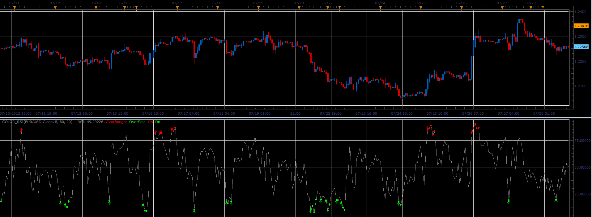

# Color RSI

> Source: https://fxcodebase.com/code/viewtopic.php?f=17&t=21622  
> Forum: 17 · Topic 21622 · 2 post(s)

---

## Color RSI

**Alexander.Gettinger** · Mon Jul 30, 2012 3:21 pm

The indicator highlights of RSI corresponding the conditions: RSI>OverBought or RSI<OverSold.
The arrows show the first entry in the zones.

 

Download:

 [Color_RSI.lua](files/37700/Color_RSI.lua)

MT4/MQ4 version.
[viewtopic.php?f=38&t=64634](https://fxcodebase.com/code/viewtopic.php?f=38&t=64634)

The indicator was revised and updated

---

## Re: Color RSI

**Apprentice** · Wed Apr 12, 2017 5:50 am

Indicator was revised and updated.
