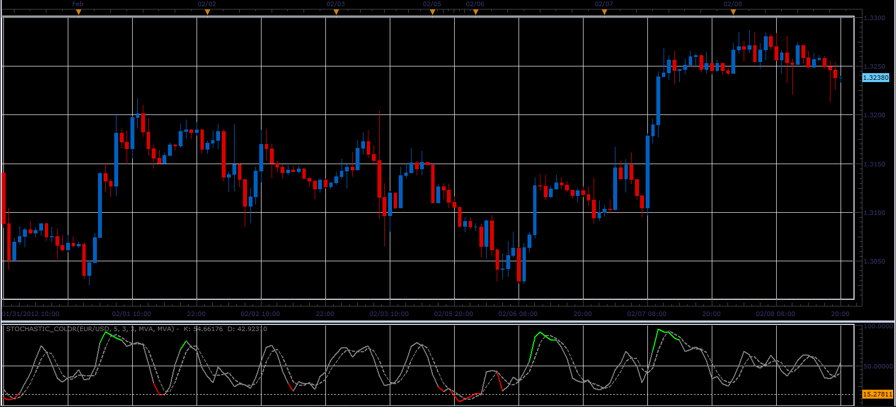
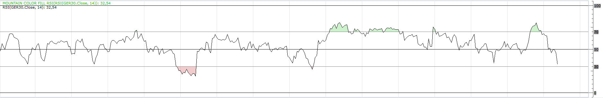

# Color stochastic

> Source: https://fxcodebase.com/code/viewtopic.php?f=17&t=13034  
> Forum: 17 · Topic 13034 · 8 post(s)

---

## Color stochastic

**Alexander.Gettinger** · Wed Feb 08, 2012 9:20 pm

This indicator is a ported MQL4 indicator from [viewtopic.php?f=27&t=12724](https://fxcodebase.com/code/viewtopic.php?f=27&t=12724)

Stochastic change color when it is upper than overbought level or lower than oversold level.

 

Download:

 [Stochastic_Color.lua](files/25481/Stochastic_Color.lua)

The indicator was revised and updated

---

## Re: Color stochastic

**Dimitri** · Tue Jun 17, 2014 1:58 pm

Hi Apprentice

is it possible to add option of having lines at the 20, 50, and 80 levels?

Thanks

---

## Re: Color stochastic

**Apprentice** · Wed Jun 18, 2014 4:38 am

Lines Added.

---

## Re: Color stochastic

**Dimitri** · Mon Jun 23, 2014 11:54 pm

hi
sorry but is it also possible to add lwma and smma to %K and %D

Thanks alot

---

## Re: Color stochastic

**Apprentice** · Tue Jun 24, 2014 3:18 am

Here you'll find a version of stochastic
with additional smoothing methods integrated into the stochastic algorithm.
[viewtopic.php?f=17&t=9566&p=20557&hilit=stochastic#p20557](https://fxcodebase.com/code/viewtopic.php?f=17&t=9566&p=20557&hilit=stochastic#p20557)

---

## Re: Color stochastic

**jrichardson83** · Tue Sep 29, 2015 9:00 pm

This is purely for aesthetic purposes, but is there a way to code a user definable color for the region between the overbought/oversold line and the stochastic average line? The attached image is actually of an RSI, but the objective is the same. I want to be able to "fill in" the curved area above/below the overbought and oversold regions.

---

## Re: Color stochastic

**Apprentice** · Wed Sep 30, 2015 3:46 am

Your request is added to the development list.

---

## Re: Color stochastic

**.nino.** · Tue Jan 31, 2017 1:18 pm

> **jrichardson83 wrote:**
> This is purely for aesthetic purposes, but is there a way to code a user definable color for the region between the overbought/oversold line and the stochastic average line? The attached image is actually of an RSI, but the objective is the same. I want to be able to "fill in" the curved area above/below the overbought and oversold regions.

Hi,

I just played with lua and attached you can find the result. I used [Mountain Color Fill](https://fxcodebase.com/code/viewtopic.php?f=17&t=15714).
**Note:** You have to show Mountain Color Fill in background, otherwise it looks 'interesting'.
Moreover you are flexible choosing your levels of overbought and oversold.

 

 [Mountain Color Fill RSI.lua](files/110821/Mountain%20Color%20Fill%20RSI.lua)
