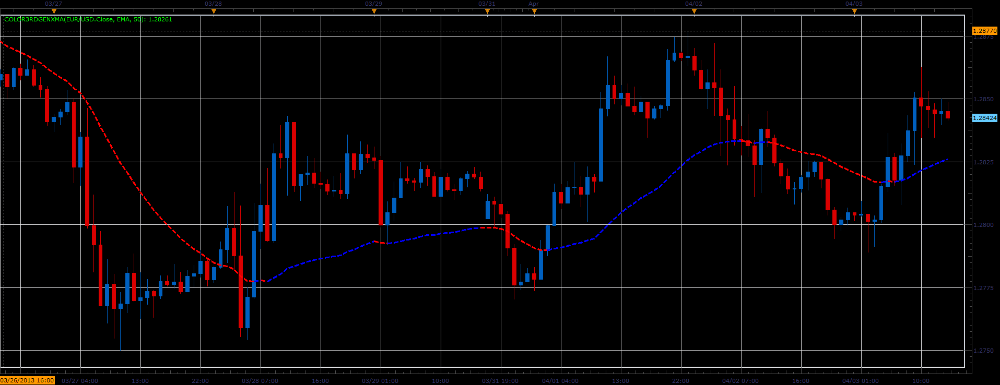

# Color3rdGenXMA indicator

> Source: https://fxcodebase.com/code/viewtopic.php?f=17&t=34065  
> Forum: 17 · Topic 34065 · 3 post(s)

---

## Color3rdGenXMA indicator

**Alexander.Gettinger** · Wed Apr 03, 2013 3:12 pm

This indicator is a ported MQL5 indicators from [http://www.mql5.com/en/code/1576](http://www.mql5.com/en/code/1576)

Formulas:
GenXMA = (1+Alpha)*MA1-Alpha*MA2, where
Alpha = (2*Period-1)/(Period-1),
MA1 - moving average with [2*Period] period from price,
MA2 - moving average with [Period] from MA1.

 

Download:

 [Color3rdGenXMA.lua](files/57905/Color3rdGenXMA.lua)

For this indicator must be installed Averages indicator ([viewtopic.php?f=17&t=2430](https://fxcodebase.com/code/viewtopic.php?f=17&t=2430)).

The indicator was revised and updated

---

## Re: Color3rdGenXMA indicator

**Alexander.Gettinger** · Wed Apr 10, 2013 4:15 pm

MQL4 version of this indicator: [viewtopic.php?f=38&t=34364](https://fxcodebase.com/code/viewtopic.php?f=38&t=34364)

---

## Re: Color3rdGenXMA indicator

**Apprentice** · Tue May 09, 2017 6:27 am

Indicator was revised and updated.
