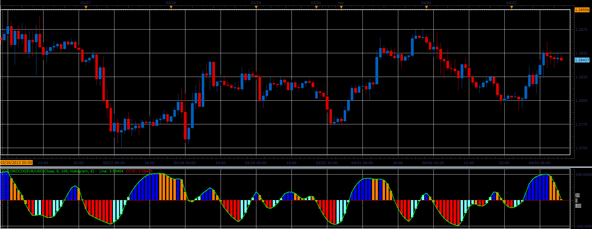

# ColorCCIX oscillator

> Source: https://fxcodebase.com/code/viewtopic.php?f=17&t=34067  
> Forum: 17 · Topic 34067 · 2 post(s)

---

## ColorCCIX oscillator

**Alexander.Gettinger** · Wed Apr 03, 2013 3:24 pm

This indicator is a ported MQL5 indicators from [http://www.mql5.com/en/code/1580](http://www.mql5.com/en/code/1580)

Formulas:
CCIX = 100*JRXup/JRXdn, where
JRXup - JRX(Price - JMA),
JRXdn - JRX(Abs(Price - JMA)).

 

Download:

 [ColorCCIX.lua](files/57907/ColorCCIX.lua)

For this indicator must be installed JMA and JRX indicators ([viewtopic.php?f=17&t=7895](https://fxcodebase.com/code/viewtopic.php?f=17&t=7895)).

The indicator was revised and updated

---

## Re: ColorCCIX oscillator

**Apprentice** · Tue May 09, 2017 6:03 am

Indicator was revised and updated.
