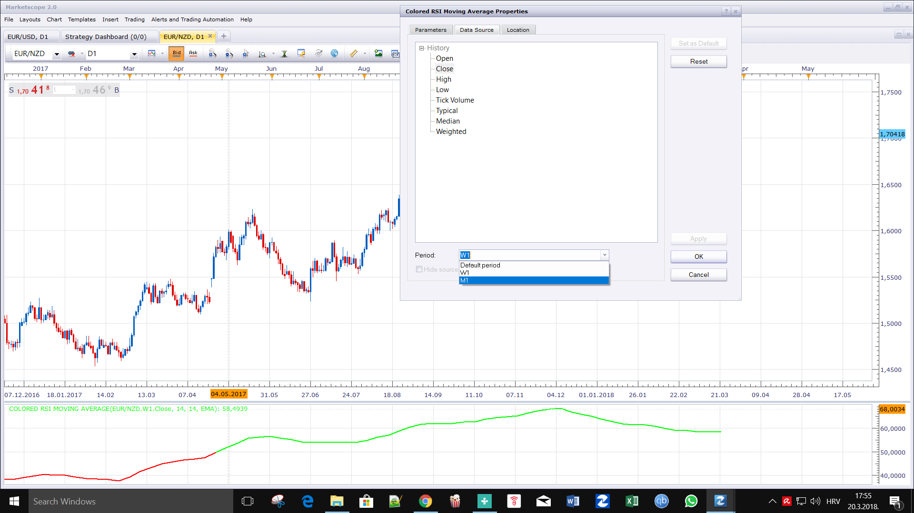

# Colored RSI Moving Average

> Source: https://fxcodebase.com/code/viewtopic.php?f=17&t=65839  
> Forum: 17 · Topic 65839 · 10 post(s)

---

## Colored RSI Moving Average

**Apprentice** · Thu Mar 15, 2018 6:06 pm

 [Colored RSI Moving Average.lua](files/118241/Colored%20RSI%20Moving%20Average.lua)

 [MTF_MCP Colored RSI Moving Average.lua](files/118241/MTF_MCP%20Colored%20RSI%20Moving%20Average.lua)

 

 [On Chart Colored RSI Moving Average.lua](files/118241/On%20Chart%20Colored%20RSI%20Moving%20Average.lua)

Averages indicator is available here.
 ([viewtopic.php?f=17&t=2430](https://fxcodebase.com/code/viewtopic.php?f=17&t=2430)).

Indicator-based strategy.
[viewtopic.php?f=31&t=68323](https://fxcodebase.com/code/viewtopic.php?f=31&t=68323)

---

## Re: Colored RSI Moving Average

**bartwas1** · Fri Mar 16, 2018 4:58 am

Hi Apprentice

Is it possible to add multi time frame version of this RSI's?

Thank you,
Bart

---

## Re: Colored RSI Moving Average

**Apprentice** · Sat Mar 17, 2018 7:10 am

Try this versions.
[viewtopic.php?f=17&t=60277](https://fxcodebase.com/code/viewtopic.php?f=17&t=60277)
[viewtopic.php?t=3005&f=17](https://fxcodebase.com/code/viewtopic.php?t=3005&f=17)

---

## Re: Colored RSI Moving Average

**bartwas1** · Sat Mar 17, 2018 6:46 pm

Hi Apprentice

I've seen heat map of RSI an the other indi, but I am after multi time frame of this particular version. This indi in its current state displays quite accurate version of the price movement as one line (without unnecessary volatility, it's smooth - maybe require adjusting of its setting..., but it's really excellent) and I thought that adding a mtf version would expand - allow to analyse price taken from several time frames. And if this mtf version could be represented as one line too, it'd be great.

Kind regards
Bart

---

## Re: Colored RSI Moving Average

**Apprentice** · Sun Mar 18, 2018 12:37 pm

MTF_MCP Colored RSI Moving Average.lua added.

---

## Re: Colored RSI Moving Average

**bartwas1** · Mon Mar 19, 2018 6:59 am

> **Apprentice wrote:**
> MTF_MCP Colored RSI Moving Average.lua added.

Hi Apprentice

If this is a mtf version of colored RSI moving average then it isn't what I'd in my mind. Thanks for your work though.

I was rather looking for an oscillator like colored RSI MA you did, but based on multi time frames' inputs of data and displayed in the same manner as colored RSI moving average based on singular time frame.

---

## Re: Colored RSI Moving Average

**jrichardson83** · Mon Mar 19, 2018 7:41 pm

> **Apprentice wrote:**
>
>
> USDSEK m2 (03-15-2018 2206).png
>
>
>
>
> Colored RSI Moving Average.lua
>
>
>
>
> MTF_MCP Colored RSI Moving Average.lua
>
>
>
> Averages indicator is available here.
> ([viewtopic.php?f=17&t=2430](https://fxcodebase.com/code/viewtopic.php?f=17&t=2430)).

Crud, my fault Apprentice I should have been more clear in my explanation. I was wanting to get a RSI based moving average that would go on the chart itself and would paint according to whether it was above or below the 50 line. I tried to apply the current indie to the chart and it wouldn't paint.

---

## Re: Colored RSI Moving Average

**Apprentice** · Tue Mar 20, 2018 1:56 pm

U can use Data Source / Period to set indicator source to other time frames.

---

## Re: Colored RSI Moving Average

**bartwas1** · Fri Jun 01, 2018 5:48 am

Hi Apprentice

I found on the net RSI bars indicator. Does something like that exist in lua? And my second question is if these bars replicate price movement better/more accurate than colored RSI moving average?

kind regards
Bart

---

## Re: Colored RSI Moving Average

**Apprentice** · Fri Jun 01, 2018 9:57 am

Try this version.
[viewtopic.php?f=17&t=66162](https://fxcodebase.com/code/viewtopic.php?f=17&t=66162)
