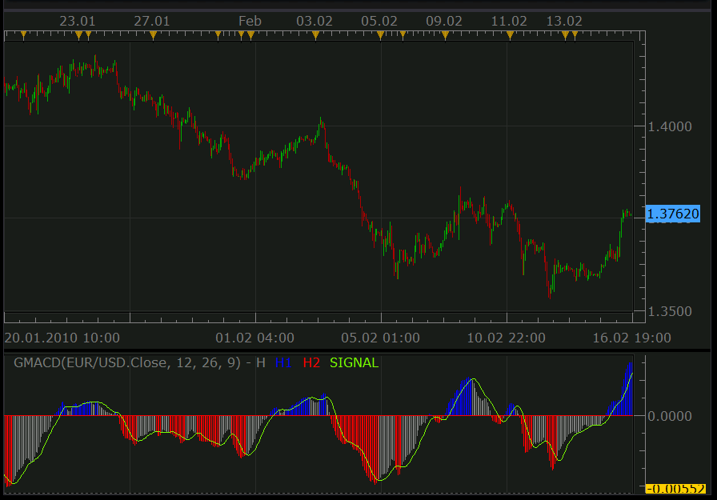
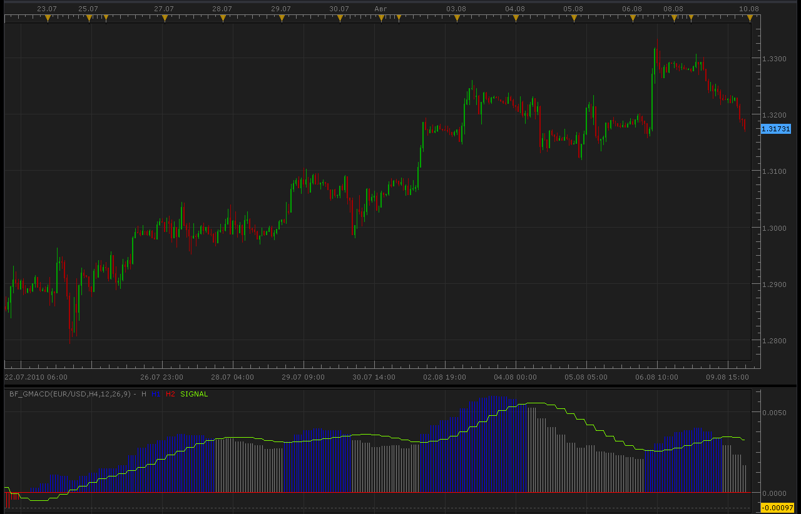

# Colorful MACD (aka Golden MT4's MACD)

> Source: https://fxcodebase.com/code/viewtopic.php?f=17&t=358  
> Forum: 17 · Topic 358 · 37 post(s)

---

## Colorful MACD (aka Golden MT4's MACD)

**Nikolay.Gekht** · Tue Feb 16, 2010 6:16 pm

This is the usual MACD indicator with the following features:

- Unlike the standard TS implementation this indicator shows the MACD as a histogram and SIGNAL as a line (the standard indicator shows MACD and SIGNAL as lines and the difference between MACD and SIGNAL as a histogram)
- The histogram bars are colored in case the bar is above (below) the signal line. The same coloring is used in MT4 Golden MACD indicator.

Formula:
MACD = EMA(price, short) - EMA(price, long)
SIGNAL = MVA(MACD, signal)

Preview:

 

Download:

 [GMACD.lua](files/595/GMACD.lua)

 [GMACD with Alert.lua](files/595/GMACD%20with%20Alert.lua)

 

Above 0 & above signal = Blue.
Above 0 & below signal = Light Blue.
Below 0 & below signal = Red.
Below 0 & above signal = Light Red.

 [4 color GMACD histogram with Alerts.lua](files/595/4%20color%20GMACD%20histogram%20with%20Alerts.lua)

The indicator was revised and updated

---

## Re: Colorful MACD (aka Golden MT4's MACD)

**Hybrid** · Sun Aug 08, 2010 6:49 am

This is a very useful indicator.
Can a bigger time frame version be created?

---

## Re: Colorful MACD (aka Golden MT4's MACD)

**Apprentice** · Sun Aug 08, 2010 1:17 pm

Added to the Development cue.
I have to check but I think someone has already written what one.

---

## Re: Colorful MACD (aka Golden MT4's MACD)

**Alexander.Gettinger** · Mon Aug 09, 2010 9:50 pm

Bigger time frame indicator.

 

Code: [Select all](https://fxcodebase.com/code/)
`function Init()
    indicator:name("Bigger timeframe GMACD");
    indicator:description("");
    indicator:requiredSource(core.Bar);
    indicator:type(core.Oscillator);

    indicator.parameters:addGroup("Calculation");
    indicator.parameters:addString("BS", "Time frame to calculate GMACD", "", "D1");
    indicator.parameters:setFlag("BS", core.FLAG_PERIODS);
    indicator.parameters:addInteger("SN", "Short EMA", "", 12, 2, 1000);
    indicator.parameters:addInteger("LN", "Long EMA", "", 26, 2, 1000);
    indicator.parameters:addInteger("IN", "Signal Line", "", 9, 2, 1000);
    indicator.parameters:addGroup("Display");
    indicator.parameters:addColor("SIGNAL_color", "The signal line color", "", core.rgb(127, 255, 0));
    indicator.parameters:addColor("HISTOGRAM_color", "The histogramm color", "", core.rgb(127, 127, 127));
    indicator.parameters:addColor("HISTOGRAM1_color", "The histogramm color 1", "", core.rgb(0, 0, 255));
    indicator.parameters:addColor("HISTOGRAM2_color", "The histogramm color 2", "", core.rgb(255, 0, 0));
end

local source;                   -- the source
local bf_data = nil;          -- the high/low data
local SN;
local LN;
local IN;
local BS;
local bf_length;                 -- length of the bigger frame in seconds
local dates;                    -- candle dates
local host;
local HISTOGRAM;
local HISTOGRAM1;
local HISTOGRAM2;
local SIGNAL;
local GMACD;
local day_offset;
local week_offset;
local extent;

function Prepare()
    source = instance.source;
    host = core.host;

    day_offset = host:execute("getTradingDayOffset");
    week_offset = host:execute("getTradingWeekOffset");

    BS = instance.parameters.BS;
    SN = instance.parameters.SN;
    LN = instance.parameters.LN;
    IN = instance.parameters.IN;
    extent = LN*2;

    local s, e, s1, e1;

    s, e = core.getcandle(source:barSize(), core.now(), 0, 0);
    s1, e1 = core.getcandle(BS, core.now(), 0, 0);
    assert ((e - s) <= (e1 - s1), "The chosen time frame must be bigger than the chart time frame!");
    bf_length = math.floor((e1 - s1) * 86400 + 0.5);

    local name = profile:id() .. "(" .. source:name() .. "," .. BS .. "," .. SN .. "," .. LN .. "," .. IN .. ")";
    instance:name(name);
    HISTOGRAM = instance:addStream("H", core.Bar, name .. ".H", "H", instance.parameters.HISTOGRAM_color, 0);
    HISTOGRAM1 = instance:addStream("H1", core.Bar, name .. ".H1", "H1", instance.parameters.HISTOGRAM1_color, 0);
    HISTOGRAM2 = instance:addStream("H2", core.Bar, name .. ".H2", "H2", instance.parameters.HISTOGRAM2_color, 0);
    SIGNAL = instance:addStream("SIGNAL", core.Line, name .. ".SIGNAL", "SIGNAL", instance.parameters.SIGNAL_color, 0);
end

local loading = false;
local loadingFrom, loadingTo;
local pday = nil;

-- the function which is called to calculate the period
function Update(period, mode)
    -- get date and time of the hi/lo candle in the reference data
    local bf_candle;
    bf_candle = core.getcandle(BS, source:date(period), day_offset, week_offset);

    -- if data for the specific candle are still loading
    -- then do nothing
    if loading and bf_candle >= loadingFrom and (loadingTo == 0 or bf_candle <= loadingTo) then
        return ;
    end

    -- if the period is before the source start
    -- the do nothing
    if period < source:first() then
        return ;
    end

    -- if data is not loaded yet at all
    -- load the data
    if bf_data == nil then
        -- there is no data at all, load initial data
        local to, t;
        local from;

        if (source:isAlive()) then
            -- if the source is subscribed for updates
            -- then subscribe the current collection as well
            to = 0;
        else
            -- else load up to the last currently available date
            t, to = core.getcandle(BS, source:date(period), day_offset, week_offset);
        end

        from = core.getcandle(BS, source:date(source:first()), day_offset, week_offset);
        HISTOGRAM:setBookmark(1, period);
        -- shift so the bigger frame data is able to provide us with the stoch data at the first period
        from = math.floor(from * 86400 - (bf_length * extent) + 0.5) / 86400;
        local nontrading, nontradingend;
        nontrading, nontradingend = core.isnontrading(from, day_offset);
        if nontrading then
            -- if it is non-trading, shift for two days to skip the non-trading periods
            from = math.floor((from - 2) * 86400 - (bf_length * extent) + 0.5) / 86400;
        end
        loading = true;
        loadingFrom = from;
        loadingTo = to;
        bf_data = host:execute("getHistory", 1, source:instrument(), BS, loadingFrom, to, source:isBid());
        GMACD = core.indicators:create("GMACD", bf_data.close, SN, LN, IN);
        return ;
    end

    -- check whether the requested candle is before
    -- the reference collection start
    if (bf_candle < bf_data:date(0)) then
        HISTOGRAM:setBookmark(1, period);
        if loading then
            return ;
        end
        -- shift so the bigger frame data is able to provide us with the stoch data at the first period
        from = math.floor(bf_candle * 86400 - (bf_length * extent) + 0.5) / 86400;
        local nontrading, nontradingend;
        nontrading, nontradingend = core.isnontrading(from, day_offset);
        if nontrading then
            -- if it is non-trading, shift for two days to skip the non-trading periods
            from = math.floor((from - 2) * 86400 - (bf_length * extent) + 0.5) / 86400;
        end
        loading = true;
        loadingFrom = from;
        loadingTo = bf_data:date(0);
        host:execute("extendHistory", 1, bf_data, loadingFrom, loadingTo);
        return ;
    end

    -- check whether the requested candle is after
    -- the reference collection end
    if (not(source:isAlive()) and bf_candle > bf_data:date(bf_data:size() - 1)) then
        HISTOGRAM:setBookmark(1, period);
        if loading then
            return ;
        end
        loading = true;
        loadingFrom = bf_data:date(bf_data:size() - 1);
        loadingTo = bf_candle;
        host:execute("extendHistory", 1, bf_data, loadingFrom, loadingTo);
        return ;
    end

    GMACD:update(mode);
    local p;
    p = findDateFast(bf_data, bf_candle, true);
    if p == -1 then
        return ;
    end
    if GMACD:getStream(0):hasData(p) then
        HISTOGRAM[period] = GMACD:getStream(0)[p];
    end
    if GMACD:getStream(1):hasData(p) then
        HISTOGRAM1[period] = GMACD:getStream(1)[p];
    end
    if GMACD:getStream(2):hasData(p) then
        HISTOGRAM2[period] = GMACD:getStream(2)[p];
    end
    if GMACD:getStream(3):hasData(p) then
        SIGNAL[period] = GMACD:getStream(3)[p];
    end
end

-- the function is called when the async operation is finished
function AsyncOperationFinished(cookie)
    local period;

    pday = nil;
    period = HISTOGRAM:getBookmark(1);

    if (period < 0) then
        period = 0;
    end
    loading = false;
    instance:updateFrom(period);
end

function findDateFast(stream, date, precise)
    local datesec = nil;
    local periodsec = nil;
    local min, max, mid;

    datesec = math.floor(date * 86400 + 0.5)

    min = 0;
    max = stream:size() - 1;

    while true do
        mid = math.floor((min + max) / 2);
        periodsec = math.floor(stream:date(mid) * 86400 + 0.5);
        if datesec == periodsec then
            return mid;
        elseif datesec > periodsec then
            min = mid + 1;
        else
            max = mid - 1;
        end
        if min > max then
            if precise then
                return -1;
            else
                return min - 1;
            end
        end
    end
end`

 [BF_GMACD.lua](files/3455/BF_GMACD.lua)

---

## Re: Colorful MACD (aka Golden MT4's MACD)

**Hybrid** · Tue Aug 10, 2010 9:54 am

Thank you, Alexander.
You guys rock!

---

## Re: Colorful MACD (aka Golden MT4's MACD)

**Belvatrader** · Mon Oct 25, 2010 5:16 pm

This is one of the best indicators for trading.
Can someone add the ability to change the type of MA?
Simple, exponential weighted, etc..

It would be very interesting!
Thanks in advance

---

## Re: Colorful MACD (aka Golden MT4's MACD)

**Apprentice** · Tue Oct 26, 2010 4:34 am

[GMACD.lua](files/5549/GMACD.lua)

 [BF_GMACD.lua](files/5549/BF_GMACD.lua)

This version allows you requested.

Price Type, Selection, Added.
Added MA Type Selection.

---

## Re: Colorful MACD (aka Golden MT4's MACD)

**Belvatrader** · Tue Oct 26, 2010 9:37 am

Hello,
thank you very much for speed.
Let me ask you another thing.
Currently, the color of the bars is determined on the basis of the signal line.
You can set a variable so that the bar color is determined by the difference in length with the previous bar?
Thanks!

---

## Re: Colorful MACD (aka Golden MT4's MACD)

**Apprentice** · Thu Dec 02, 2010 5:51 am

Style Update.

---

## Re: Colorful MACD (aka Golden MT4's MACD)

**upsunx** · Fri Dec 10, 2010 7:22 am

hi, Nice work.
Can you give a option to add a Simple Moving agave line to the bars? That will make easier to see the single across.
Please see the picture about my MACD in MT4.

Thanks again.

---

## Re: Colorful MACD (aka Golden MT4's MACD)

**Belvatrader** · Wed Dec 29, 2010 4:29 am

News for the development?

Thanks!

---

## Re: Colorful MACD (aka Golden MT4's MACD)

**Apprentice** · Thu Mar 29, 2012 3:21 am

to upsunx, Something like this

 

 [GMACD Lines.lua](files/28940/GMACD%20Lines.lua)

---

## Re: Colorful MACD (aka Golden MT4's MACD)

**alex2011uk** · Tue Jun 26, 2012 7:02 am

Hey! I'd need to color the area between 2 monig avarage...doen anybody know how to do it?
thanks
ALex

---

## Re: Colorful MACD (aka Golden MT4's MACD)

**Apprentice** · Wed Jun 27, 2012 4:31 am

Try to use Cloud Indicator.
[viewtopic.php?f=17&t=1589&p=5701&hilit=mva+%2F+ema+cloud#p5701](https://fxcodebase.com/code/viewtopic.php?f=17&t=1589&p=5701&hilit=mva+%2F+ema+cloud#p5701)
P.S.
Only one post is sufficient, multiple posts are not necessity.

---

## Re: Colorful MACD (aka Golden MT4's MACD)

**ertonm** · Sun Jul 08, 2012 8:34 pm

Hi, is there any strategy for colorful MACD indicator that open positions when MACD crosses 0 line?

Thank you

---

## Re: Colorful MACD (aka Golden MT4's MACD)

**Apprentice** · Mon Jul 09, 2012 6:55 am

You can use MACD strategy which is using this algo.

---

## Re: Colorful MACD (aka Golden MT4's MACD)

**ertonm** · Mon Jul 09, 2012 9:05 pm

Can't find this strategy Aprentice. Can you help please.

---

## Re: Colorful MACD (aka Golden MT4's MACD)

**sunshine** · Tue Jul 10, 2012 12:38 am

Please see [MACD Strategy](https://fxcodebase.com/code/viewtopic.php?f=31&t=4100&p=22982&hilit=macd#p10276)

---

## Re: Colorful MACD (aka Golden MT4's MACD)

**ertonm** · Tue Jul 10, 2012 10:11 pm

Thank you sunshine.

---

## Re: Colorful MACD (aka Golden MT4's MACD)

**RJH501** · Wed Jul 25, 2012 12:55 pm

Gentlemen,

Would you please add the zero line to GMACD LINE indicator.

Thank you,

RJH

---

## Re: Colorful MACD (aka Golden MT4's MACD)

**amazon1a** · Thu Jul 26, 2012 10:56 am

Hi, Is there a version of MACD that would let me add Horizontal lines as well as a Zero line, eg. +/- 0.0025 etc, preferably with a choice of color.

---

## Re: Colorful MACD (aka Golden MT4's MACD)

**mykkee** · Sun Aug 23, 2015 12:44 pm

Hi, I would like to know if a signal can be made for the GMACD. I use the GMACD and have a area between the .0002 and negative -.0002 marked off or shaded. I find that when the GMACD is between these levels the pair more or less is ranging and anything above or below these levels it tends to be trending. I would like to know if a signal or alert can be made that triggers when the histograms bar close is either above or below theses levels. Also I would like for the signal to be able to be used on different or custom time frames, as I use the 1, 2, 3, 5 and 10 minute charts. Thank you for your time and service.

---

## Re: Colorful MACD (aka Golden MT4's MACD)

**Apprentice** · Wed Aug 26, 2015 9:46 am

Try MACD Histogram Level Cross Strategy
[viewtopic.php?f=31&t=62587](https://fxcodebase.com/code/viewtopic.php?f=31&t=62587)

---

## Re: Colorful MACD (aka Golden MT4's MACD)

**mykkee** · Wed Aug 26, 2015 1:32 pm

Hey, I think that may work....it lets me put in the levels....but can you also adjust or allow so that I can put in different time frames like I can on the charts....like M2, M3, M10...for 2,3 and 10 minute charts, I would like to use these other time frames to help with confirmation and some of them as alerts ...thanks a bunch!!

---

## Re: Colorful MACD (aka Golden MT4's MACD)

**MarkMcCoskey** · Mon Feb 15, 2016 2:57 pm

It would be nice to have a signal/arrow painted on the chart when the GMACD histogram closes above and below the signal line, if at all possible. Thanks!

---

## Re: Colorful MACD (aka Golden MT4's MACD)

**Apprentice** · Wed Feb 17, 2016 5:46 am

GMACD with Alert.lua Added (First post in topic)

---

## Re: Colorful MACD (aka Golden MT4's MACD)

**MarkMcCoskey** · Fri Feb 19, 2016 3:55 pm

**Thank you Apprentice**!!

Here is a screenshot of the GMACD with Alert.
Note: I did edit the .lua to suit my needs.

---

## Re: Colorful MACD (aka Golden MT4's MACD)

**MarkMcCoskey** · Tue Jul 19, 2016 5:38 pm

Could you possibly make a 4 color GMACD histogram with Alerts?

Above 0 & above signal = Blue.
Above 0 & below signal = Light Blue.
Below 0 & below signal = Red.
Below 0 & above signal = Light Red.

Thanks!

---

## Re: Colorful MACD (aka Golden MT4's MACD)

**Apprentice** · Wed Jul 20, 2016 6:20 am

4 color GMACD histogram with Alerts.lua added.

---

## Re: Colorful MACD (aka Golden MT4's MACD)

**MarkMcCoskey** · Sun Aug 07, 2016 6:34 pm

Screenshot of "4 color GMACD histogram with Alerts.lua"

Thanks!!!

---

## Re: Colorful MACD (aka Golden MT4's MACD)

**SavvyStrategist** · Thu Sep 01, 2016 6:14 pm

I hate to add to this thread, so many requests...
But could we get a version that flat out ignores the signal line and colors according to the histogram with respect to itself: above 0 and ascending, above 0 and descending; below 0 and descending and below 0 and ascending. So no signal line, just the MACD line, which in this indicator is the histogram, with formatting options.

Also, a zero line that isn't red would be nice, any shade of grey or black would do fine.

---

## Re: Colorful MACD (aka Golden MT4's MACD)

**Apprentice** · Fri Sep 02, 2016 2:29 am

GMACD.lua without signal line, Only MACD & Histogram bars?

---

## Re: Colorful MACD (aka Golden MT4's MACD)

**SavvyStrategist** · Sat Sep 03, 2016 4:24 pm

Pretty much, just the MACD line as a histogram. I don't use the signal line, so I just want to recolor it to make it easier to read. Basically, I'm looking to make the golden MACD look like the four color OsMA indicator, as seen below.

---

## Re: Colorful MACD (aka Golden MT4's MACD)

**Apprentice** · Sun Sep 04, 2016 6:30 am

Try this version.
[viewtopic.php?f=17&t=63834](https://fxcodebase.com/code/viewtopic.php?f=17&t=63834)

---

## Re: Colorful MACD (aka Golden MT4's MACD)

**SavvyStrategist** · Thu Jan 05, 2017 5:44 am

I hadn't realized I never thanked you for this, my bad. I think I downloaded it, tried it and proceeded to forget. Thank you, is what I'm getting at.

One question, is there a strategy for this indicator? Just the change in slope of the MACD line. I saw there's a few indicators with alerts but because you can't select a sound file it yields an error.

---

## Re: Colorful MACD (aka Golden MT4's MACD)

**BigFOX** · Thu Jan 05, 2017 1:16 pm

Hi Apprentice,
it is possible to create a strategy with "GMACD with Alert".

Cordially BigFOX.

---

## Re: Colorful MACD (aka Golden MT4's MACD)

**Apprentice** · Sat Jan 07, 2017 8:25 am

Try this version.
[viewtopic.php?f=31&t=64271](https://fxcodebase.com/code/viewtopic.php?f=31&t=64271)
