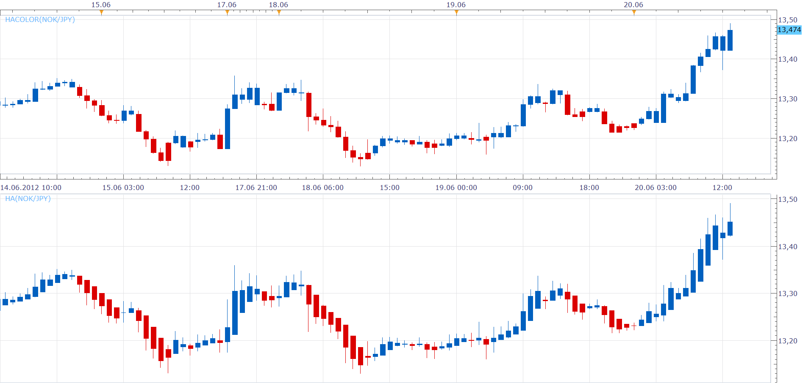

# Colorize candles into Heikin-Ashi colors

> Source: https://fxcodebase.com/code/viewtopic.php?f=17&t=20429  
> Forum: 17 · Topic 20429 · 7 post(s)

---

## Colorize candles into Heikin-Ashi colors

**Nikolay.Gekht** · Wed Jun 20, 2012 12:03 pm

A simple indicator which colorizes the candles into the colors of corresponding Heikin-Ashi candles.

 

Download:

 [HACOLOR.lua](files/35819/HACOLOR.lua)

The indicator was revised and updated

---

## Re: Colorize candles into Heikin-Ashi colors

**biggiesmalls** · Thu Jun 21, 2012 6:53 am

Thanks guys.

---

## Re: Colorize candles into Heikin-Ashi colors

**nickgal** · Wed Jan 08, 2014 11:55 am

Hi Nikolay thank you for taking the time to write and post this wonderful indicator.
I wanted to ask you if it's possible to write the same indicator but instead of showing the Heikin-Ashi color to just show the actual candle color in real time ? The reason I'm asking is because the indicator as it is can be overlayed on smaller time frames as in 4Hour on top of the 15min or Daily on top of a 4Hour charts ... this I think is the interesting part since now you can plot other smaller time frames indicators ( CCI,RSI,MACD) on the bigger time frames.
Your help is much appreciated and thank you again.

Nick

---

## Re: Colorize candles into Heikin-Ashi colors

**Apprentice** · Mon Jan 13, 2014 6:01 am

Can you offer an explanation.
If we use a real candle color, then this indicator is redundant.
Simply remove it.

It this your desired Presentation mode?
[download/file.php?id=7670&mode=view](https://fxcodebase.com/code/download/file.php?id=7670&mode=view)

If you are only interested in Price, you can use the indicator similar to this.
[search.php?st=0&sk=t&sd=d&sr=posts&keywords=BTF+Candle&fid%5B%5D=17&start=10](https://fxcodebase.com/code/search.php?st=0&sk=t&sd=d&sr=posts&keywords=BTF+Candle&fid%5B%5D=17&start=10)

---

## Re: Colorize candles into Heikin-Ashi colors

**Apprentice** · Sun Aug 06, 2017 7:12 am

The indicator was revised and updated.

---

## Re: Colorize candles into Heikin-Ashi colors

**scandisk** · Sun May 24, 2020 1:04 pm

Hi Apprentice

Its weird because with this indicator installed my price charts are unable to scroll charts up or down to size the candles?

---

## Re: Colorize candles into Heikin-Ashi colors

**Apprentice** · Mon May 25, 2020 5:31 am

affirmative,
sent it to the development team.
