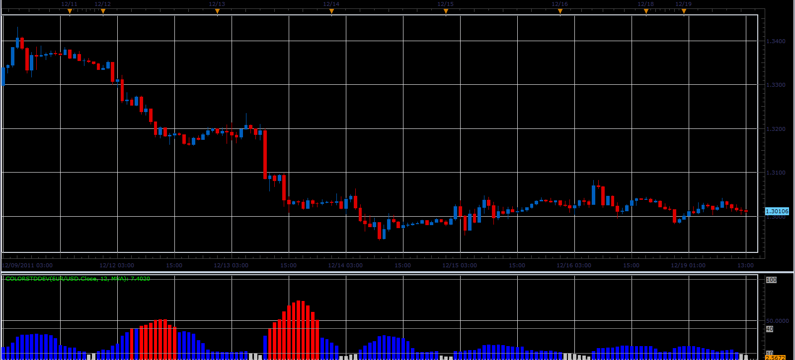

# ColorStdDev indicator

> Source: https://fxcodebase.com/code/viewtopic.php?f=17&t=10139  
> Forum: 17 · Topic 10139 · 2 post(s)

---

## ColorStdDev indicator

**Alexander.Gettinger** · Mon Dec 19, 2011 1:28 pm

This indicator is a ported MQL5 indicator from [http://www.mql5.com/ru/code/761](http://www.mql5.com/ru/code/761) (in Russian).

ColorStdDev=StdDev/(Size of pip).
If ColorStdDev>MaxTrendLevel, indicator have a MaxTrendColor,
If ColorStdDev<MaxTrendLevel and ColorStrDev>MiddleTrendLevel, indicator have a MiddleTrendColor, etc.

 

Download:

 [ColorStdDev.lua](files/21237/ColorStdDev.lua)

For this indicator must be installed StdDev2 indicator ([viewtopic.php?f=17&t=870&p=1577](https://fxcodebase.com/code/viewtopic.php?f=17&t=870&p=1577)).

The indicator was revised and updated

---

## Re: ColorStdDev indicator

**Apprentice** · Tue Mar 21, 2017 6:24 am

Indicator was revised and updated.
