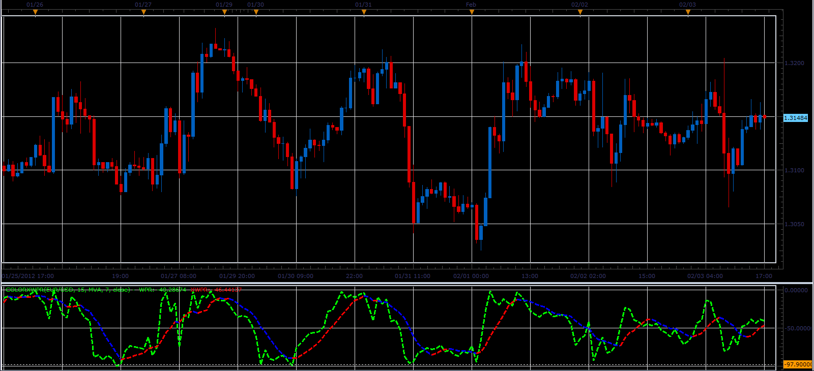

# ColorXWPR oscillator

> Source: https://fxcodebase.com/code/viewtopic.php?f=17&t=12832  
> Forum: 17 · Topic 12832 · 7 post(s)

---

## ColorXWPR oscillator

**Alexander.Gettinger** · Sat Feb 04, 2012 6:54 pm

This indicator is a ported MQL5 indicator from [http://www.mql5.com/en/code/753](http://www.mql5.com/en/code/753).

> Signal line and the possibility to select price time series are added in this version of Larry Williams' Percent Range.

 

Download:

 [ColorXWPR.lua](files/25173/ColorXWPR.lua)

For this indicator must be installed AVERAGES indicator ([viewtopic.php?f=17&t=2430](https://fxcodebase.com/code/viewtopic.php?f=17&t=2430)).

The indicator was revised and updated

---

## Re: ColorXWPR oscillator

**Coondawg71** · Tue Aug 28, 2012 8:34 am

Can we please request a Strategy to compliment this indicator. It would operate in a similar fashion to the AVERAGES Strategy. Long/Short trades would be opened and closed at the CHANGE OF SLOPE, as opposed to crossing of MA over/under signal, this would reduce false signals greatly.

Thanks,

sjc

---

## Re: ColorXWPR oscillator

**Apprentice** · Wed Aug 29, 2012 12:59 am

Your request is added to the development list.

---

## Re: ColorXWPR oscillator

**Apprentice** · Thu Apr 06, 2017 3:55 pm

Indicator was revised and updated.

---

## Re: ColorXWPR oscillator

**Apprentice** · Fri Apr 07, 2017 1:46 pm

Check out this strategy based on this indicator.
[viewtopic.php?f=31&t=64574](https://fxcodebase.com/code/viewtopic.php?f=31&t=64574)

---

## Re: ColorXWPR oscillator

**cash4u** · Sat Apr 08, 2017 4:52 pm

hi apprendice ,

may i request a strategy based on this indicator.

indicator: color wpr with default parameters

buy level; 50
sell level:;50

buy: wpr cross over xwpr and xwpr(period)>xwpr (period - 1) and xwpr < buy level

sell: wpr cross under xwpr and xwpr(period) < xwpr (period - 1) and xwpr >sell level

---

## Re: ColorXWPR oscillator

**Apprentice** · Mon Apr 10, 2017 7:34 am

Try this version.
[viewtopic.php?f=31&t=64582](https://fxcodebase.com/code/viewtopic.php?f=31&t=64582)
