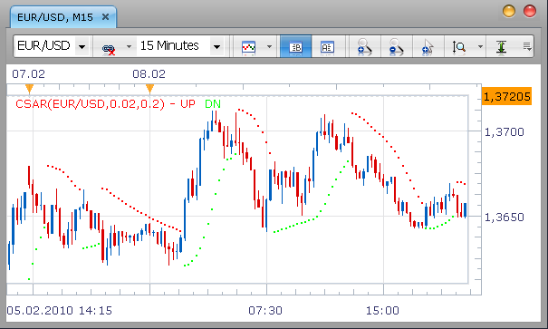

# Colour SAR

> Source: https://fxcodebase.com/code/viewtopic.php?f=17&t=295  
> Forum: 17 · Topic 295 · 17 post(s)

---

## Colour SAR

**Nikolay.Gekht** · Tue Feb 09, 2010 3:35 pm

This is a slightly modified version of the standard TS/Marketscope SAR indicator which:
- lets choose different color for up and down parts of SAR
- lets choose step and maximum values (default values are 0.02 and 0.2)

 

Code: [Select all](https://fxcodebase.com/code/)
`-- The indicator corresponds to the Parabolic indicator in MetaTrader.
-- The formula is described in the Kaufman "Trading Systems and Methods" chapter 5 "Trend Systems" (page 98-99)

-- Indicator profile initialization routine
-- Defines indicator profile properties and indicator parameters
function Init()
    indicator:name("Color SAR");
    indicator:description("Helps to define the direction of the prevailing trend and the moment to close positions opened during the reversal.");
    indicator:requiredSource(core.Bar);
    indicator:type(core.Indicator);
    indicator.parameters:addDouble("Step", "Step", "", 0.02, 0.001, 1);
    indicator.parameters:addDouble("Max", "Max", "", 0.2, 0.001, 10);
    indicator.parameters:addColor("clrUp", "Up Line Color", "", core.rgb(255, 0, 0));
    indicator.parameters:addColor("clrDown", "Down Line Color", "", core.rgb(0, 255, 0));
end

-- Indicator instance initialization routine
-- Processes indicator parameters and creates output streams
-- Parameters block

local first;
local source = nil;
local tradeHigh = nil;
local tradeLow = nil;
local parOp = nil;
local position = nil;
local af = nil;
local Step;
local Max;

-- Streams block
local SAR = nil;
local UP = nil;
local DOWN = nil;

-- Routine
function Prepare()
    source = instance.source;
    first = source:first() + 1;

    Step = instance.parameters.Step;
    Max = instance.parameters.Max;

    local name = profile:id() .. "(" .. source:name() .. "," .. Step .. "," .. Max .. ")";
    instance:name(name);

    tradeHigh = instance:addInternalStream(0, 0);
    tradeLow = instance:addInternalStream(0, 0);
    parOp = instance:addInternalStream(0, 0);
    position = instance:addInternalStream(0, 0);
    af = instance:addInternalStream(0, 0);
    SAR = instance:addInternalStream(first, 0);
    UP = instance:addStream("UP", core.Dot, name .. ".Up", "UP", instance.parameters.clrUp, first)
    DOWN = instance:addStream("DN", core.Dot, name .. ".Dn", "DN", instance.parameters.clrDown, first)
end

-- Indicator calculation routine
function Update(period)
    local init = Step;
    local quant = Step;
    local maxVal = Max;
    local lastHighest = 0;
    local lastLowest = 0;
    local high = 0;
    local low = 0;
    local prevHigh = 0;
    local prevLow = 0;
    if period >= first then
        high = source.high[period];
        low = source.low[period];
        prevHigh = source.high[period - 1];
        prevLow = source.low[period - 1];
        if (period == first) then
            tradeHigh[period] = prevHigh;
            tradeLow[period] = prevLow;
            position[period] = -1;
            parOp[period] = prevHigh;
            af[period] = 0;
        else
            parOp[period] = parOp[period - 1];
            position[period] = position[period - 1];
            tradeHigh[period] = tradeHigh[period - 1];
            tradeLow[period] = tradeLow[period - 1];
            af[period] = af[period - 1];
        end
        lastHighest = tradeHigh[period];
        lastLowest = tradeLow[period];
        if high > lastHighest then
            tradeHigh[period] = high;
        end

        if low < lastLowest then
            tradeLow[period] = low;
        end

        if position[period] == 1 then
            if (low < parOp[period]) then
                position[period] = -1;
                SAR[period] = lastHighest;
                tradeHigh[period] = high;
                tradeLow[period] = low;
                af[period] = init;
                parOp[period] = SAR[period] + af[period] * (tradeLow[period] - SAR[period]);
                if (parOp[period] < high) then
                    parOp[period] = high;
                end
                if (parOp[period] < prevHigh) then
                    parOp[period] = prevHigh;
                end
            else
                SAR[period] = parOp[period];
                if (tradeHigh[period] > tradeHigh[period - 1] and af[period] < maxVal) then
                    af[period] = af[period] + quant;
                    if af[period] > maxVal then
                        af[period] = maxVal;
                    end
                end

                parOp[period] = SAR[period] + af[period] * (tradeHigh[period] - SAR[period]);
                if (parOp[period] > low) then
                    parOp[period] = low;
                end
                if (parOp[period] > prevLow) then
                    parOp[period] = prevLow;
                end
            end
        else
            if (high > parOp[period]) then
                position[period] = 1;
                SAR[period] = lastLowest;
                tradeHigh[period] = high;
                tradeLow[period] = low;
                af[period] = init;
                parOp[period] = SAR[period] + af[period] * (tradeHigh[period] - SAR[period]);
                if (parOp[period] > low) then
                    parOp[period] = low;
                end
                if (parOp[period] > prevLow) then
                    parOp[period] = prevLow;
                end
            else
                SAR[period] = parOp[period];
                if (tradeLow[period] < tradeLow[period - 1] and af[period] < maxVal) then
                    af[period] = af[period] + quant;
                    if af[period] > maxVal then
                        af[period] = maxVal;
                    end
                end

                parOp[period] = SAR[period] + af[period] * (tradeLow[period] - SAR[period]);
                if (parOp[period] < high) then
                    parOp[period] = high;
                end
                if (parOp[period] < prevHigh) then
                    parOp[period] = prevHigh;
                end
            end
        end

        if position[period] == 1 then
            DOWN[period] = SAR[period];
        else
            UP[period] = SAR[period];
        end
    end
end`

Download indicator:

 [CSAR.lua](files/515/CSAR.lua)

---

## Re: Colour SAR

**maani1972** · Wed Apr 21, 2010 7:25 am

Hi Nikolay,

You added a great feature to the SAR, congratulation. Do you think it would be possible to add a way to make the dots bigger, more visible? And when the SAR changes from up to down and the opposite, it can generate at the first dot, a bigger dot than the others or an arrow? And do you think having a sound alert of our choice and e-mail alerts can be done? If so do you think with your skills you can do that? If so let me know. Have a great day.

---

## Re: Colour SAR

**chriz2110** · Sat Jan 08, 2011 10:53 am

Hi Nikolay,

Would it be possible for someone to write an original Parabolic Sar strategy like this Expert Advisor:

[http://www.tradingsystemforex.com/exper ... ar-ea.html](http://www.tradingsystemforex.com/expert-advisors-backtesting/157-parabolic-sar-ea.html).

Thank you & kindly regards,

chriz2110

---

## Re: Colour SAR

**Apprentice** · Sat Jan 08, 2011 12:44 pm

Added to the development cue.

---

## Re: Colour SAR

**Apprentice** · Fri Mar 30, 2012 6:18 am

Requested can be found here.
[viewtopic.php?f=31&t=15391](https://fxcodebase.com/code/viewtopic.php?f=31&t=15391)

---

## Re: Colour SAR

**bbpulse** · Wed May 23, 2012 10:25 am

I am trying to Load the SAR indicator with sound and bigger color dots but it keeps giving me an error which reads incorrect file format. I see the code is saved as .lua I'm not familiar with this. I copied the code and saved it on Notepad but the error continues.

Any thoughts?

---

## Re: Colour SAR

**Apprentice** · Thu May 24, 2012 5:58 am

Can you post, or send this code to my privat email.

---

## Re: Colour SAR

**DanPhi74** · Tue Jul 12, 2016 5:18 am

Hello,

could you code a version of Color SAR with the step until 0.0000001 ?

Best regards
Daniel

---

## Re: Colour SAR

**Apprentice** · Tue Jul 12, 2016 7:26 am

Try it now.

---

## Re: Colour SAR

**DanPhi74** · Wed Jul 13, 2016 10:08 am

Many Thanks to you !

---

## Re: Colour SAR

**DanPhi74** · Fri Jul 22, 2016 3:57 am

Hello Guys,

could you improve the CSAR indi by enabling bigger size of dots ?

Best regards
Dan

---

## Re: Colour SAR

**Apprentice** · Sun Jul 24, 2016 7:35 am

Width option added.

---

## Re: Colour SAR

**DanPhi74** · Wed Jul 27, 2016 6:37 am

Many thanks again !

---

## Re: Colour SAR

**Apprentice** · Tue Sep 04, 2018 9:59 am

The indicator was revised and updated.

---

## Re: Colour SAR

**xpertize** · Fri Nov 15, 2019 8:20 am

Hello Fxcodebase,

I want to add Moving average on SAR. I can do that perfectly on MT4 software like this:

 

But when I do that on Tradestation II, it shows two SAR values. Like Up and down. Under the data source tab.

Is there any way I can place Moving average on SAR just like I did on MT4? Without the up and down values separately.

Thanks,
Xpertize

---

## Re: Colour SAR

**Apprentice** · Sat Nov 16, 2019 7:19 am

Try this version.
[viewtopic.php?f=17&t=29613](https://fxcodebase.com/code/viewtopic.php?f=17&t=29613)

---

## Re: Colour SAR

**xpertize** · Sat Nov 16, 2019 8:13 am

Thanks Apprentice!
