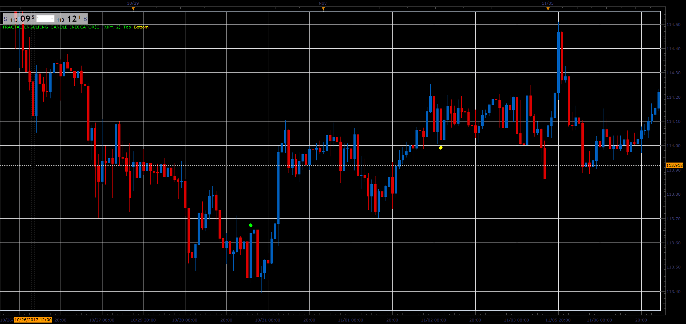

# Combined Fractal Engulfing Candle indicator

> Source: https://fxcodebase.com/code/viewtopic.php?f=17&t=65399  
> Forum: 17 · Topic 65399 · 5 post(s)

---

## Combined Fractal Engulfing Candle indicator

**Alexander.Gettinger** · Mon Nov 27, 2017 11:02 am

Based on request: [viewtopic.php?f=27&t=62961](https://fxcodebase.com/code/viewtopic.php?f=27&t=62961)

 

Download:

 [Fractal_Engulfing_Candle_Indicator.lua](files/116239/Fractal_Engulfing_Candle_Indicator.lua)

---

## Re: Combined Fractal Engulfing Candle indicator

**Apprentice** · Sat Apr 21, 2018 9:28 am

The Indicator was revised and updated.

---

## Re: Combined Fractal Engulfing Candle indicator

**goldmind** · Thu Nov 28, 2024 3:19 pm

> **Apprentice wrote:**
> The Indicator was revised and updated.

Hi
I'm searching for a similar indicator for mt4 or mt5 is it possible?

---

## Re: Combined Fractal Engulfing Candle indicator

**Apprentice** · Thu Dec 05, 2024 1:44 pm

We have added your request to the development list.
Development reference 902

---

## Re: Combined Fractal Engulfing Candle indicator

**Apprentice** · Thu Jan 30, 2025 4:50 am

Try this version.
[https://fxcodebase.com/code/viewtopic.p ... 95#p145695](https://fxcodebase.com/code/viewtopic.php?f=38&t=70407&p=145695#p145695)
