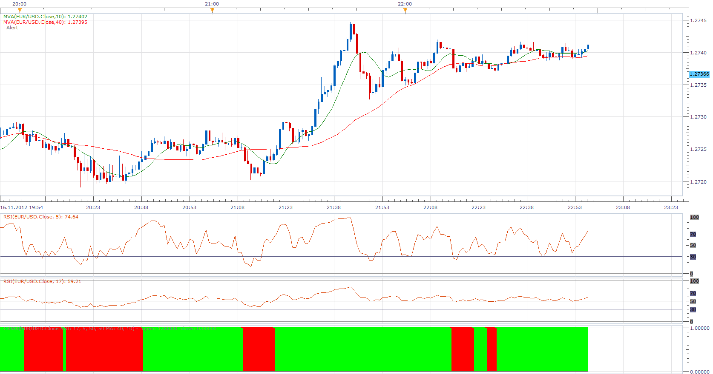

# Combining Rsi With Rsi

> Source: https://fxcodebase.com/code/viewtopic.php?f=17&t=26220  
> Forum: 17 · Topic 26220 · 5 post(s)

---

## Combining Rsi With Rsi

**Apprentice** · Sun Nov 18, 2012 5:55 am

This indicator will give you a Buy or Sell signal if both RSI / MA filters give the same indication.
Buy
Price> MA
RSI> RSI Buy Line

Sell
Price <MA
RSI <RSI Sell Line

Additional Filter
If used, the filter, will eliminate,
unambiguous (neutral) indications.

 [CRWR.lua](files/44995/CRWR.lua)

The indicator was revised and updated

---

## Re: Combining Rsi With Rsi

**trader-muc** · Tue Nov 20, 2012 12:09 pm

a great indicator. very useful as filter (i use it in combination with supertrend).

is it possible to build a strategy / alert when the color of the indicator changes ? tanks in advance !

---

## Re: Combining Rsi With Rsi

**Blackcat2** · Wed Nov 21, 2012 2:50 am

Can it be modified to allow different type of MA? For example, EMA, etc..

Thanks.

---

## Re: Combining Rsi With Rsi

**Apprentice** · Wed Nov 21, 2012 3:48 am

To both.
Your requests are added to the development list.

---

## Re: Combining Rsi With Rsi

**Apprentice** · Fri Apr 21, 2017 5:23 am

Indicator was revised and updated.
