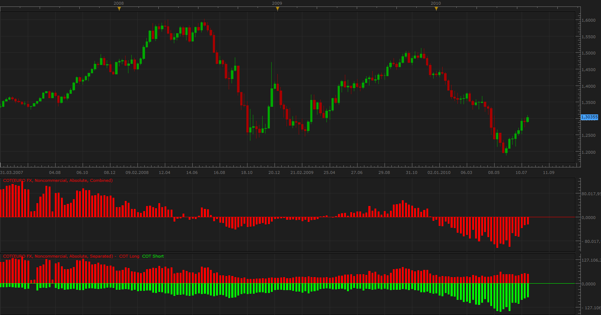
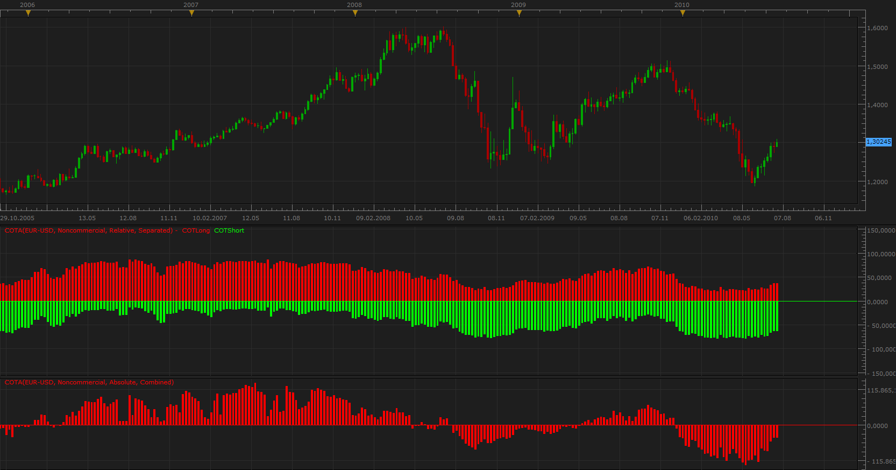

# Commitments of Traders (COT)

> Source: https://fxcodebase.com/code/viewtopic.php?f=17&t=1615  
> Forum: 17 · Topic 1615 · 70 post(s)

---

## Commitments of Traders (COT)

**Apprentice** · Thu Jul 29, 2010 3:59 pm

Commitment of Traders (COT) report is published by the Commodity Futures Trading Commission (CFTC).

CFTC divides traders into three groups: Commercial, Non Commercial (large speculators), Small traders (small speculators).

Commercial investors, companies that protect their Long positions (Hedging).

 [COT.lua](files/3194/COT.lua)

 

 [COT Dashboard.lua](files/3194/COT%20Dashboard.lua)

There are three options.
Combined
If true, Adds, Sum Long and Short positions of the selected type of investor.

Relative
If true, Shows the percentage of investors who have long or short positions.

Investor Type(Noncommercial/Commercial)
The choice of the investor type data, you would like to view.

The best results, give on the weekly time frame.

**Warning. COT is not derivation of price, it can give early warning of change in relationships on the market.**

ng: Useful reading: Using COT Report To Forecast FX Movements by Kathy Lien @ informedtraders: [Part I](http://www.informedtrades.com/blogs/tekmnd/64-using-cot-report-forecast-fx-movements-part-1.html), [Part II](http://www.informedtrades.com/blogs/tekmnd/65-using-cot-report-forecast-fx-movements-part-2.html)

---

## Re: Commitments of Traders (COT)

**a135711** · Thu Jul 29, 2010 6:19 pm

very interesting and useful. well done. could you possibly revise it to have the option for line display instead of bars? also, if the commercial, large speculative could be viewed in one window?

---

## Re: Commitments of Traders (COT)

**Apprentice** · Fri Jul 30, 2010 7:03 am

**Commitments of Traders Autoselect**

To work you must have regular COT indicator.

This implementation automatically retrieves COT report for the currency pair that trader open.
Indicator retrieves data if they are available.

If the COT report is available for only one currency pair, Indicator fetches the data for only one currency.

 [COTA.lua](files/3205/COTA.lua)

---

## Re: Commitments of Traders (COT)

**Apprentice** · Fri Jul 30, 2010 7:07 am

a135711 I thought about it, but here we have a problem with overlaping.

Maybe, if one is a Line and the second is bar, I will think about about it.
For now you can open two COT indicators one below the other.

Keep in mind that this is the first version, all suggestions are welcome, errors are possible.

---

## Re: Commitments of Traders (COT)

**[email protected]** · Sun Aug 01, 2010 3:19 am

Dear Apprentice, --

Good work on this . Was wishing to ask you if this could be considered an indicator
version of the "Market Depth Display" that is now currently on the ActiveTrader Platform --
Does this rely on the same information - and therefore would it generate quantifiably similar
picture of BULL-BEAR bought-sold market-depth type signals - withouth the actual numerics
relative to liquidity-pricing availabilities at the different prices ??? ... Could we call it
Our TSII alternative to marketdepth ?

If this is indeed the case GREAT !!! and good work -- If there is a variation instead -- the
nature of the information handled being different, this could be a good opportunity to ask you
if it were possible to incorporate the basic BOTTOM LINE of the Marketdepth information into
An Indicator that we could use on the TSII Platforms ??? ...

Yours, With Many Thanks in Advance, -- Sincerely & Fraternally -- [[email protected]](https://fxcodebase.com/cdn-cgi/l/email-protection#a7e1e4ededfee7f1e8eeebe689e1f5)+

---

## Re: Commitments of Traders (COT)

**Apprentice** · Sun Aug 01, 2010 6:08 am

Vasiliy & Nikolay are responsible for the difficult part of the job,
I am only responsible for the presentation.

Market Depth from ActiveTrader Platform and COT are not not comparable.

Market Depth shows us levels of currently open orders,
COT tells us about the open position (not trades) in the week behind us,
Similar to SSI (Speculative-sentiment-index) from FXCM.

Certainly I propose that we include Market Depth as soon as possible,
but it primarily depends on FXCM response.

---

## Re: Commitments of Traders (COT)

**scbforex** · Mon Sep 06, 2010 3:33 pm

Great work guys!

May we have a version which presents the current number of positions as a percentile of an arbitrary number of weeks? This would make identifying extremes in sentiment very easy.

Thanks Again!

---

## Re: Commitments of Traders (COT)

**Apprentice** · Wed Sep 08, 2010 8:24 am

Can you describe in detail your request.

> "Presents the current number of positions as a percentile of an arbitrary number of weeks"

Do you think in relation to the moving average, for a defined number of weeks, cumulative or some other way.

---

## Re: Commitments of Traders (COT)

**scbforex** · Wed Sep 08, 2010 8:43 pm

Apprentice,

I am looking at using Saettele`s approach in "Sentiment in the Forex Market" (Wiley, 2008). In Ch 5 he discusses a method to more readily identify sentiment extremes. He proposes calculating a three part indicator:

The first is the COT Index which is the percent rank of the current net position against the last 13, 26 or 52 weeks, arbitrarily chosen by the trader according to their trading time-lines.

The last tow parts are the %Long index commercial and non-commercial positions:

%Long = # long contracts ÷ (# long contracts + # short contracts)

Extremes in COT positioning would be confirmed by extreme bullish and bearish positions in the commercial and non-commercial positions.

I highly recommend his book as I am not really doing justice to his work.

Kindest Regards

S

---

## Re: Commitments of Traders (COT)

**Apprentice** · Thu Sep 09, 2010 2:24 am

As far as I understand it, by reading his book.
In calculating it only uses, large, speculators.

---

## Re: Commitments of Traders (COT)

**Apprentice** · Thu Sep 09, 2010 4:27 am

Requests can be found here.
When I find time I will unite all three indicators into one.

[viewtopic.php?f=17&t=2103&p=4333#p4333](https://fxcodebase.com/code/viewtopic.php?f=17&t=2103&p=4333#p4333)

---

## Re: Commitments of Traders (COT)

**momo721** · Tue Dec 28, 2010 6:12 pm

Hi there, I installed COT indicator. But, the graph doesn't look the way it is displayed here: with green bars for shorts and red for longs. There are only red bars for both, longs and shorts and they displayed very similar to COTA indicator: longs followed by shorts and so on. Please advise.

---

## Re: Commitments of Traders (COT)

**Apprentice** · Wed Dec 29, 2010 7:36 am

You probably have set the Combined option to Yes.
If you set it to No, you will get Long and Short component separately.

I plan facelift for this indicator.

---

## Re: Commitments of Traders (COT)

**momo721** · Wed Dec 29, 2010 2:03 pm

Hi Apprentice, thx, it worked. I could not find the instructions for settings though. Just a suggestion: could you please provide some instructions for indicator settings. I know, for programmers it seems redundant and boring to explain how the program you design works. But, for new users as I am, even the simple instructions would be very useful. Once again, thank you for your contribution to the platform.

---

## Re: Commitments of Traders (COT)

**Apprentice** · Mon May 02, 2011 3:39 am

2 momo721

In essence it is not important what settings you use.
COT group of indicators shows the same information.
If you understand the COT, and how to read this information.
Parameters given you choice of presentation.

For COT.
Combined
If true, Adds, Sum Long and Short positions of the selected type of investor.

Relative
If true, Shows the percentage of investors who have long or short positions.

Investor Type(Noncommercial/Commercial)
The choice of the investor type data, you would like to view.

---

## Re: Commitments of Traders (COT)

**Trader1** · Mon Sep 26, 2011 1:23 pm

why Im getting error when loading the indicators?

COT

An error occurred during the calculation of the indicator 'COT'. The error details: [string "COT.lua"]:267: attempt to index field '?' (a nil value).

COTA

[string "COTA.lua"]:88: attempt to concatenate local 'crncy2' (a nil value)

---

## Re: Commitments of Traders (COT)

**Apprentice** · Mon Sep 26, 2011 3:45 pm

I tested this indicator.
But I have not managed to reproduce this problem, for now.
That time frame, currency pair, you use,

---

## Re: Commitments of Traders (COT)

**Trader1** · Tue Sep 27, 2011 2:34 pm

I think I maybe had some settings wrong, or wrong timeframe,
please disregard my previous post,
it's working now
btw, thanks for the indicator,
Im loving it!

---

## Re: Commitments of Traders (COT)

**Apprentice** · Wed Sep 19, 2012 1:56 am

COT for "RUSSIAN RUBLE","VIX FUTURES", "2-YEAR U.S. TREASURY NOTES", "10-YEAR U.S. TREASURY NOTES", "5-YEAR U.S. TREASURY NOTES", "E-MINI S&P 400 STOCK INDEX", "RUSSELL 2000 MINI INDEX FUTURE","COPPER","SILVER", "PALLADIUM", "PLATINUM" added.

---

## Re: Commitments of Traders (COT)

**Esports** · Tue Oct 30, 2012 7:34 am

Hi, thanks for your work. I've noticed that data are not completely the same as the cot report on [http://www.cftc.gov/dea/futures/deacmesf.htm](https://www.cftc.gov/dea/futures/deacmesf.htm) . Euro says non commercial 38171 and 93390 but on the chart is 37913 and 97267. It's almost the same but sometimes there are a few thousand of difference. Have I got wrong settings?

---

## Re: Commitments of Traders (COT)

**juju1024** · Tue Oct 30, 2012 1:44 pm

hi,

i have a problem when i set this indicator,

message error :

[string "COT.lua"]:283: attempt to index field '?' (a nil value)."'

help me please,

Cordialy

---

## Re: Commitments of Traders (COT)

**arstechnica** · Wed Oct 31, 2012 12:05 am

For intraday trading to avoid to have a fixed istogram, It should be very usefull to have a string on the main chart that tell COT values and the max and min of last n weeks

---

## Re: Commitments of Traders (COT)

**Apprentice** · Wed Oct 31, 2012 2:46 am

Your request is added to the development list.

---

## Re: Commitments of Traders (COT)

**Apprentice** · Wed Oct 31, 2012 3:01 am

To Juju, I have detected the problem.
I will forward the info to the development team.

---

## Re: Commitments of Traders (COT)

**Esports** · Wed Oct 31, 2012 8:30 am

> **Apprentice wrote:**
> To Juju, I have detected the problem.
> I will forward the info to the development team.

Can I know why data are not the same of official cot report data?

---

## Re: Commitments of Traders (COT)

**juju1024** · Wed Oct 31, 2012 11:28 am

okay Apprentice,
Thanks

---

## Re: Commitments of Traders (COT)

**Apprentice** · Wed Oct 31, 2012 12:07 pm

Honestly I'm not sure.
I should make a comparison of both data sources,
to be sure.
We have WeekEnd Data (data is updated once a week)
So that this difference is negligible.

---

## Re: Commitments of Traders (COT)

**Esports** · Wed Oct 31, 2012 8:33 pm

> **Apprentice wrote:**
> Honestly I'm not sure.
> I should make a comparison of both data sources,
> to be sure.
> We have WeekEnd Data (data is updated once a week)
> So that this difference is negligible.

Well, I don't find 4-5 thousands contracts so negligible since they are € 400-500 millions. By the way Cot data are always every weekend and I don't understand why there are 4-5 k of difference on Euro if data report are shown every saturday on the official COT website.

---

## Re: Commitments of Traders (COT)

**Apprentice** · Thu Nov 01, 2012 3:09 am

Can you send me a concerned report.
Make sure to add downlaod link, and page where i can find it.

---

## Re: Commitments of Traders (COT)

**Esports** · Sun Nov 04, 2012 5:37 pm

All I can do is provide you links to the COT official website and to the last reports of EURO.
Official COT website: [http://www.cftc.gov/MarketReports/Commi ... /index.htm](https://www.cftc.gov/MarketReports/CommitmentsofTraders/index.htm)
Last reports:
16/10/12 [http://www.cftc.gov/files/dea/cotarchiv ... 101612.htm](https://www.cftc.gov/files/dea/cotarchives/2012/futures/deacmesf101612.htm)
23/10/12 : [http://www.cftc.gov/files/dea/cotarchiv ... 102312.htm](https://www.cftc.gov/files/dea/cotarchives/2012/futures/deacmesf102312.htm)
30/10/12 [http://www.cftc.gov/dea/futures/deacmesf.htm](https://www.cftc.gov/dea/futures/deacmesf.htm)
However you can see all the historical if you go on the first link and then click on "Historical Viewables " after about 20 lines.
Hope this helps.

---

## Re: Commitments of Traders (COT)

**Apprentice** · Tue Feb 26, 2013 8:43 pm

Update.
Performanse /Bug Fix
Additional instruments added.

---

## Re: Commitments of Traders (COT)

**Sinned** · Wed Mar 13, 2013 3:47 pm

How come the data hasn't been update for at least more then a week now?

---

## Re: Commitments of Traders (COT)

**Apprentice** · Thu Mar 14, 2013 4:39 am

This is expected behavior.
Out server has access to end of week data only.
Hence, the change happens once a week.

---

## Re: Commitments of Traders (COT)

**Jeffreyvnlk** · Mon Apr 01, 2013 4:31 am

Appreciated if any Open Interest added and exploit in some way such as:

- Kathy Lien said Open Interest decline when Price rises, that rise should suspect
- Larry Williams, take ratio of net short/total OI as overbought/oversold indicator

Thank you

---

## Re: Commitments of Traders (COT)

**Apprentice** · Mon Apr 01, 2013 7:20 am

Unfortunately I do not have Open Interest data available to me.

---

## Re: Commitments of Traders (COT)

**Esports** · Thu Apr 11, 2013 7:15 pm

Where does Larry Williams say that? Non commercial or Commercial net positions?

---

## Re: Commitments of Traders (COT)

**Jeffreyvnlk** · Sat Apr 13, 2013 8:23 pm

> **Esports wrote:**
> Where does Larry Williams say that? Non commercial or Commercial net positions?

Do you ask me or someone else ? Please quoting so people could know whom you ask for ?

---

## Re: Commitments of Traders (COT)

**paninie** · Sat Aug 17, 2013 6:00 am

Hi, in the last two week I was not able to use cot or cota indicators. It's a my pc problem or have you some trouble with your cot setver? Thanks.

---

## Re: Commitments of Traders (COT)

**Apprentice** · Mon Aug 19, 2013 1:43 am

Affirmative, we have certain problems with COT.
Will ask Vasilliy to take a look.

---

## Re: Commitments of Traders (COT)

**mjf1288** · Wed Nov 20, 2013 10:09 pm

> **Apprentice wrote:**
> Affirmative, we have certain problems with COT.
> Will ask Vasilliy to take a look.

Has anyone been able to address the issues with COT? Its a great tool and I would love to have the use of it again.

---

## Re: Commitments of Traders (COT)

**Apprentice** · Thu Nov 21, 2013 4:04 am

If the use nativ COT time frame.
D1 or higher it should work.

---

## Re: Commitments of Traders (COT)

**Apprentice** · Tue May 27, 2014 9:01 am

For all those interested the server issue is now fixed.

---

## Re: Commitments of Traders (COT)

**ntrader** · Tue Aug 09, 2016 7:18 am

Hi There,

Would you min sending me the latest version?

Many thanks
Ntrader

---

## Re: Commitments of Traders (COT)

**Apprentice** · Thu Aug 11, 2016 3:12 am

Latest version is published here.
As it is, Due to server problems, indicator does not work.

---

## Re: Commitments of Traders (COT)

**Yodian** · Sat Sep 10, 2016 3:36 am

Can you please make it work? COT is a very good piece of info to know...

Thank you in advance,

Yodian

---

## Re: Commitments of Traders (COT)

**jrichardson83** · Sun Sep 11, 2016 7:35 pm

> **Yodian wrote:**
> Can you please make it work? COT is a very good piece of info to know...
>
> Thank you in advance,
>
> Yodian

Yodian,

It's not a server problem on Apprentice's end, it's a local server problem. Apparently, whatever source this data is being accessed from is null.

---

## Re: Commitments of Traders (COT)

**nookie** · Tue Sep 13, 2016 4:18 am

Can we have an MT4 version ?

---

## Re: Commitments of Traders (COT)

**Apprentice** · Thu Sep 15, 2016 3:22 am

Your request is added to the development list, Under Id Number 3627
 If someone is interested to do this task, please contact me.

---

## Re: Commitments of Traders (COT)

**Apprentice** · Tue Mar 14, 2017 5:14 am

Indicator was revised and updated.

---

## Re: Commitments of Traders (COT)

**jrichardson83** · Sun Jul 02, 2017 10:54 pm

> **Apprentice wrote:**
> Indicator was revised and updated.

Is this indi now functional? When I apply to chart it is still not yielding any values.

---

## Re: Commitments of Traders (COT)

**Apprentice** · Mon Jul 03, 2017 4:23 am

Try to use higher time frames.

---

## Re: Commitments of Traders (COT)

**Magoth** · Tue May 29, 2018 4:51 pm

Heya there,

Cot seems to have an issue.
The datas don't refresh since 24/03/2018. They keep the same values from this date.

Ty,
Mag

---

## Re: Commitments of Traders (COT)

**Apprentice** · Wed May 30, 2018 2:36 pm

Thanks for reporting,
I alerted the development team.

---

## Re: Commitments of Traders (COT)

**Magoth** · Thu May 31, 2018 3:13 pm

Hello Apprentice,
thank you.

The issue comes from the fxcodebase's server it seems. The url call by the indicator returns all the datas to 13/03/2018, not after.

Ty.
Mag

---

## Re: Commitments of Traders (COT)

**paulcarissimo** · Wed Aug 14, 2019 3:14 pm

Is a possible MT4/5 version in the works ?

---

## Re: Commitments of Traders (COT)

**ChrisM** · Wed Jun 03, 2020 5:43 pm

Dear Apprentice,

it is possible to develop an COT Commercial Oszillato who:

"Show's the commercials net extreme position for a defined period of time"

Example like that:

[https://de.tradingview.com/script/2g7yOxTn-COT-Commercial-Oszillator/](https://de.tradingview.com/script/2g7yOxTn-COT-Commercial-Oszillator/)

Thank you in advance!
Chris

---

## Re: Commitments of Traders (COT)

**Protrader** · Mon Jun 08, 2020 7:58 am

Dear,

I'm new and I saw that you can translate PineScript code to LUA.

Do you now it"s possible to translate this code [https://fr.tradingview.com/script/qVvld ... -strategy/](https://fr.tradingview.com/script/qVvld2ti-noro-s-sila-v1-6l-strategy/) ?

Thank you.

---

## Re: Commitments of Traders (COT)

**Apprentice** · Tue Jun 09, 2020 6:08 am

Your request is added to the development list.
Development reference 1442.

---

## Re: Commitments of Traders (COT)

**Apprentice** · Tue Jun 09, 2020 6:10 am

For now, we will not so any COT development.

The reason, server that feeds the data is down.
Until we don’t fix it, any development doesn’t make sense.

---

## Re: Commitments of Traders (COT)

**Apprentice** · Wed Jun 10, 2020 4:47 am

Try this version.
[viewtopic.php?f=17&t=69991](https://fxcodebase.com/code/viewtopic.php?f=17&t=69991)

---

## Re: Commitments of Traders (COT)

**Apprentice** · Tue Oct 06, 2020 7:09 am

COT service has been updated.
From now onward all COT-based Indicators should work fine.

---

## Re: Commitments of Traders (COT)

**amvt85** · Sat Jan 16, 2021 7:12 am

Hello,

Is it possible to create this indicator?

[https://freecotdata.com/how-to-use/](https://freecotdata.com/how-to-use/)

Thanks.

---

## Re: Commitments of Traders (COT)

**Apprentice** · Mon Jan 18, 2021 7:36 am

Your request is added to the development list.
Development reference 87.

---

## Re: Commitments of Traders (COT)

**Apprentice** · Mon Jan 25, 2021 1:56 pm

It looks like there is no access to the data except their own charts.
You can try this: [viewtopic.php?f=17&t=1615](https://fxcodebase.com/code/viewtopic.php?f=17&t=1615)

---

## Re: Commitments of Traders (COT)

**Apprentice** · Thu Jan 28, 2021 10:31 am

COT Dashboard.lua added

---

## Re: Commitments of Traders (COT)

**amvt85** · Thu Jan 28, 2021 6:08 pm

> **Apprentice wrote:**
> It looks like there is no access to the data except their own charts.
> You can try this: [viewtopic.php?f=17&t=1615](https://fxcodebase.com/code/viewtopic.php?f=17&t=1615)

Yes, almost the same! Thanks!

---

## Re: Commitments of Traders (COT)

**Gilles** · Fri Jun 10, 2022 11:02 am

Hi Apprentice,

COT indicator does not work.
Could you take a look at it?

Thank you very much :)

---

## Re: Commitments of Traders (COT)

**Apprentice** · Wed Jun 15, 2022 1:59 pm

We have added your request to the development list.
Development reference 359.

---

## Re: Commitments of Traders (COT)

**adloule** · Fri Aug 30, 2024 3:44 pm

hi Apprentice
the COT indicator doesn't work for me
it gives this error

can you please take a look

---

## Re: Commitments of Traders (COT)

**Apprentice** · Sun Sep 01, 2024 5:13 pm

We have added your request to the development list.
Development reference 684
