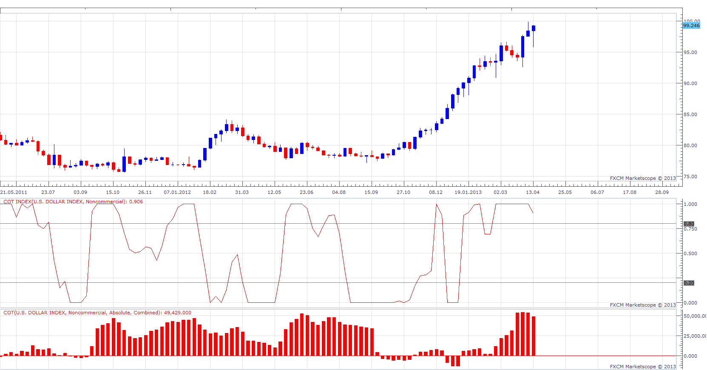

# Commitments of Traders Report Index

> Source: https://fxcodebase.com/code/viewtopic.php?f=17&t=34918  
> Forum: 17 · Topic 34918 · 2 post(s)

---

## Commitments of Traders Report Index

**Apprentice** · Fri Apr 19, 2013 8:34 am

COT Index is derivative of Commitments of Traders Report Indicator.
 [viewtopic.php?f=17&t=1615&hilit=COT](https://fxcodebase.com/code/viewtopic.php?f=17&t=1615&hilit=COT)

Net position (NP) = Longs - Shorts by CFTCclassification
COT Index = (NP - minNP) / (maxNP-minNP)

 [COT Index.lua](files/59364/COT%20Index.lua)

The indicator was revised and updated

---

## Re: Commitments of Traders Report Index

**Apprentice** · Mon Aug 07, 2017 12:50 pm

The indicator was revised and updated.
