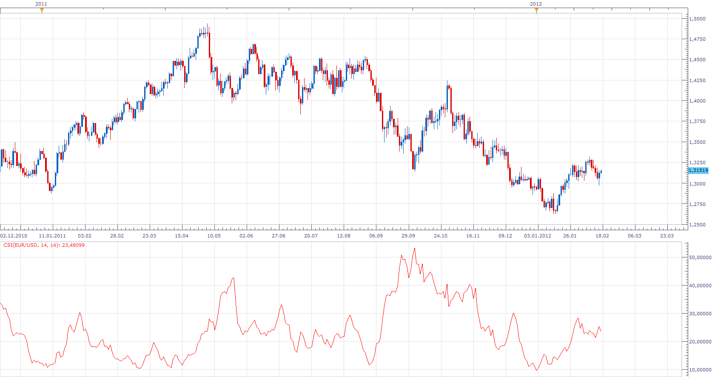
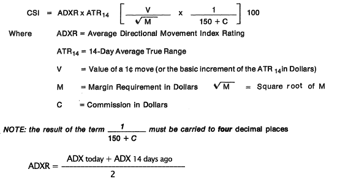

# Commodity Selection Index - (CSI)

> Source: https://fxcodebase.com/code/viewtopic.php?f=17&t=13530  
> Forum: 17 · Topic 13530 · 5 post(s)

---

## Commodity Selection Index - (CSI)

**Apprentice** · Fri Feb 17, 2012 5:50 am

 

 [CSI.lua](files/26209/CSI.lua)

 The CSI was developed by Welles Wilder and was first published in the book New Concepts in Technical Trading Systems. The higher the CSI, the greater the volatility and strength of trend. Traders use the CSI is to find commodities with the highest volatility, because it has the greatest odds of quick gains.

Characteristic for this indicator.
The explosion of CSI is occurs just before the start of a strong trend

The indicator was revised and updated

---

## Re: Commodity Selection Index - (CSI)

**Jeffreyvnlk** · Wed Sep 17, 2014 3:40 am

Very good one. Thanks

---

## Re: Commodity Selection Index - (CSI)

**Jeffreyvnlk** · Fri Dec 19, 2014 5:34 pm

Can you change from C to Spread ? A forex broker like fxcm gets not commissions but spreads. Thanks.

Btw, I see CSI of EURUSD and USDJPY are 1.00 and 1062 for today, respectively. Meaning trading the later is about 1000 times better than that of the former ? How about CIS of ESPN35 stands at 10.500 ? I think there is a problem when comparing CIS of those instruments

---

## Re: Commodity Selection Index - (CSI)

**Apprentice** · Sun Dec 21, 2014 4:03 am

Spread is already used it this implementation.

---

## Re: Commodity Selection Index - (CSI)

**Apprentice** · Mon Jun 26, 2017 9:58 am

The indicator was revised and updated.
