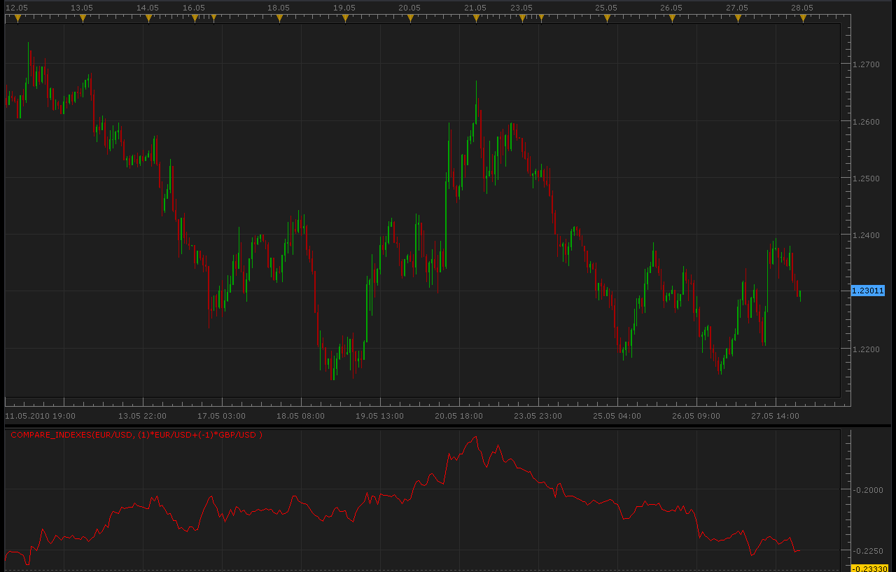

# Compare Indexes

> Source: https://fxcodebase.com/code/viewtopic.php?f=17&t=1170  
> Forum: 17 · Topic 1170 · 12 post(s)

---

## Compare Indexes

**Alexander.Gettinger** · Thu May 27, 2010 11:04 pm

Indicator for compare two different indexes.

Compare Indexes=Index1*Coeff1+Index2*Coeff2;
For example: Compare Indexes=EUR/USD-GBP/USD

 

 [Compare_Indexes.lua](files/2242/Compare_Indexes.lua)

 [Multiple Indexes Comparison.lua](files/2242/Multiple%20Indexes%20Comparison.lua)

The indicator was revised and updated

---

## Re: Compare Indexes

**fxm12000** · Wed Feb 06, 2013 5:51 pm

I love this indicator. Can you make a signal on this indicator? Signal should be triggered as sound at certain value of indicator that could be manually entered. Thx

---

## Re: Compare Indexes

**Apprentice** · Fri Feb 08, 2013 5:15 am

Style Option Added.

---

## Re: Compare Indexes

**allisonmagic** · Fri Feb 08, 2013 5:49 am

comparing in what way ?

---

## Re: Compare Indexes

**Apprentice** · Fri Feb 08, 2013 5:58 am

 [Compare Indexes With Alert.lua](files/54331/Compare%20Indexes%20With%20Alert.lua)

This indicator provides Audio / Email Alerts if and when Compare Indexes cross over/under one of the two defined levels.

Compatibility issue fixed.
_Alert Helper is not longer needed.

---

## Re: Compare Indexes

**Apprentice** · Fri Feb 08, 2013 6:06 am

to allisonmagic
Compare Indexes will Add or Subtract First from Second Currency Pair.

---

## Re: Compare Indexes

**Apprentice** · Mon Dec 07, 2015 5:24 am

Compatibility issue fixed.
_Alert Helper is not longer needed.

---

## Re: Compare Indexes

**fxm12000** · Wed Oct 12, 2016 4:01 am

> **Apprentice wrote:**
>
>
> Compare Indexes With Alert.png
>
>
>
>
>
> Compare Indexes With Alert.lua
>
>
>
> This indicator provides Audio / Email Alerts if and when Compare Indexes cross over/under one of the two defined levels.
>
> Compatibility issue fixed.
> _Alert Helper is not longer needed.

Hello

Can you,please, add 3rd index to this indictaor.

Thank you
Lep pozdrav

---

## Re: Compare Indexes

**Apprentice** · Thu Oct 13, 2016 6:14 am

Compare Indexes = Pair1+/- Pair 2 +-/Pair3 ..

Your request is added to the development list, Under Id Number 3650
 If someone is interested to do this task, please contact me.

---

## Re: Compare Indexes

**Apprentice** · Thu Oct 20, 2016 10:14 am

Multiple Indexes Comparison.lua added.

---

## Re: Compare Indexes

**fxm12000** · Thu Oct 20, 2016 2:49 pm

> **Apprentice wrote:**
> Multiple Indexes Comparison.lua added.

Thx. How can I see it?

---

## Re: Compare Indexes

**fxm12000** · Thu Oct 20, 2016 3:47 pm

> **Apprentice wrote:**
> Multiple Indexes Comparison.lua added.

Sorry for previous post, I find it. I wasn't look carefully enough recent convesations.
