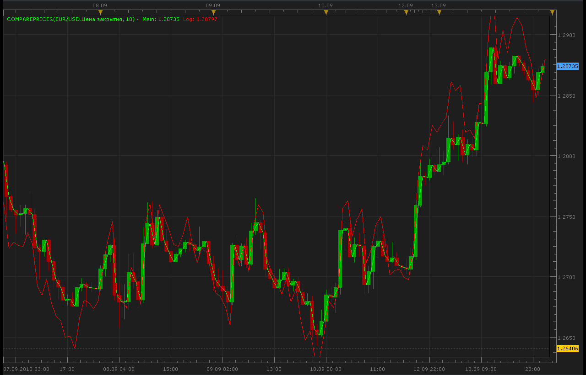

# Compare prices

> Source: https://fxcodebase.com/code/viewtopic.php?f=17&t=2162  
> Forum: 17 · Topic 2162 · 2 post(s)

---

## Compare prices

**Alexander.Gettinger** · Mon Sep 13, 2010 10:39 pm

Indicator's formulas:

Main[period] = Price[period];
Log[period] = Price[period] /(1+ Math.Log10(Price[period-shift]/Price[period]));

 

The indicator was revised and updated

MT4/Mq4 version.
[viewtopic.php?f=38&t=63908](https://fxcodebase.com/code/viewtopic.php?f=38&t=63908)

---

## Re: Compare prices

**Apprentice** · Mon Jan 23, 2017 6:07 am

Indicator was revised and updated.
