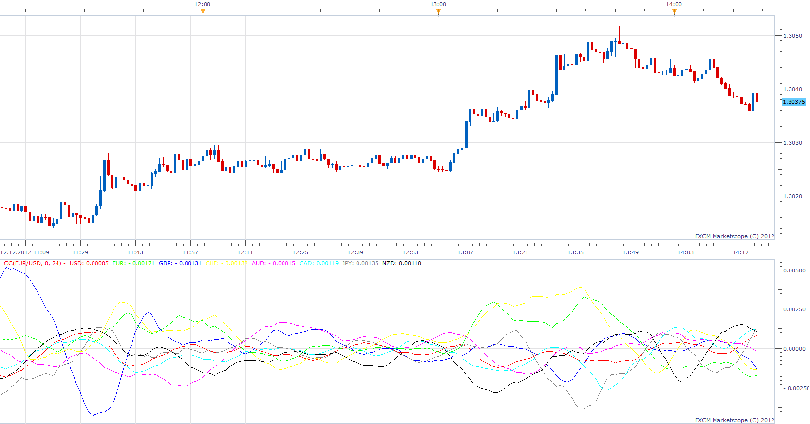

# Complex

> Source: https://fxcodebase.com/code/viewtopic.php?f=17&t=27630  
> Forum: 17 · Topic 27630 · 5 post(s)

---

## Complex

**Apprentice** · Wed Dec 12, 2012 8:16 am

Written according user request.
[viewtopic.php?f=27&t=14761&p=48337#p48337](https://fxcodebase.com/code/viewtopic.php?f=27&t=14761&p=48337#p48337)

For this indicator, you must be subscribed to these currency pairs.
"EUR/USD", "GBP/USD", "USD/CHF", "AUD/USD", "USD/CAD", "USD/JPY", "NZD/USD"};
Indicator compute indices for 8 Major currency pairs.
User can exclude specific currency.
In this case excludeded currency, will not be used in calculating of indexes.

 [Complex.lua](files/48336/Complex.lua)

The indicator was revised and updated

---

## Re: Complex

**frankdrebin** · Wed May 01, 2013 10:25 pm

I have tried to use this indicator, but I get the error

[string "Complex.lua"]:113: Cannot recognize the host command

I have all 7 of the required pairs in my subscription list.

Thanks for your help.

---

## Re: Complex

**Apprentice** · Fri May 03, 2013 3:06 am

Please download new version of TS from FXCM page and reinstall.

---

## Re: Complex

**frankdrebin** · Sun May 05, 2013 12:50 am

Downloaded new version of TS and the Indicator works now.

Many Thanks.

---

## Re: Complex

**Apprentice** · Tue May 23, 2017 10:12 am

Indicator was revised and updated.
