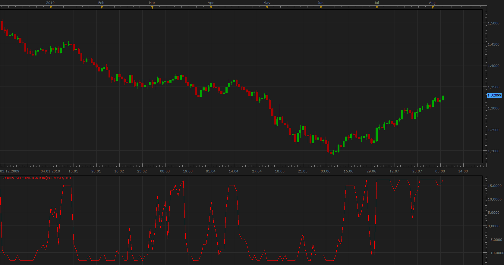
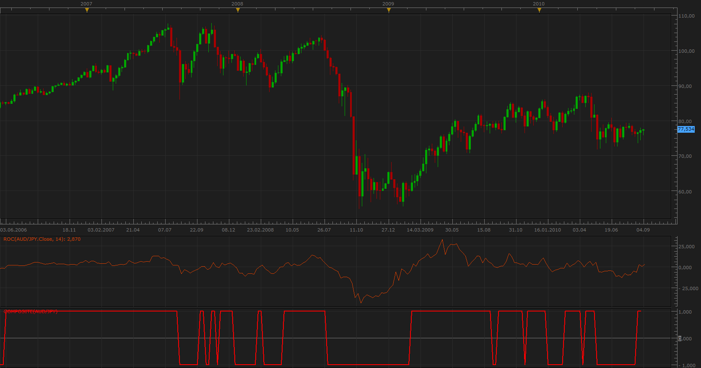

# Composite Indicator

> Source: https://fxcodebase.com/code/viewtopic.php?f=17&t=1708  
> Forum: 17 · Topic 1708 · 27 post(s)

---

## Composite Indicator

**Apprentice** · Sun Aug 08, 2010 9:37 am

This indicator is calculated based on 23 indicators.

Individual indicator gives an indication of +1 or -1.
Indicator is the sum of individual indications.

His range is from -23 to +23.

 [zzzcomposite.lua](files/3397/zzzcomposite.lua)

If you do not already have, you must install the following nonstandard indicators,

One advice, related to the installation of inaccessible indicators.
When you install some or all inaccessible indicators.
**Restart Platform**

Momentum
[http://fxcodebase.com/code/viewtopic.php?f=17&t=896&start=0&hilit=Momentum](https://fxcodebase.com/code/viewtopic.php?f=17&t=896&start=0&hilit=Momentum)

TRIX
[http://fxcodebase.com/code/viewtopic.php?f=17&t=1022&start=0&hilit=TRIX](https://fxcodebase.com/code/viewtopic.php?f=17&t=1022&start=0&hilit=TRIX)

Wilders MA
[http://fxcodebase.com/code/viewtopic.php?f=17&t=248&start=0&hilit=Wilders+MA](https://fxcodebase.com/code/viewtopic.php?f=17&t=248&start=0&hilit=Wilders+MA)

DeMarker
[http://fxcodebase.com/code/viewtopic.php?f=17&t=22&start=0&hilit=DeMarker](https://fxcodebase.com/code/viewtopic.php?f=17&t=22&start=0&hilit=DeMarker)

Forecast
[http://fxcodebase.com/code/viewtopic.php?f=17&t=693&start=0&hilit=Forecast](https://fxcodebase.com/code/viewtopic.php?f=17&t=693&start=0&hilit=Forecast)

FRAMA
[http://fxcodebase.com/code/viewtopic.php?f=17&t=1355&start=0&hilit=FRAMA](https://fxcodebase.com/code/viewtopic.php?f=17&t=1355&start=0&hilit=FRAMA)

Slope Direction Line
[http://fxcodebase.com/code/viewtopic.php?f=17&t=949&start=0&hilit=Slope+Direction+Line](https://fxcodebase.com/code/viewtopic.php?f=17&t=949&start=0&hilit=Slope+Direction+Line)

Supertrend
[http://fxcodebase.com/code/viewtopic.php?f=17&t=605&start=0&hilit=Supertrend](https://fxcodebase.com/code/viewtopic.php?f=17&t=605&start=0&hilit=Supertrend)

VORTEX
[http://fxcodebase.com/code/viewtopic.php?f=17&t=277&start=0&hilit=VORTEX](https://fxcodebase.com/code/viewtopic.php?f=17&t=277&start=0&hilit=VORTEX)

 

I made a few modifications.

I have Add ROC indicator. Request.

Now you have the choice which indicator will be in the composite indicator.
So you can specify the maximum number of indicators .

For those who do not want to know know the value of an indicator, but only its indication,
You can use only one indicator.

The indicator will now work even when you do not have installed all the indicators.
See the Selector parameter group to see the indicators that you are missing.

ADX
IF ADX > Level AND Composite > 0 +
IF ADX > Level AND Composite < 0 -

DMI 2
DIP > DMI Level +
DIM > DMI Level -

---

## Re: Composite Indicator

**gregg1** · Thu Oct 07, 2010 6:27 am

I've tested the newly updated Composite Indicator with ROC and have reviewed an number of parameters to maximize results.

In the past two days, I've had good execution withthe following parameters.

(quick note: Update Marketscope with the latest patch)

EURUSD

10-6-2010: 6:35 am; 26.4 PIPs
10-7-2010: 2:35 am: 31.2 PIPS

The revised parameters are:
5M Chart
Composite Signal Level: 20
ROC Signal Level: .14
All Composite Parameters (ones that have default settings at 10) have been reset to: 7 periods
Time Frame: Five Minutes

I have manually executed the trades. I'm testing the 'auto trade' function now and will report as it progresses.

---

## Re: Composite Strategy

**gregg1** · Fri Oct 08, 2010 6:18 am

Update to the Composite Strategy using ZZZcomposite Indicator

Tweak to the settings:
5M Chart
Composite Signal Level: changed to: 16
ROC: .14 [no change]
Periods: 7 [no change]
TimeFrame: Five Minutes [no change]
Limit: 30 pips
Stop: 30 pips
Updated results: Events Alerts worked as designed in manual mode [not yet successfully tested auto trade yet]

10/8/2010: Sell EURUSD @ 1.39133 4:15am
10/8/2010: Buy EURUSD @ 1.38794 6:05 am

---

## Re: Composite Indicator

**Nikolay.Gekht** · Mon Oct 11, 2010 11:18 pm

1) The first thing to check is whether ALL the indicators required (listed in the first topic) are installed.
2) When (Error) appears in the indicator label - please go to the Chart->Indicators Log and tell us at least the line number where error appears.

---

## Re: Composite Indicator

**bonnevie** · Wed Nov 10, 2010 1:25 pm

Hi Apprentice,

Thanks for the response. Does "Update" mean a new version of the indicator has replaced the one at the beginning of the thread? Or is the update located elsewhere?

Or should the default parameters be adjusted in any way?

I downloaded the indicator from the beginning of the thread today (assuming it was a corrected version) and I'm still getting pretty much the same error message when I try to attach it to my charts - except now the number after '[string “zzzcompsite.lua”]' is 388 instead of 365 like the last time:

"An error occurred during the calculation of the indicator ‘ZZZ COMPOSITE’. The error details: [string “zzzcompsite.lua”]: 388: [string “Slope_Direction_Line.lua”]: 48: [string “mva.lua”]: 41: The first parameter must be a price stream."

Your help would be appreciated.

Thanks,
bonnevie

---

## Re: Composite Indicator

**Apprentice** · Wed Nov 10, 2010 3:24 pm

Sorry for the inconvenience.

I am to blame.
Yesterday I update Slope_Direction_Line, but I forgot to do this here.

Error corrected.

---

## Re: Composite Indicator

**fabfxcm** · Fri Feb 25, 2011 2:37 am

Dear Apprentice,
I installed all the indicators requested but each time I try to open the zzzcomposite indicator this text appear: [string "zzzcomposite.lua"]:506: attempt to index field 'UP' (a nil value).
How can I solve the problem??

---

## Re: Composite Indicator

**Apprentice** · Fri Feb 25, 2011 6:07 am

Use Top Most Version of SuperTrend Indicator.
(Not Single Stream Version)

---

## Re: Composite Indicator

**nookie** · Sat May 09, 2015 2:23 am

Hi Apprentice, is it possible to include alert and real values to be reached for example below:

I am sure it has mistakes but this is the idea

6. DMI(10) Di+ > 10 = +1 Di+ < 10 = -1
 Di- > 10 = +1 Di- < 10 = -1
 if ON[5] then
 DMI:update(mode);
 if DMI.DIP:hasData(period) and DMI.DIM:hasData(period) then
 if DMI.DIP[period] > 10 then
 Plus(5);
 if DMI.DIM[period] > 10 then
 Plus(5);
 elseif Minus(5);
 end

and similar and awsome if we add ADX to this indicator.. tried to add it but got the following error:

The error details: TESTzzzcomposite.lua:515: attempt to index field 'UP' (a nil value).

---

## Re: Composite Indicator

**Apprentice** · Mon May 11, 2015 4:24 am

Additional ADX and DMI filters added.

---

## Re: Composite Indicator

**nookie** · Mon May 11, 2015 4:13 pm

Thanks, but the following error is showing up:

An error occurred during the calculation of the indicator 'ZZZCOMPOSITE (1)'. The error details: zzzcomposite (1).lua:553: attempt to index field 'UP' (a nil value).

---

## Re: Composite Indicator

**Apprentice** · Tue May 12, 2015 2:40 am

You probably use the wrong version of the Super Trend Indicator.
Try to exclude the Super Trend from composite.

---

## Re: Composite Indicator

**nookie** · Tue May 12, 2015 3:21 am

I am testing it on the old and the new indicator with the option "No" of the supertrend, dont think this is the reason

---

## Re: Composite Indicator

**nookie** · Sat May 16, 2015 4:25 am

I think there is something minor as a problem.. seems like this indicator is not refreshing, it keeps the same chart after it was loaded for the last time after severel minutes or hours, is this fixable ?

---

## Re: Composite Indicator

**Apprentice** · Sun May 17, 2015 12:11 am

Ups, It looks like I broke itI,
with the recent update.
Try it now.

Note. I did not have a chance, to test it.
As market is closed.

---

## Re: Composite Indicator

**nookie** · Sun May 17, 2015 4:41 pm

It shows now the error: "unexpected symbol near "i" " ..

Is it possible and alert to be added ?

---

## Re: Composite Indicator

**Apprentice** · Mon May 18, 2015 2:50 am

Try it now. Fixed and Tested.
Previous modifications were done to my mobile phone.

---

## Re: Composite Indicator

**nookie** · Mon May 18, 2015 3:17 pm

Its working fine, thanks! Is it possible alert to be added, if > 10 then buy, if < 10 -> sell ?

---

## Re: Composite Indicator

**Apprentice** · Tue May 19, 2015 3:33 am

Can you make use of Plain Composite Strategy.lua?
[viewtopic.php?f=31&t=2293&hilit=zzzcomposite](https://fxcodebase.com/code/viewtopic.php?f=31&t=2293&hilit=zzzcomposite)

---

## Re: Composite Indicator

**nookie** · Thu May 28, 2015 6:41 am

Is there a way for few enhancements on the current one source to be able to be selectable, for example for all to be able to select the source from close, high, tick volume for the indicators and Zones of OB and OS to be added of +23 and -23 ?

---

## Re: Composite Indicator

**nookie** · Wed Aug 12, 2015 8:58 am

Is it possible that few volume indicators are added with levels for OB and OS ?

[http://www.fxcodebase.com/code/viewtopi ... 17&t=62451](http://www.fxcodebase.com/code/viewtopic.php?f=17&t=62451)
Slow Volume Strength Index

and

[viewtopic.php?f=17&t=62324&p=101676&hilit=volume#p101676](https://fxcodebase.com/code/viewtopic.php?f=17&t=62324&p=101676&hilit=volume#p101676)
Unusual Volume Price Movement

and

Normalized volume [viewtopic.php?f=17&t=41287&p=67507](https://fxcodebase.com/code/viewtopic.php?f=17&t=41287&p=67507)

---

## Re: Composite Indicator

**Apprentice** · Sun Aug 16, 2015 4:53 am

Your request is added to the development list.

---

## Re: Composite Indicator

**Apprentice** · Tue Dec 01, 2015 6:38 am

Bump up.

---

## Re: Composite Indicator

**Apprentice** · Fri Jan 20, 2017 7:06 am

Indicator was revised and updated.

---

## Re: Composite Indicator

**jaricarr** · Mon Oct 16, 2017 7:23 pm

Hi Apprentice,

is there a composite indicator similar to the one on this video.

Looks like FXCM has it but i could not find it.

[https://youtu.be/y8wjpKIXs9g](https://youtu.be/y8wjpKIXs9g) (@ 3:30min)

---

## Re: Composite Indicator

**Apprentice** · Tue Oct 17, 2017 4:07 am

Try these.
[viewtopic.php?f=17&t=63679&hilit=profile](https://fxcodebase.com/code/viewtopic.php?f=17&t=63679&hilit=profile)
[viewtopic.php?f=17&t=2640&hilit=profile](https://fxcodebase.com/code/viewtopic.php?f=17&t=2640&hilit=profile)
[viewtopic.php?f=17&t=604&p=88744&hilit=profile#p88744](https://fxcodebase.com/code/viewtopic.php?f=17&t=604&p=88744&hilit=profile#p88744)

---

## Re: Composite Indicator

**Apprentice** · Mon Feb 05, 2018 8:21 am

The Indicator was revised and updated.
