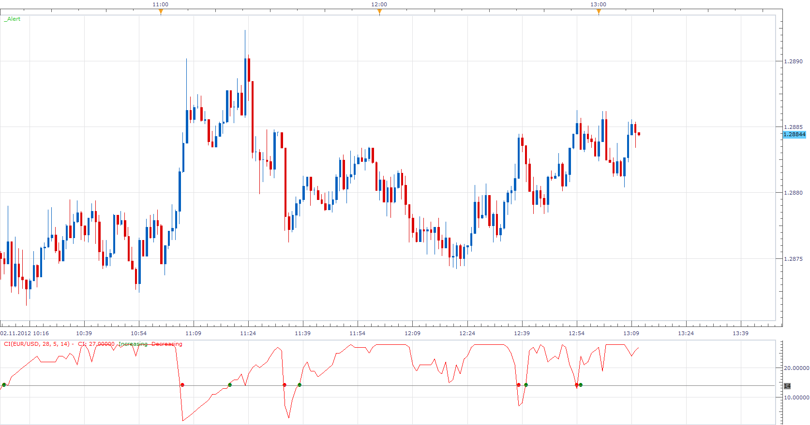

# Congestion Identifier

> Source: https://fxcodebase.com/code/viewtopic.php?f=17&t=25314  
> Forum: 17 · Topic 25314 · 3 post(s)

---

## Congestion Identifier

**Apprentice** · Fri Nov 02, 2012 7:13 am

Shows how many times the closing price, in last N periods, was in belt X pips up or down from last close.

 [CI.lua](files/43521/CI.lua)

This indicator provides Audio / Email Alerts if and when Congestion Identifier cross over/under defined Alert levels.
Dec 21, 2015: Compatibility issue Fix. _Alert helper is not longer needed.

The indicator was revised and updated

---

## Re: Congestion Identifier

**Alexander.Gettinger** · Thu Oct 23, 2014 9:53 am

MQL4 version of Congestion Identifier: [viewtopic.php?f=38&t=61369](https://fxcodebase.com/code/viewtopic.php?f=38&t=61369).

---

## Re: Congestion Identifier

**Apprentice** · Fri Jun 23, 2017 7:23 am

The indicator was revised and updated.
