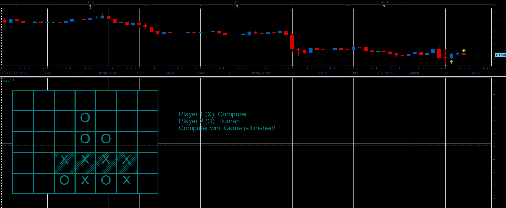

# Connect Four game

> Source: https://fxcodebase.com/code/viewtopic.php?f=17&t=60500  
> Forum: 17 · Topic 60500 · 2 post(s)

---

## Connect Four game

**Alexander.Gettinger** · Fri Apr 04, 2014 12:14 pm

The indicator is just a Connect Four game ([http://en.wikipedia.org/wiki/Connect_Four](https://en.wikipedia.org/wiki/Connect_Four)). Right-click and use context menu to make a turn and restart the game.

 

Download:

 [Connect4.bin](files/93379/Connect4.bin)

---

## Re: Connect Four game

**Apprentice** · Fri Jun 16, 2017 6:49 am

The indicator was revised and updated.
