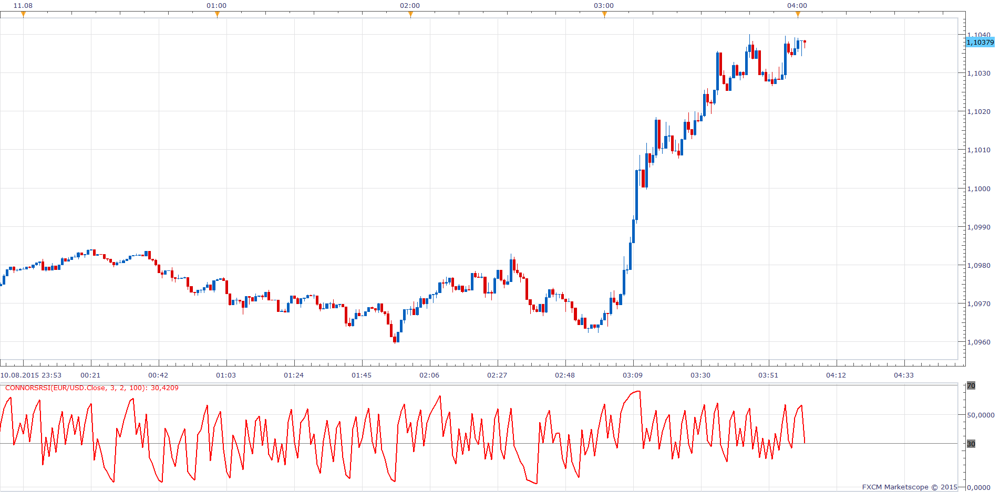
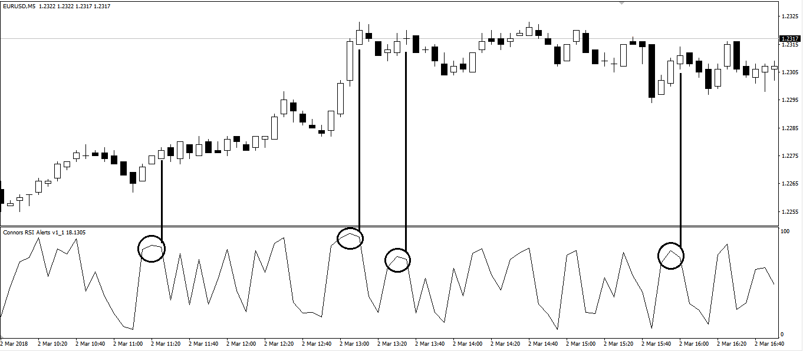
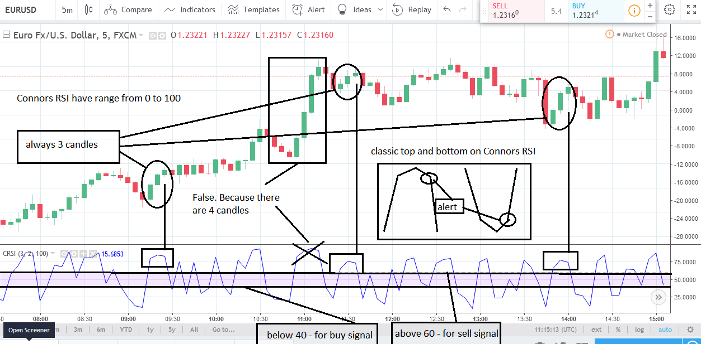
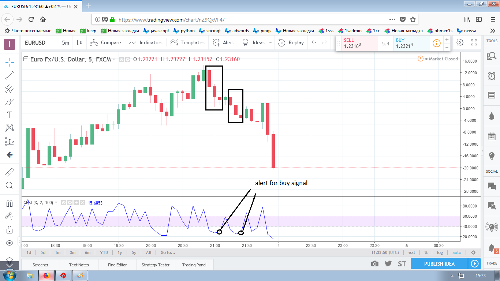
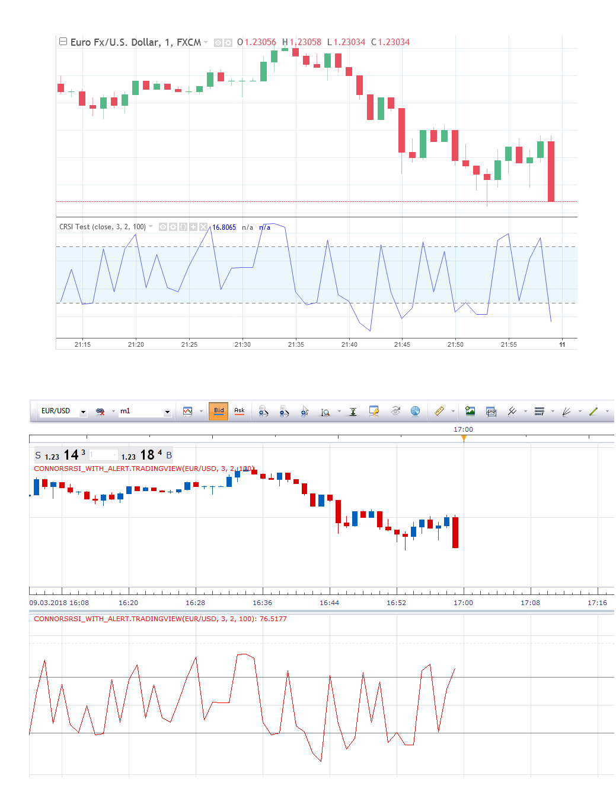

# ConnorsRSI

> Source: https://fxcodebase.com/code/viewtopic.php?f=17&t=62518  
> Forum: 17 · Topic 62518 · 17 post(s)

---

## ConnorsRSI

**Apprentice** · Tue Aug 11, 2015 3:40 am

ConnorsRSI(3,2,100) = [ RSI(Close,3) + RSI(UpDownDays,2) + PercentRank(percentMove,100) ] / 3

 [ConnorsRSI.lua](files/101737/ConnorsRSI.lua)

 

 [MTF MCP Connors RSI Heat Map.lua](files/101737/MTF%20MCP%20Connors%20RSI%20Heat%20Map.lua)

---

## Re: ConnorsRSI

**Alexander.Gettinger** · Mon Aug 31, 2015 11:41 am

MQL4 version of Connors RSI oscillator: [viewtopic.php?f=38&t=62614](https://fxcodebase.com/code/viewtopic.php?f=38&t=62614).

---

## Re: ConnorsRSI

**Apprentice** · Wed Jul 19, 2017 7:14 am

The indicator was revised and updated.

---

## Re: ConnorsRSI

**Apprentice** · Tue Oct 10, 2017 4:38 am

MTF MCP Connors RSI Heat Map.lua added.

---

## Re: ConnorsRSI

**isamegrelo** · Sat Mar 03, 2018 9:32 am

Can you add alert for this pattern in Connors RSI? Triangular divergence between indicator and price.

 

---

## Re: ConnorsRSI

**Apprentice** · Sun Mar 04, 2018 6:37 am

Can you describe the alert logic with more details?
The indicator was revised and updated.

---

## Re: ConnorsRSI

**isamegrelo** · Sun Mar 04, 2018 8:28 am

---

## Re: ConnorsRSI

**isamegrelo** · Sun Mar 04, 2018 8:41 am

---

## Re: ConnorsRSI

**isamegrelo** · Sun Mar 04, 2018 8:47 am

If necessary, I can graphically describe in more detail

---

## Re: ConnorsRSI

**Apprentice** · Mon Mar 05, 2018 8:41 am

Your request is added to the development list under Id Number 4059

---

## Re: ConnorsRSI

**Apprentice** · Mon Mar 05, 2018 12:04 pm

[ConnorsRSI_with_alert.lua](files/118032/ConnorsRSI_with_alert.lua)

Done, but... there is something wrong. I didn't manage to find not a single instance on the chart where these conditions for the alert are met. All screenshot provided are from TradingView. Maybe we needs this alert based on different indicator?

---

## Re: ConnorsRSI

**isamegrelo** · Tue Mar 06, 2018 1:39 pm

This is formula from Tradingview.

Source: [https://www.tradingview.com/script/OD1o ... -RSI-Test/](https://www.tradingview.com/script/OD1odrK5-Connors-RSI-Test/)

Code: [Select all](https://fxcodebase.com/code/)
`//--study(title="Connors RSI")
study("Connors RSI Test", shorttitle = "CRSI Test", overlay=false)

//--------------- input parameters

src = input(defval=close, type=source, title="Source")
lenrsi = input(3, minval=1, type=integer, title="RSI Length")
lenupdown = input(2, minval=1, type=integer, title="UpDown Length")
lenroc = input(100, minval=1, type=integer, title="ROC Length")

//--------------- define function

updown(s) =>
    isEqual = s == s[1]
    isGrowing = s > s[1]
    ud = isEqual ? 0 : isGrowing ? (nz(ud[1]) <= 0 ? 1 : nz(ud[1])+1) : (nz(ud[1]) >= 0 ? -1 : nz(ud[1])-1)
    ud

//--------------- calculate RSIs

rsi = rsi(src, lenrsi)
updownrsi = rsi(updown(src), lenupdown)
percentrank = percentrank(roc(src, 1), lenroc)
crsi = avg(rsi, updownrsi, percentrank)

//--------------- calculate signal

sig1 = (close >= open) and (crsi < (crsi[1] - 3)) ? 1 : na
sig2 = (close <= open) and (crsi > (crsi[1] + 3)) ? 1 : na

//-------------- plotting
plot(crsi, color=blue, linewidth=1, title="Connors RSI")
band1 = hline(70, color=gray, linestyle=dashed)
band2 = hline(30, color=gray, linestyle=dashed)
fill(band1, band2)

plotshape(sig1, style=shape.labeldown, size=size.tiny, location=location.top, color=red)
plotshape(sig2, style=shape.labelup, size=size.tiny, location=location.bottom, color=blue)
//--END`

---

## Re: ConnorsRSI

**Apprentice** · Fri Mar 09, 2018 6:34 am

Your request is added to the development list under Id Number 4067

---

## Re: ConnorsRSI

**Apprentice** · Sat Mar 10, 2018 7:01 pm

[ConnorsRSI_with_alert.tradingview.lua](files/118121/ConnorsRSI_with_alert.tradingview.lua)

Try this version.

---

## Re: ConnorsRSI

**isamegrelo** · Sun Mar 11, 2018 5:06 pm

why your version of Connors RSI is lagging?

 

---

## Re: ConnorsRSI

**Apprentice** · Tue Mar 13, 2018 6:50 am

I'm not sure the code looks the same.

---

## Re: ConnorsRSI

**Apprentice** · Thu Mar 15, 2018 2:01 pm

Try ConnorsRSI_with_alert.tradingview now.
